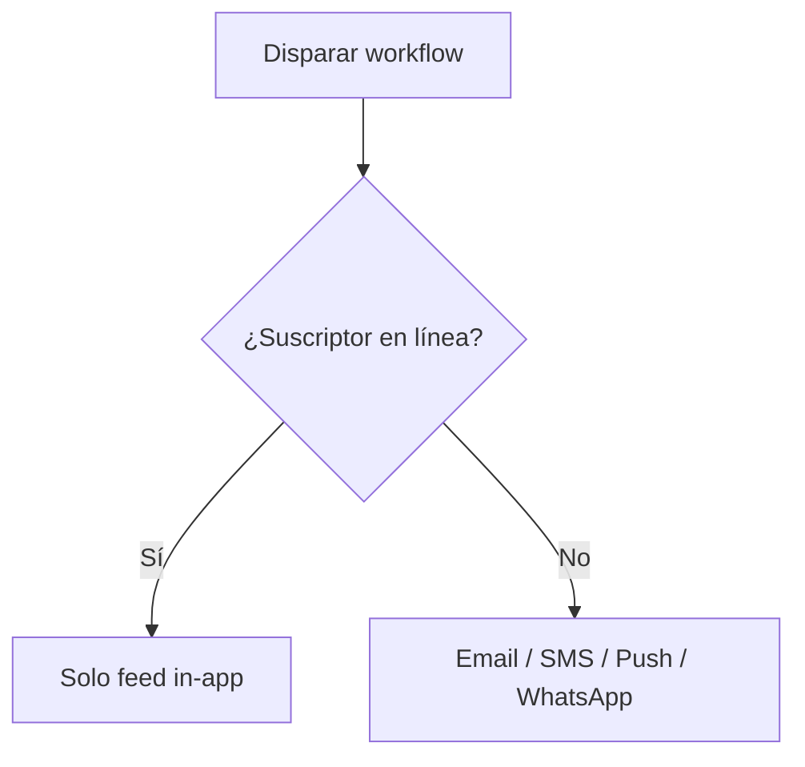

Nexus incluye mecanismos de control de costos integrados diseñados para eliminar automáticamente el gasto innecesario en notificaciones.

---

## Supresión por presencia (Presence Suppression)

Enviar múltiples alertas externas (SMS, push) cuando un usuario ya está usando activamente tu aplicación es molesto para el usuario y un desperdicio del presupuesto del proveedor.

Cuando un suscriptor tiene una conexión activa del SDK cliente (React, Angular o Headless JS), Nexus lo marca como **en línea (online)** y suprime los canales externos salientes, enrutando la notificación únicamente al **inbox in-app**.



### Canales suprimibles

Por defecto, los siguientes canales se suprimen si el suscriptor está activo:

- Mobile Push (`MOBILE_PUSH`)
- Web Push (`WEB_PUSH`)
- SMS (`SMS`)
- WhatsApp (`WHATSAPP`)

Las notificaciones in-app nunca se suprimen y siempre se entregan a través de la conexión WebSocket.

### Cómo se rastrea la presencia

1. El SDK del lado del cliente abre una conexión WebSocket y envía un ping de heartbeat a `/realtime` cada **40 segundos**.
2. Redis almacena la clave de conexión `presence:sub:<subscriberId>` con un Time-To-Live (TTL) estricto de **45 segundos**.
3. Antes de despachar un paso suprimible, el worker del workflow consulta Redis. Si la clave existe, el paso se omite.
4. Las ejecuciones suprimidas se registran bajo el paso del ciclo de vida `PRESENCE_SUPPRESSION` con el estado `SKIPPED_BY_PREFERENCE`.

<Callout type="info">
  Puedes activar o desactivar esto por cada paso de canal en el editor de workflows usando la
  casilla de verificación **Suppress when subscriber is online**, o en workflow-as-code
  estableciendo `suppressWhenOnline` en las opciones.
</Callout>

---

## Modo Sandbox (Desarrollo)

Probar workflows de notificaciones con proveedores reales (por ejemplo, Twilio, SendGrid) genera costos transaccionales y corre el riesgo de enviar mensajes basura a usuarios reales.

En el entorno de **Development**, Nexus aísla todos los canales externos utilizando un **Simulador Sandbox** virtual. Las llamadas a la API salientes se simulan (mocked), y el contenido generado, los payloads y los resultados de renderizado se almacenan directamente en tus logs de desarrollo.

- Previsualiza los emails exactos, los payloads de SMS y los formatos JSON de WhatsApp en el panel de control.
- No se requieren credenciales de API reales para las pruebas.
- Consulta [Modo Sandbox](/docs/platform/features/sandbox) para la configuración.

---

## Enrutamiento ponderado de proveedores (Weighted Provider Routing)

Distribuye el tráfico de entrega entre múltiples proveedores en la misma capa de canal (por ejemplo, 70% SendGrid, 30% Resend). Esto es útil para:

- Dividir el gasto entre proveedores.
- Migración gradual de proveedor.
- Distribución del riesgo.

**Actualizar los pesos de enrutamiento vía API:**

```http
PUT /v1/integrations/weights/:layer
Authorization: Bearer <jwt_dashboard_token>
Content-Type: application/json

{
  "weights": {
    "sendgrid": 70,
    "resend": 30
  }
}
```

- `:layer`: Debe ser uno de `email`, `sms`, `whatsapp`, `push`, `webhook`, `slack`, `discord` o `ms_teams`.
- **Restricción**: La suma de todos los pesos de proveedores en una capa **debe ser exactamente 100**.

---

## Failover por circuit breaker

Cuando un endpoint de proveedor rechaza solicitudes repetidamente (5 errores consecutivos en una ventana de 60 segundos), el circuit breaker del proveedor se abre (estado `OPEN`). El tráfico se redirige automáticamente a proveedores alternativos en la capa, evitando reintentos desperdiciados en endpoints de API caídos.

---

## Relacionado

- [Smart send-time](/docs/platform/features/smart-send-time) — optimización de temporización
- [Analíticas de costos](/docs/platform/features/cost-analytics) — medición de ahorros
- [Digest y throttle](/docs/platform/features/digest-throttle) — reglas de anti-rebote
