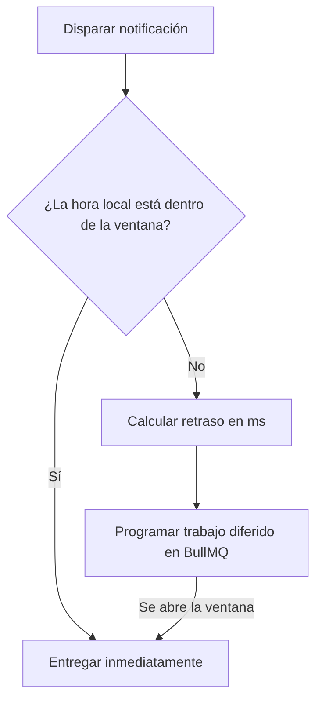

El paso de **Ventana de entrega** (Delivery Window) comprueba la hora local del suscriptor antes de despachar las notificaciones posteriores. Si la hora actual está fuera de la ventana permitida (por ejemplo, en mitad de la noche), Nexus pausa la ejecución y programa un trabajo diferido para reanudar cuando la ventana se abra.



---

## Configuración

Al definir un nodo de Ventana de entrega en el lienzo o mediante workflow-as-code, especifica los siguientes parámetros:

| Campo         | Tipo    | Requerido | Descripción                                                                                                          |
| :------------ | :------ | :-------- | :------------------------------------------------------------------------------------------------------------------- |
| `windowStart` | string  | ✅        | Hora de inicio en formato `HH:MM` (24 horas, por ejemplo, `"09:00"`)                                                 |
| `windowEnd`   | string  | ✅        | Hora de fin en formato `HH:MM` (24 horas, por ejemplo, `"21:00"`)                                                    |
| `urgent`      | boolean | —         | Establece `true` para omitir completamente la comprobación de la ventana en alertas críticas. Por defecto es `false` |

---

## Cómo se resuelve la zona horaria del suscriptor

La hora local del suscriptor se determina en el siguiente orden de prioridad:

1. La propiedad `timezone` pasada en el objeto del suscriptor al momento del trigger:
   ```ts
   recipients: [{ externalId: 'user_42', timezone: 'America/New_York' }];
   ```
2. La `timezone` almacenada en el perfil del suscriptor en la base de datos.
3. Fallback a **`UTC`** si no se resuelve ninguna zona horaria o si la cadena proporcionada no es un identificador IANA válido.

---

## Estados de ejecución y ciclo de vida

El paso de ventana de entrega registra los siguientes eventos del ciclo de vida en el árbol del log de ejecución:

### 1. Retención de ventana de entrega (`DELIVERY_WINDOW_HOLD`)

Si la hora local del usuario está fuera de la ventana permitida:

- El estado cambia a `QUEUED`.
- BullMQ programa un trabajo diferido con `jobId: "deliveryWindow:<logId>:<nodeId>"` y un retraso personalizado en milisegundos.
- Registra metadatos que muestran:
  - `subscriberLocalTime`
  - `delayMs` (milisegundos hasta que se abra la ventana)
  - `resumeNodeId` (el siguiente paso en el flujo)

### 2. Paso de ventana de entrega (`DELIVERY_WINDOW_PASS`)

Si la hora local del usuario está dentro de la ventana permitida, o si `urgent` está establecido en `true`:

- El estado permanece en `PROCESSING` (se ejecuta inmediatamente).
- Registra `reason: "within_window"` o `reason: "urgent_bypass"`.

---

## Ejemplo de Workflow-as-code

```ts
import { defineWorkflow } from '@nexus-signal/node';

defineWorkflow('invoice.overdue')
  .addDeliveryWindow({
    windowStart: '09:00',
    windowEnd: '18:00',
    urgent: false,
  })
  .addChannel('SMS')
  .toDefinition();
```

---

## Relacionado

- [Smart send-time](/docs/platform/features/smart-send-time) — optimiza _qué_ hora; la ventana de entrega establece las horas _permitidas_
- [API de Suscriptores](/docs/api/subscribers) — configurar las zonas horarias de los usuarios
- [Workflow-as-code](/docs/sdk/workflow/workflow-as-code)
