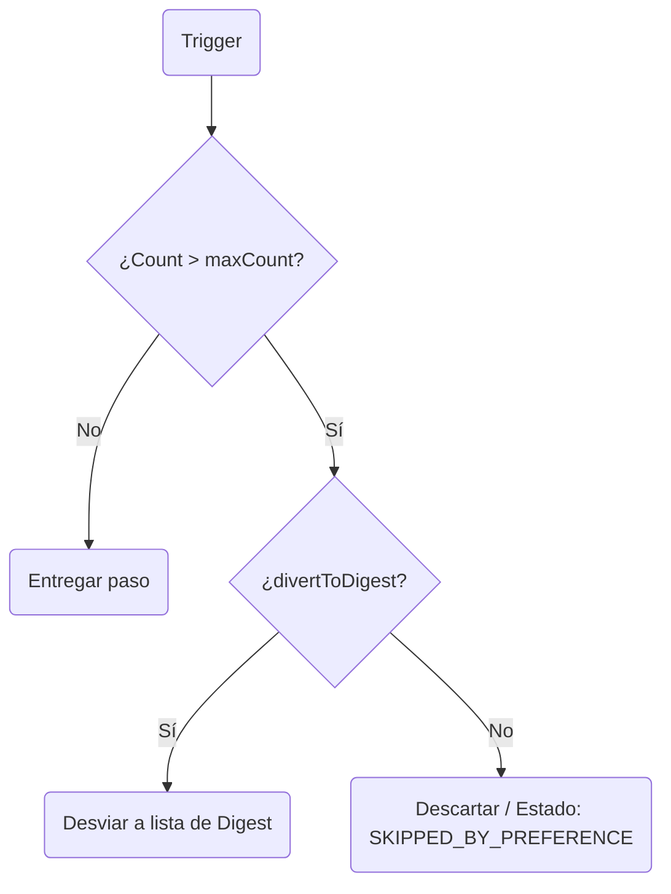

Nexus incluye gestión de estado integrada para **colapsar notificaciones ruidosas** (Digest) y **limitar las tasas de mensajes** (Throttle) a nivel de suscriptor, utilizando Redis como coordinador en tiempo real.

---

## Nodo Digest

El nodo **Digest** intercepta la ejecución del workflow, inserta el contexto del trigger en una lista de Redis y retrasa el despacho posterior. Cuando el temporizador configurado expira, Nexus vacía la lista de Redis y despacha una única notificación que contiene todos los eventos agrupados.

```mermaid
flowchart TD
  T1(Trigger 1) --> D(Nodo Digest)
  T2(Trigger 2) --> D
  T3(Trigger 3) --> D
  D -->|Acumular en Redis| Redis[(Lista de Redis)]
  Redis -->|Vaciar windowMinutes| Compile(Compilar plantilla de resumen)
  Compile --> Channel(Email / SMS / Push)
```



### Configuración

| Campo           | Tipo   | Por defecto | Descripción                                                                                       |
| :-------------- | :----- | :---------- | :------------------------------------------------------------------------------------------------ |
| `windowMinutes` | number | `30`        | El tamaño de la ventana deslizante en minutos para recolectar eventos de trigger antes de vaciar. |

### Cómo funciona

1. Cuando un trigger llega al nodo digest, el worker inserta `{ logId, at, data }` en la clave de Redis `digest:<workflowId>:<subscriberId>:<nodeId>`.
2. El estado del log se establece en `QUEUED_IN_DIGEST` y la ejecución se difiere (`deferred: true`). El ciclo de vida registra `DIGEST_HELD`.
3. Se programa un trabajo diferido de BullMQ con `jobId: "digest:<workflowId>:<nodeId>"` correspondiente a `windowMinutes`.
4. Cuando se dispara el trabajo, vacía la lista, actualiza el ciclo de vida a `DIGEST_FLUSH` e inyecta un objeto `digest` consolidado en el contexto de Handlebars:

```json
{
  "digest": {
    "count": 3,
    "items": [
      { "logId": "log-1", "at": "2026-07-28T21:00:00Z", "data": { "comment": "Nice post!" } },
      { "logId": "log-2", "at": "2026-07-28T21:01:00Z", "data": { "comment": "Love this!" } }
    ],
    "nodeId": "digest-node-id",
    "windowMinutes": 30
  }
}
```

### Formato de la plantilla de resumen

En tu plantilla de email o push del canal posterior, recorres `digest.items` usando el helper `{{#each}}` de Handlebars:

```html
<h3>You have {{ digest.count }} new updates</h3>
<ul>
  {{#each digest.items}}
  <li>On {{ at }}: {{ data.comment }}</li>
  {{/each}}
</ul>
```

---

## Nodo Throttle

El nodo **Throttle** limita la tasa de notificaciones rastreando la frecuencia de entrega en Redis. Si un suscriptor recibe más de `maxCount` mensajes dentro de `windowSeconds`, los mensajes excedentes se descartan o se desvían hacia un digest.



### Configuración

| Campo            | Tipo    | Por defecto | Descripción                                                                            |
| :--------------- | :------ | :---------- | :------------------------------------------------------------------------------------- |
| `maxCount`       | number  | `3`         | Máximo de notificaciones permitidas en la ventana.                                     |
| `windowSeconds`  | number  | `60`        | Duración de la ventana de límite de tasa en segundos.                                  |
| `divertToDigest` | boolean | `false`     | Si es `true`, el excedente de throttle se agrupa en un digest en lugar de descartarse. |

### Cómo funciona

1. Cada ejecución incrementa la clave de conteo de throttle en Redis. En el primer incremento, la clave se establece para expirar en `windowSeconds`.
2. **Por debajo del límite**: La ejecución registra `THROTTLE_PASS` y continúa inmediatamente.
3. **Por encima del límite**:
   - **`divertToDigest: false`**: La ejecución se descarta. El estado del log se establece en `SKIPPED_BY_PREFERENCE` y registra un paso del ciclo de vida `THROTTLE_LIMIT`.
   - **`divertToDigest: true`**: La ejecución se enruta a una lista de digest de Redis. El estado del log cambia a `QUEUED_IN_DIGEST` y registra `DIGEST_HELD`. Se programa un trabajo de BullMQ con `jobId: "throttle-digest:<workflowId>:<nodeId>"` para vaciar el digest cuando expire la ventana.

---

## Ejemplo de Workflow-as-code

```ts
import { defineWorkflow } from '@nexus-signal/node';

// Workflow de digest regular
defineWorkflow('comments.digest')
  .addDigest({ windowMinutes: 15 })
  .addChannel('EMAIL')
  .toDefinition();

// Workflow de throttle con desvío de excedente
defineWorkflow('payment.alerts')
  .addThrottle({
    maxCount: 2,
    windowSeconds: 300,
    divertToDigest: true,
  })
  .addChannel('SMS')
  .toDefinition();
```

---

## Relacionado

- [Workflows](/docs/platform/concepts/workflows)
- [Pipeline de entrega](/docs/platform/concepts/delivery-pipeline)
- [Workflow-as-code](/docs/sdk/workflow/workflow-as-code)
