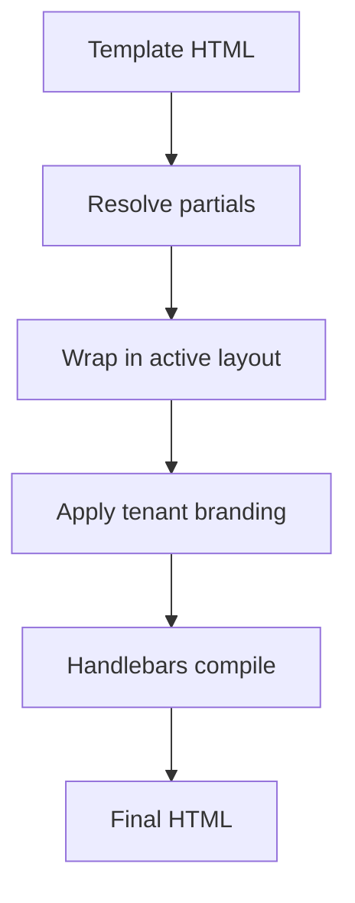

Los **layouts de email** envuelven todas las plantillas de correo electrónico en un marco HTML compartido (cabecera, pie de página, estilos). Los **partials** (parciales) son fragmentos de Handlebars reutilizables a los que se hace referencia en distintas plantillas.

## Layouts (Plantillas de Envoltorio)

Los layouts definen la estructura exterior del correo con una ranura para el contenido:

```html
<!DOCTYPE html>
<html>
  <body>
    
    <div class="content">{{{ content }}}</div>
    <footer>{{ branding.footerHtml }}</footer>
  </body>
</html>
```

Desde el panel en la sección **Templates → Layouts**. Solo se puede marcar un layout como activo por cada entorno. Las variables de marca (branding) del tenant se inyectan de manera automática cuando se establece un contexto de tenant.

## Partials (Parciales Reutilizables)

Crea bloques de código reutilizables desde **Templates → Partials**:

```html
<!-- partial: cta-button -->
<a href="{{ url }}" class="btn btn-primary">{{ label }}</a>
```

Referencia dentro de cualquier plantilla de correo:

```html
{{> cta-button url=data.checkoutUrl label="Complete purchase" }}
```

Modifica el fragmento parcial una sola vez — cualquier plantilla que lo utilice se actualizará automáticamente en el siguiente envío.

## Orden de compilación



## Relacionado

- [Marca Multi-Tenant](/docs/platform/features/tenants)
- [API de Layouts de Email](/docs/api/email-layouts)
- [Plantillas multi-idioma](/docs/platform/features/i18n)
