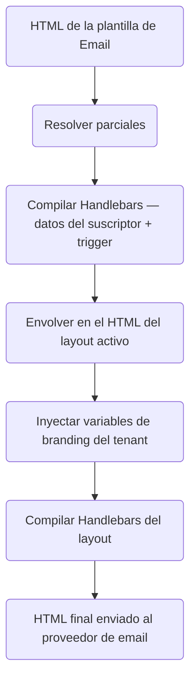

Los **layouts de email** envuelven todas las plantillas de correo en un marco HTML compartido (cabecera, pie de página, estilos). Los **parciales** (Partials) son fragmentos de Handlebars reutilizables que pueden referenciarse en múltiples plantillas. Juntos te permiten mantener una marca coherente sin duplicar HTML.

---

## Layouts de email

Un layout define la capa HTML exterior. El cuerpo de la plantilla compilada se inyecta en `{{{ content }}}`:

```html
<!DOCTYPE html>
<html>
  <head>
    <meta charset="utf-8" />
    <style>
      /* your base styles */
    </style>
  </head>
  <body>
    <header>
      
    </header>
    <main>{{{ content }}}</main>
    <footer>{{{ footerHtml }}}</footer>
  </body>
</html>
```

<Callout type="info">
  Usa llaves triples `{{{ content }}}` y `{{{ footerHtml }}}` para renderizar HTML sin escapar. Usa llaves dobles `{{ logo }}` para cadenas de URL y otros valores escalares.
</Callout>

### Variables de branding de tenant en los layouts

Cuando un trigger de workflow incluye un valor de `tenant`, los campos de branding del tenant se inyectan directamente en el contexto del layout por sus nombres de campo:

| Variable del layout  | Origen                         |
| :------------------- | :----------------------------- |
| `{{ logo }}`         | `tenant.branding.logo`         |
| `{{ primaryColor }}` | `tenant.branding.primaryColor` |
| `{{{ footerHtml }}}` | `tenant.branding.footerHtml`   |
| `{{ name }}`         | `tenant.name`                  |

Si no se establece ningún tenant en el trigger, estas variables están vacías y tu layout debe incluir valores de fallback adecuados.

### Variables del layout

Más allá del branding del tenant, puedes definir **variables estáticas personalizadas** en el propio layout (pares clave-valor en el panel de control). Estas se fusionan en el contexto junto con el branding del tenant y los datos del suscriptor.

---

## Parciales

Los parciales son fragmentos HTML reutilizables registrados por nombre. Créalos en **Templates → Partials**:

```html
<!-- partial name: cta-button -->
<a
  href="{{ url }}"
  style="display:inline-block; padding:12px 24px;
   background-color:{{ primaryColor }}; color:#fff; text-decoration:none;
   border-radius:4px;"
  >{{ label }}</a
>
```

Referencialos en cualquier plantilla de email o layout con:

```html
{{> cta-button url=data.checkoutUrl label="Complete purchase" }}
```

Cambia el parcial una vez — cada plantilla que lo utilice se actualiza en el próximo envío.

---

## Orden de compilación



---

## Asignar un layout a un workflow

En el **lienzo de Workflow** del panel de control:

1. Abre la configuración del workflow
2. Selecciona **Email Layout** — elige entre los layouts del entorno actual
3. Guarda — el layout se aplica a todos los pasos del canal de email en ese workflow

Un único layout puede estar activo en múltiples workflows. Cambiar el HTML del layout actualiza todos los workflows que lo utilizan en su próximo envío.

---

## Relacionado

- [Branding por tenant](/docs/platform/features/tenants)
- [API de layouts de email](/docs/api/email-layouts)
- [Plantillas multi-idioma](/docs/platform/features/i18n)
