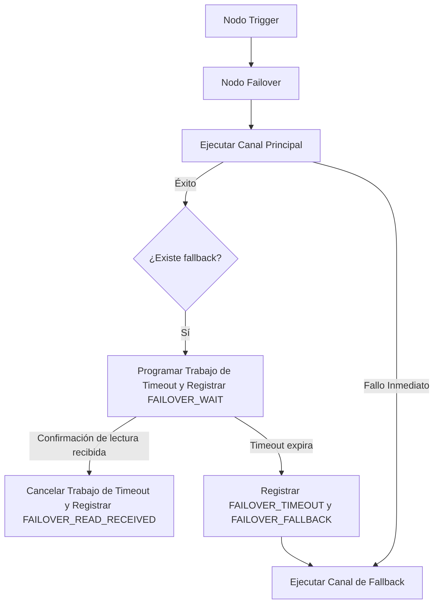

El nodo **Failover** garantiza que las alertas críticas lleguen a tus suscriptores ejecutando ramas de canal de fallback. El failover opera en dos modos: **failover inmediato** ante un fallo del proveedor y **failover con retraso de tiempo** si un mensaje permanece sin leer.

---

## Configuración

Al configurar un nodo Failover, especifica los siguientes parámetros:

| Campo             | Tipo   | Requerido | Por defecto | Descripción                                                                                  |
| :---------------- | :----- | :-------- | :---------- | :------------------------------------------------------------------------------------------- |
| `primaryChannel`  | string | ✅        | —           | Canal principal (por ejemplo, `MOBILE_PUSH`, `EMAIL`)                                        |
| `fallbackChannel` | string | —         | —           | Canal de respaldo a utilizar si el principal falla o no se lee (por ejemplo, `SMS`)          |
| `timeoutSeconds`  | number | —         | `120`       | Segundos a esperar por una confirmación de lectura antes de activar el fallback (10 a 3600). |

---

## Rutas de ejecución

### 1. Failover inmediato (Interrupción del proveedor)

Si el despacho del canal principal falla (por ejemplo, dirección de email inválida o error del proveedor) o si el [circuit breaker](/docs/platform/features/cost-reduction) del proveedor principal está abierto:

- Nexus registra el fallo bajo el paso del ciclo de vida `FAILOVER_PRIMARY`.
- Si el circuit estaba abierto, el estado se establece en `FAILED_PROVIDER_DOWN` con el error `provider_down`.
- Nexus omite inmediatamente el retraso y ejecuta el paso `fallbackChannel`, registrando `FAILOVER_FALLBACK` con la razón `circuit_open_primary` o `primary_failed`.

### 2. Failover con retraso de tiempo (Alertas sin leer)

Si el canal principal se despacha con éxito pero hay un fallback configurado:

1. **Programar vigilancia**: Nexus programa un trabajo diferido de BullMQ `failover:<logId>:<nodeId>` con un retraso de `timeoutSeconds`.
2. **Escribir metadatos en Redis**: Los parámetros de vigilancia se almacenan en Redis bajo la clave `failover:meta:<logId>` (con un TTL de `timeoutSeconds + 60`).
3. **Registrar WAIT**: La ejecución registra un paso del ciclo de vida `FAILOVER_WAIT` y establece el estado del log en `QUEUED`.
4. **Resolución**:
   - **Caso A: El usuario lee el mensaje**: Si el usuario abre o lee el mensaje antes del timeout, el evento de lectura del WebSocket/SDK invoca `acknowledgeFailoverWatch`. Esto elimina el trabajo diferido de BullMQ, limpia los metadatos de Redis, registra `FAILOVER_READ_RECEIVED` y reanuda la ejecución posterior inmediatamente.
   - **Caso B: El timeout expira**: Si el timeout expira sin una confirmación de lectura (estado `READ` u `OPENED`), el worker registra `FAILOVER_TIMEOUT` y `FAILOVER_FALLBACK` (razón: `read_timeout`), luego despacha el `fallbackChannel`.

---

## Pruebas en modo Chaos

Para probar tus rutas de failover sin esperar interrupciones reales del proveedor:

1. Navega a **Integrations** en el panel de control.
2. Activa el **Chaos Mode** en el proveedor principal.
3. Dispara un workflow. El proveedor simulará un fallo y podrás ver el failover inmediato ejecutarse en el log de auditoría del panel de control.

---

## Relacionado

- [Reducción de costos y circuit breakers](/docs/platform/features/cost-reduction)
- [Simulador sandbox](/docs/platform/features/sandbox)
- [Workflow-as-code](/docs/sdk/workflow/workflow-as-code)
