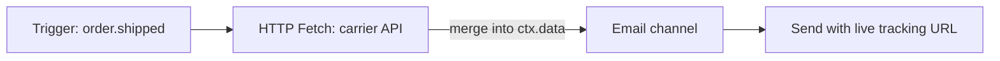

El nodo **HTTP Fetch** (Petición HTTP) realiza una solicitud HTTP durante la ejecución del flujo de trabajo y fusiona la respuesta en el contexto del flujo para que la utilicen los pasos posteriores.

## Por qué consultar datos al enviar

Sin HTTP Fetch, todos los datos deben pasarse en el momento del disparo (trigger). Esto da lugar a valores desactualizados (como URLs de seguimiento que cambian) o payloads inflados. Obtén datos en vivo cuando la notificación realmente se envíe.



## Configuración

| Campo         | Descripción                                                                                     |
| ------------- | ----------------------------------------------------------------------------------------------- |
| `url`         | URL de la solicitud — soporta Handlebars: `https://api.carrier.com/track/{{ data.trackingId }}` |
| `method`      | `GET` o `POST`                                                                                  |
| `headers`     | Cabeceras opcionales en formato clave-valor                                                     |
| `body`        | Plantilla del cuerpo POST (Handlebars)                                                          |
| `responseKey` | Clave del contexto donde guardar el JSON devuelto (por defecto se combina en `data`)            |

## Ejemplo

Obtener el estado de envío más reciente antes del correo:

```
URL:    https://api.shipping.com/v1/shipments/{{ data.shipmentId }}
Method: GET
responseKey: shipment
```

Plantilla de correo:

```html
<p>Estado: {{ shipment.status }}</p>
<a href="{{ shipment.trackingUrl }}">Seguir paquete</a>
```

## Manejo de errores

- Tiempo de espera (timeout) configurable (por defecto de worker).
- Las consultas HTTP fallidas se registran en el ciclo de vida de la ejecución; configura rutas de fallback con [condiciones de paso](/docs/platform/features/step-conditions) o nodos de failover.
- Lista de dominios permitidos (allowlist) por entorno para mayor seguridad.

## Flujo de trabajo como código

```ts
import { defineWorkflow } from "@nexus-signal/node";

defineWorkflow("order.shipped")
  .addHttpFetch({
    url: "https://api.carrier.com/track/{{ data.trackingId }}",
    method: "GET",
    responseKey: "tracking",
  })
  .addChannel("EMAIL");
```

## Relacionado

- [Concepto de Workflows](/docs/platform/concepts/workflows)
- [Flujo de trabajo como código](/docs/sdk/workflow/workflow-as-code)
