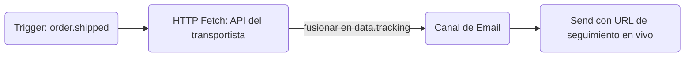

El nodo **HTTP Fetch** realiza una solicitud HTTP saliente durante la ejecución del workflow y fusiona la respuesta JSON en el contexto de `data` del workflow. Los pasos posteriores — plantillas, condiciones y nodos de IA — pueden hacer referencia a los datos obtenidos como `{{ data.<responseKey>.<field> }}`.

---

## Por qué realizar peticiones al enviar

Pasar todos los datos en el momento del trigger tiene limitaciones:

- Las URLs de seguimiento pueden cambiar entre el trigger y la entrega.
- El estado del pedido puede actualizarse en los segundos que transcurren entre la llamada a la API y el envío de la notificación.
- Se infla el payload del trigger con datos que tal vez nunca se utilicen.

HTTP Fetch resuelve esto obteniendo datos en vivo exactamente cuando se está ensamblando la notificación.



---

## Configuración

| Campo         | Tipo             | Requerido | Descripción                                                                                                       |
| :------------ | :--------------- | :-------- | :---------------------------------------------------------------------------------------------------------------- |
| `url`         | string           | ✅        | URL de solicitud — admite Handlebars: `https://api.carrier.com/track/{{ data.trackingId }}`                       |
| `method`      | `GET` \| `POST`  | —         | Método HTTP. Por defecto es `GET`                                                                                 |
| `headers`     | `{key, value}[]` | —         | Pares clave-valor de cabecera opcionales. Admite Handlebars tanto en la clave como en el valor                    |
| `body`        | string           | —         | Plantilla del cuerpo POST (Handlebars). Solo se envía para solicitudes `POST`                                     |
| `responseKey` | string           | —         | Nombre de la clave del contexto donde guardar la respuesta JSON analizada bajo `data.*`. Por defecto es `fetched` |

<Callout type="info">
  **`responseKey` por defecto**: Si no especificas una `responseKey`, la respuesta se almacena bajo
  `data.fetched`. La clave debe comenzar con una letra y contener únicamente letras, dígitos y
  guiones bajos.
</Callout>

---

## Límites

| Propiedad                              | Valor            |
| :------------------------------------- | :--------------- |
| Tiempo de espera de la solicitud       | 10 segundos      |
| Tamaño máximo de la respuesta          | 50 KB            |
| Longitud máxima de la URL de solicitud | 2,048 caracteres |
| Máximo de cabeceras personalizadas     | 10               |
| Tamaño máximo del cuerpo de solicitud  | 10 KB            |

---

## Ejemplo: obtener el estado de envío en tiempo real

**Configuración del nodo:**

```
URL:         https://api.shipping.com/v1/shipments/{{ data.shipmentId }}
Method:      GET
responseKey: shipment
```

**Plantilla de Email** (paso posterior):

```html
<p>Status: {{ data.shipment.status }}</p>
<a href="{{ data.shipment.trackingUrl }}">Track your package →</a>
```

<Callout type="warn">
  Los datos obtenidos siempre están disponibles como `data.<responseKey>` — no directamente como `{{ responseKey }}`. Esto se debe a que todos los datos de trigger, incluidos los resultados de HTTP Fetch, se almacenan bajo el namespace `data` en el contexto de la plantilla.
</Callout>

---

## Manejo de errores

- Si la solicitud **agota el tiempo de espera (times out)** después de 10 segundos, la ejecución continúa con `data.<responseKey>` establecido en `null`
- Si el cuerpo de la respuesta **no se puede analizar como JSON**, se almacena como `{ "_raw": "<contenido de texto>" }`
- Las búsquedas fallidas registran `HTTP_FETCH_FAILED` en el ciclo de vida de la ejecución; configura rutas de fallback utilizando [condiciones de paso](/docs/platform/features/step-conditions)
- La **lista de dominios permitidos (allowlisting)** está disponible por entorno para configuraciones conscientes de la seguridad

---

## Workflow-as-code

```ts
import { defineWorkflow } from '@nexus-signal/node';

defineWorkflow('order.shipped')
  .addHttpFetch({
    url: 'https://api.carrier.com/track/{{ data.trackingId }}',
    method: 'GET',
    responseKey: 'tracking',
  })
  .addChannel('EMAIL')
  .toDefinition();
```

La plantilla de correo electrónico para este workflow puede entonces hacer referencia a `{{ data.tracking.estimatedDelivery }}`, `{{ data.tracking.status }}`, etc.

---

## Ramificación condicional sobre datos obtenidos

Utiliza [condiciones de paso](/docs/platform/features/step-conditions) en un paso posterior para ramificar según el resultado obtenido:

```json
{
  "logic": "AND",
  "rules": [{ "variable": "data.tracking.status", "operator": "equals", "value": "DELAYED" }]
}
```

Adjunta esto a un nodo SMS para enviar una alerta de retraso únicamente cuando el transportista informe un retraso.

---

## Relacionado

- [Workflows](/docs/platform/concepts/workflows)
- [Condiciones de paso](/docs/platform/features/step-conditions)
- [Nodo de workflow de IA](/docs/platform/features/ai-workflow-node)
- [Workflow-as-code](/docs/sdk/workflow/workflow-as-code)
