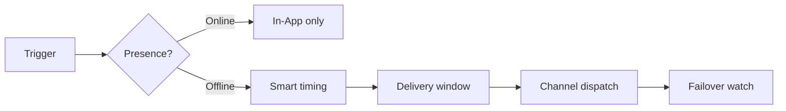

<Cards>
  <Card title="Reducción de costos" href="/docs/platform/features/cost-reduction" description="Supresión por presencia, sandbox, enrutamiento ponderado." />
  <Card title="Envío inteligente" href="/docs/platform/features/smart-send-time" description="Entrega en hora pico con IA por suscriptor." />
  <Card title="Contenido con IA" href="/docs/platform/features/ai-content" description="Genera copy para todos los canales desde un prompt." />
  <Card title="Analítica de costos" href="/docs/platform/features/cost-analytics" description="Seguimiento de gasto y alertas de presupuesto." />
  <Card title="Ventanas de entrega" href="/docs/platform/features/delivery-windows" description="Horas de silencio según zona horaria." />
  <Card title="Plantillas i18n" href="/docs/platform/features/i18n" description="Multidioma desde un solo flujo." />
  <Card title="Digest y throttle" href="/docs/platform/features/digest-throttle" description="Agrupa alertas, límites de tasa." />
  <Card title="Failover" href="/docs/platform/features/failover" description="Respaldo automático de canal." />
  <Card title="Topics" href="/docs/platform/features/topics" description="Suscripciones por categoría." />
  <Card title="Schedules" href="/docs/platform/features/schedules" description="Triggers cron y de una sola vez." />
  <Card title="Sandbox" href="/docs/platform/features/sandbox" description="Prueba sin gasto real en proveedores." />
</Cards>

## Nexus vs plataformas típicas

| Función | Nexus | Infra típica |
|---------|-------|--------------|
| Supresión por presencia | Sí | Raro |
| Envío inteligente con IA | Sí | Raro |
| Analítica de costos por proveedor | Sí | No |
| BYOP sin markup | Sí | A menudo empaquetado |
| Generación de contenido con IA | Sí | No |

## Cómo se conectan las funciones

