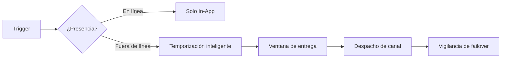

## Entrega y fiabilidad

<Cards>
  <Card
    title="Reducción de costos"
    href="/docs/platform/features/cost-reduction"
    description="Supresión por presencia, sandbox, enrutamiento ponderado."
  />
  <Card
    title="Smart send-time"
    href="/docs/platform/features/smart-send-time"
    description="Entrega en hora pico por suscriptor con IA."
  />
  <Card
    title="Ventanas de entrega"
    href="/docs/platform/features/delivery-windows"
    description="Horas de silencio con reconocimiento de zona horaria."
  />
  <Card
    title="Digest y throttle"
    href="/docs/platform/features/digest-throttle"
    description="Agrupa alertas y aplica límites de tasa."
  />
  <Card
    title="Failover"
    href="/docs/platform/features/failover"
    description="Fallback automático de canal."
  />
  <Card
    title="Sandbox"
    href="/docs/platform/features/sandbox"
    description="Prueba sin gasto real del proveedor."
  />
</Cards>

## Inteligencia de workflows

<Cards>
  <Card
    title="Condiciones de paso"
    href="/docs/platform/features/step-conditions"
    description="Reglas booleanas en cualquier nodo de workflow."
  />
  <Card
    title="Nodo HTTP Fetch"
    href="/docs/platform/features/http-fetch-node"
    description="Datos de API en vivo a mitad del workflow."
  />
  <Card
    title="Nodo de workflow de IA"
    href="/docs/platform/features/ai-workflow-node"
    description="Clasificación y copy por LLM en tiempo de ejecución."
  />
  <Card
    title="Contenido con IA"
    href="/docs/platform/features/ai-content"
    description="Genera el copy de la plantilla a partir de un prompt."
  />
</Cards>

## Mensajería de producto

<Cards>
  <Card
    title="Objetos y suscripciones"
    href="/docs/platform/features/objects-subscriptions"
    description="Fan-out a todos los que observan una entidad."
  />
  <Card
    title="Audiencias"
    href="/docs/platform/features/audiences"
    description="Segmentos dinámicos de suscriptores."
  />
  <Card
    title="Broadcasts"
    href="/docs/platform/features/broadcasts"
    description="Envíos únicos desde el panel de control."
  />
  <Card
    title="Guías dentro del producto"
    href="/docs/platform/features/guides"
    description="Banners, modales, tooltips."
  />
  <Card
    title="Branding por tenant"
    href="/docs/platform/features/tenants"
    description="White-label para clientes de SaaS B2B."
  />
  <Card
    title="Rich inbox"
    href="/docs/platform/features/rich-inbox"
    description="Pestañas, acciones, actores, filtros de etiquetas."
  />
</Cards>

## Contenido y localización

<Cards>
  <Card
    title="Archivos de traducción"
    href="/docs/platform/features/translations"
    description="{{ t 'key' }} cadenas de locale compartidas."
  />
  <Card
    title="Layouts y parciales de email"
    href="/docs/platform/features/email-layouts"
    description="Marcos compartidos y bloques HTML reutilizables."
  />
  <Card
    title="Plantillas multi-idioma"
    href="/docs/platform/features/i18n"
    description="Variantes de locale por canal."
  />
</Cards>

## Organización y analíticas

<Cards>
  <Card
    title="Topics"
    href="/docs/platform/features/topics"
    description="Grupos de preferencias por categoría."
  />
  <Card
    title="Schedules"
    href="/docs/platform/features/schedules"
    description="Triggers de cron y de un único disparo."
  />
  <Card
    title="Analíticas de costos"
    href="/docs/platform/features/cost-analytics"
    description="Seguimiento de gasto y alertas de presupuesto."
  />
</Cards>

## Nexus vs plataformas típicas

| Funcionalidad             | Nexus | Infraestructura típica         |
| ------------------------- | ----- | ------------------------------ |
| Fan-out de objetos        | Sí    | Poco común                     |
| Broadcasts desde el panel | Sí    | Solo enterprise                |
| Nodos HTTP Fetch / IA     | Sí    | Poco común                     |
| Branding por tenant       | Sí    | Solo enterprise                |
| MCP + CLI                 | Sí    | Nuevo en 2025+                 |
| BYOP sin margen           | Sí    | A menudo incluido en el precio |

## Cómo se conectan las funcionalidades

```mermaid
flowchart LR
  T[Trigger] --> P{¿Presencia?}
  P -->|En línea| I[Solo In-App]
  P -->|Fuera de línea| S[Temporización inteligente]
  S --> W[Ventana de entrega]
  W --> C[Despacho de canal]
  C --> F[Vigilancia de failover]
```
