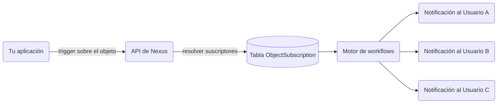

Los **objetos** (Objects) son entidades de primer nivel en Nexus — piensa en proyectos, documentos, pedidos o cualquier recurso al que tus usuarios se suscriban. Al disparar un workflow con un objeto como destinatario, Nexus resuelve automáticamente todos los suscriptores y ejecuta el workflow para cada uno de ellos.

---

## El problema que resuelven los objetos

Sin objetos, cada trigger de envío en abanico requiere que tu backend:

1. Consulte tu base de datos para responder a "¿quién está observando este recurso?".
2. Construya una lista de IDs de destinatarios.
3. Pase esa lista completa en cada llamada de trigger.

Los objetos trasladan esa relación directamente a Nexus, de modo que un único trigger realiza la entrega a todos los observadores automáticamente.



---

## Conceptos

| Término                        | Descripción                                                                   |
| :----------------------------- | :---------------------------------------------------------------------------- |
| **Colección (Collection)**     | Un grupo de tipo lógico (por ejemplo, `"projects"`, `"orders"`, `"channels"`) |
| **Objeto (Object)**            | Una sola entidad dentro de una colección, identificada por `externalId`       |
| **Suscripción (Subscription)** | Un mapeo de un suscriptor a un objeto con propiedades opcionales              |

---

## Crear o actualizar un objeto

Los objetos se crean o actualizan mediante upsert — llamar al método `set` sobre un `externalId` existente actualiza sus campos.

**SDK de Node:**

```ts
await nexus.objects.set({
  collection: 'projects',
  externalId: 'proj_alpha',
  name: 'Project Alpha',
  properties: { status: 'active', owner: 'team-eng' },
});
```

**API de Gestión (lado del servidor, clave `sk_*`):**

```http
PUT /v1/management/objects/projects/proj_alpha
Authorization: Bearer sk_prd_…
Content-Type: application/json

{
  "name": "Project Alpha",
  "properties": { "status": "active", "owner": "team-eng" }
}
```

<Callout type="info">
  **Nota sobre las variables**: Debido a que los objetos se resuelven y eliminan duplicados a
  perfiles de suscriptores sin procesar en el momento del trigger, las propiedades específicas de
  los objetos no están disponibles automáticamente dentro de los contextos de las variables de la
  plantilla. Para mostrar los detalles del objeto (como el nombre o el estado de un proyecto) en tus
  notificaciones, pásalos en el payload `data` de la solicitud del trigger.
</Callout>

---

## Gestionar suscripciones

**Añadir suscriptores a un objeto:**

```ts
await nexus.objects.addSubscriptions('projects', 'proj_alpha', {
  recipients: ['user_alice', 'user_bob'],
  // o: recipients: [{ externalId: 'user_alice' }]
});
```

**Eliminar suscriptores de un objeto:**

```ts
await nexus.objects.removeSubscriptions('projects', 'proj_alpha', ['user_bob']);
```

<Callout type="info">
  Los destinatarios ya deben existir como **suscriptores** en el mismo entorno antes de que puedan
  añadirse a un objeto. Utiliza `nexus.subscribers.identify()` primero si aún no los has creado.
</Callout>

El campo `recipients` acepta cadenas simples `externalId` o bien objetos con la estructura `{ externalId: string }`.

---

## Disparar con envío en abanico (fan-out) de objetos

Pasa un destinatario de objeto utilizando `{ collection, id }` en tu llamada del trigger:

```ts
await nexus.workflows.trigger({
  workflowName: 'project.updated',
  recipients: [{ collection: 'projects', id: 'proj_alpha' }],
  data: { changeType: 'milestone_completed', updatedBy: 'sarah' },
});
```

El worker del workflow resuelve todos los suscriptores activos de `proj_alpha` y ejecuta un workflow por suscriptor. El contexto del suscriptor (`subscriber.email`, `subscriber.locale`, etc.) está disponible en las plantillas de forma normal.

---

## Mezclar objetos y suscriptores

Una sola llamada de trigger puede incluir tanto objetos como suscriptores individuales:

```ts
await nexus.workflows.trigger({
  workflowName: 'project.updated',
  recipients: [
    { collection: 'projects', id: 'proj_alpha' }, // envío en abanico a todos los observadores
    { externalId: 'admin_user' }, // suscriptor individual explícito
  ],
  data: { changeType: 'status_change' },
});
```

---

## Propiedades de suscripción por objeto

Al añadir suscriptores, puedes almacenar metadatos a nivel de suscripción:

```ts
await nexus.objects.addSubscriptions('projects', 'proj_alpha', {
  recipients: ['user_alice'],
  properties: { role: 'owner', notifyOnAll: true },
});
```

---

## Preferencias por objeto

Los suscriptores pueden silenciar un objeto específico mientras mantienen activas las notificaciones para otros. La preferencia se delimita bajo la clave del objeto en la matriz de preferencias del suscriptor — sin necesidad de realizar cambios en el código de tu lado.

---

## Límites de la API

| Límite                                                   | Valor                 |
| :------------------------------------------------------- | :-------------------- |
| Máximo de objetos por entorno                            | Configurable por plan |
| Máximo de suscripciones por objeto                       | Configurable por plan |
| Máximo de destinatarios por llamada a `addSubscriptions` | 100                   |

---

## Relacionado

- [Guía de envío en abanico de objetos](/docs/platform/guides/object-fanout)
- [API de Objetos](/docs/api/objects)
- [SDK de Node](/docs/sdk/backend/node)
- [Broadcasts](/docs/platform/features/broadcasts)
