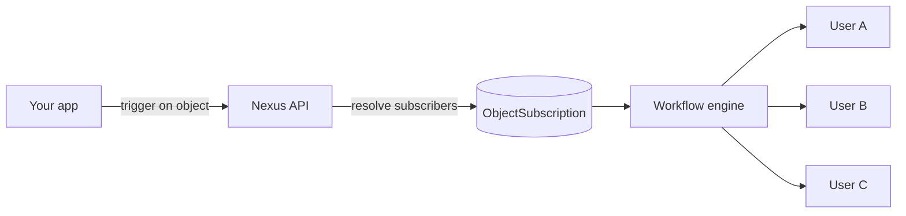

Los **objetos** son entidades de primer nivel (como proyectos, documentos, pedidos, canales) a las cuales los usuarios pueden suscribirse. Al disparar un flujo de trabajo con un objeto como destinatario, Nexus realiza automáticamente un envío en abanico a todos los suscriptores.

## Por qué son importantes los objetos

Sin objetos, cada disparo (trigger) requiere que tu backend consulte "¿quién está observando esto?" y pase una lista completa de destinatarios. Los objetos trasladan esa relación directamente a Nexus.



## Crear un objeto

Desde el panel en la sección **Objects** (Objetos), o a través de la API/SDK:

```ts
await nexus.objects.set({
  collection: "projects",
  externalId: "proj_alpha",
  name: "Project Alpha",
  properties: { status: "active", owner: "team-eng" },
});
```

Las propiedades de los objetos están disponibles en las plantillas como `{{ object.name }}`, `{{ object.properties.status }}`.

## Gestionar suscripciones

```ts
await nexus.objects.addSubscriptions("projects", "proj_alpha", {
  recipients: ["user_alice", "user_bob"],
});

await nexus.objects.removeSubscriptions("projects", "proj_alpha", ["user_bob"]);
```

## Disparar con envío en abanico (Fan-out) de objetos

Pasa el objeto en lugar de los usuarios individuales:

```ts
await nexus.workflows.trigger({
  workflowName: "project.updated",
  recipients: [{ collection: "projects", id: "proj_alpha" }],
  data: { changeType: "milestone_completed", milestone: "v1.0" },
});
```

El worker resuelve todos los suscriptores suscritos y ejecuta el flujo de trabajo para cada uno de ellos.

## Preferencias por objeto

Los suscriptores pueden silenciar un objeto específico mientras mantienen otros activos. Las preferencias se estructuran dentro del JSON de `preferences` de cada suscriptor bajo las claves correspondientes al objeto.

## Relacionado

- [Guía de notificaciones en abanico de objetos](/docs/platform/guides/object-fanout)
- [API de Objetos](/docs/api/objects)
- [Objetos en el SDK de Node](/docs/sdk/backend/node)
