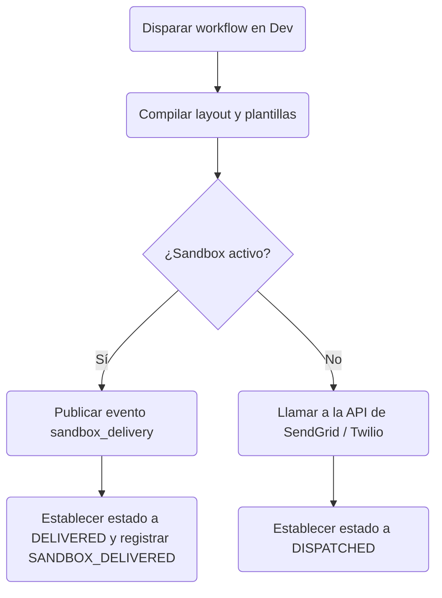

El **Modo Sandbox** se activa automáticamente para todos los canales externos en el entorno de **Development**. En lugar de realizar solicitudes de API salientes a proveedores como SendGrid o Twilio, Nexus intercepta el despacho y lo enruta a través de un simulador sandbox.

---

## Cómo funciona el simulador sandbox

1. Cuando un workflow llega a un paso de canal (por ejemplo, email, SMS, push, webhook), se evalúa el contexto de ejecución.
2. El compilador detecta que el nombre del entorno es `development` (`ctx.sandboxMode = true`).
3. El despacho saliente se enruta al **Proveedor Sandbox** (`sandbox`) en lugar de las integraciones de operador en vivo.
4. El simulador publica un evento en tiempo real de tipo `sandbox_delivery` en el canal de pub/sub de Redis.
5. El log de ejecución actualiza el estado directamente a **`DELIVERED`** (en lugar de `DISPATCHED`) y añade el paso del ciclo de vida `SANDBOX_DELIVERED`.
6. El cuerpo del payload compilado, la línea de asunto y las propiedades sin procesar se guardan en `responseMeta.outbound` con `sandbox: true`.



---

## Consola sandbox del panel de control

Puedes ver y probar las entregas sandbox en el panel de control:

1. Navega a **Activities → Sandbox** en el panel de control.
2. La página establece una conexión WebSocket y escucha los eventos `sandbox_delivery`.
3. Verás mocks en tiempo real de:
   - Burbujas de SMS con el cuerpo sin procesar.
   - Marcos HTML mostrando los emails compilados.
   - Banners de push.
   - Payloads de Slack y MS Teams.

Esto te permite probar la tipografía, la sustitución de variables Handlebars, los parciales de layout y los flujos de lógica en tiempo real sin costos reales del proveedor.

---

## Modo Chaos (Pruebas de interrupción)

Simula interrupciones del proveedor de API directamente en tu entorno de desarrollo para probar cómo gestionan las interrupciones tus workflows:

1. Navega a **Integrations** en el panel de control.
2. Selecciona cualquier tarjeta de integración y activa el **Chaos Mode** a `on` (esto establece `environment.chaosMode = true`).
3. Cuando dispares un workflow en development, el despachador del proveedor intercepta la llamada y fuerza un error simulado `503 Service Unavailable`, devolviendo:
   ```json
   { "error": "Chaos mode simulated failure" }
   ```
4. Esto activa las rutas de [failover](/docs/platform/features/failover) del workflow o los circuit breakers inmediatamente, permitiéndote depurar las ramas de fallback en el log de auditoría.

---

## Comportamientos por entorno

| Canal                 | Development (Sandbox)     | Staging / Production             |
| :-------------------- | :------------------------ | :------------------------------- |
| **Inbox In-App**      | Entrega WebSocket en vivo | Entrega WebSocket en vivo        |
| **Email**             | Sandbox (simulado)        | Despacho SMTP / API real         |
| **SMS y WhatsApp**    | Sandbox (simulado)        | Despacho real de Twilio / Sinch  |
| **Mobile y Web Push** | Sandbox (simulado)        | Despacho real de FCM / APNs      |
| **Webhooks y Chat**   | Sandbox (simulado)        | Despacho real de Slack / Discord |

---

## Relacionado

- [Entornos](/docs/platform/getting-started/environments)
- [Failover de proveedor](/docs/platform/features/failover)
- [Quickstart](/docs/platform/getting-started/quickstart)
