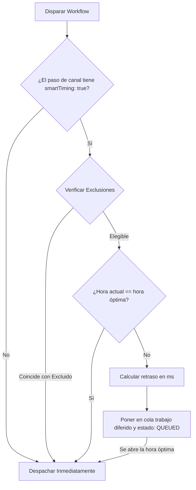

**Smart Send-Time** es una función de machine learning que aprende cuándo es más probable que cada suscriptor lea o abra los mensajes. Retrasa automáticamente la entrega hasta la hora de mayor engagement local del suscriptor, aumentando las tasas de lectura y minimizando la fatiga por notificaciones.

---

## Cómo funciona

1. **Rastrear el engagement**: Nexus monitorea los eventos `READ` y `OPENED` en los logs de ejecución para cada suscriptor (usando una ventana retrospectiva de 60 días).
2. **Calcular la matriz de puntuación**: Un servicio de puntuación en segundo plano recalcula una matriz de engagement por hora (24 horas × 7 días) en la zona horaria local del suscriptor cada **6 horas**.
3. **Guardar en Redis**: La hora de mayor engagement calculada se almacena en caché en Redis bajo `engagement:scores:<subscriberId>`.
4. **Evaluar al enviar**: Cuando se ejecuta un paso de canal con la temporización inteligente habilitada:
   - Si la hora actual ya es la hora óptima, la ejecución continúa inmediatamente, registrando `SMART_TIMING_PASS` con `reason: "already_optimal"`.
   - Si no es la hora óptima, Nexus calcula el retraso en milisegundos hasta la próxima ocurrencia de esa hora, programa un trabajo diferido de BullMQ `smartTiming:<logId>:<nodeId>`, actualiza el estado del log a `QUEUED` y registra `SMART_TIMING_HOLD`.



---

## Exclusiones y fallbacks

### Hora de fallback

Si un suscriptor tiene un historial de engagement insuficiente (menos de **5 eventos registrados**), el modelo de temporización hace fallback a un valor por defecto de **10:00 AM hora local** (usando `reason: "fallback"`).

### Exclusiones de ejecución

La temporización inteligente se desactiva automáticamente para:

- **Canales excluidos**: Los pasos In-App (`IN_APP`) y Webhook (`WEBHOOK`) se entregan inmediatamente.
- **Estructuras de workflow**: Cualquier workflow que contenga un nodo de [Ventana de entrega](/docs/platform/features/delivery-windows) en cualquier parte de su grafo queda excluido de la optimización de temporización.
- **Triggers programados**: Workflows iniciados a través de plantillas cron programadas.
- **Flag aplicado**: Si la temporización inteligente ya se aplicó anteriormente en la misma ejecución del workflow.

---

## Configuración en el lienzo

Para habilitar la temporización inteligente:

1. Haz clic en cualquier nodo de canal (Email, SMS, Push, WhatsApp, Chat) en el lienzo del workflow.
2. En la barra lateral derecha, activa **AI Send Time** (Tiempo de envío con IA).
3. Guarda el workflow.

---

## Workflow-as-code

En tus definiciones de TypeScript, pasa `smartTiming: true` en la configuración del canal:

```ts
import { defineWorkflow } from '@nexus-signal/node';

defineWorkflow('marketing.newsletter')
  .addChannel('EMAIL', {
    smartTiming: true,
  })
  .toDefinition();
```

---

## Relacionado

- [Ventanas de entrega](/docs/platform/features/delivery-windows) — horas de silencio estáticas (las ventanas de entrega tienen precedencia si ambas están definidas en un workflow)
- [Reducción de costos](/docs/platform/features/cost-reduction) — combina la temporización con la supresión por presencia
- [API de Suscriptores](/docs/api/subscribers) — configurar las zonas horarias de los suscriptores
