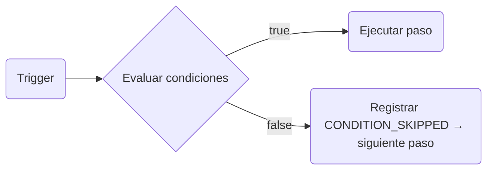

Las **condiciones de paso** te permiten adjuntar reglas de filtrado a cualquier nodo en el lienzo de workflow. Si las condiciones se evalúan como `false`, el paso se **omite** (skipped) y la ejecución continúa hacia el siguiente nodo — no se lanza ningún error ni se produce ningún reintento.

---

## Cómo funcionan las condiciones

Cuando el motor de workflows llega a un paso que tiene condiciones configuradas, evalúa todas las reglas con respecto al contexto de ejecución en vivo **antes** de ejecutar el paso. Los pasos omitidos se registran como `CONDITION_SKIPPED` en el árbol del ciclo de vida de ejecución.



---

## Estructura de las condiciones

```json
{
  "logic": "AND",
  "rules": [
    { "variable": "data.amount", "operator": "greater_than", "value": 500 },
    { "variable": "subscriber.locale", "operator": "equals", "value": "en" }
  ]
}
```

- `logic`: `"AND"` (todas las reglas deben cumplirse) o `"OR"` (basta con que se cumpla una sola regla)
- `rules`: Matriz de objetos de regla, cada uno con `variable`, `operator` y `value`

---

## Namespaces de variables compatibles

Las variables se resuelven a partir del contexto de ejecución en vivo en el momento en que se ejecuta el paso. Esto significa que los datos enriched por pasos anteriores (por ejemplo, el output de un HTTP Fetch) están disponibles.

| Namespace      | Variables de ejemplo                                             | Origen                                                        |
| :------------- | :--------------------------------------------------------------- | :------------------------------------------------------------ |
| `data.*`       | `data.amount`, `data.plan`, `data.status`                        | Payload del trigger + output de HTTP Fetch / AI Node          |
| `subscriber.*` | `subscriber.email`, `subscriber.locale`, `subscriber.externalId` | Registro del suscriptor                                       |
| `env.*`        | `env.name`                                                       | Nombre del entorno actual (`development`, `production`, etc.) |

<Callout type="warn">
  Únicamente se admiten `data.*`, `subscriber.*` y `env.*`. Las variables como `tenant.*` o
  `object.*` no se resuelven en las condiciones de paso.
</Callout>

---

## Operadores compatibles

| Operador                 | Funciona en         | Descripción                                                   |
| :----------------------- | :------------------ | :------------------------------------------------------------ |
| `equals`                 | String, number      | Igualdad estricta de cadenas después de la coerción           |
| `not_equals`             | String, number      | Negación de `equals`                                          |
| `greater_than`           | Number              | Comparación `>`                                               |
| `greater_than_or_equals` | Number              | Comparación `>=`                                              |
| `less_than`              | Number              | Comparación `<`                                               |
| `less_than_or_equals`    | Number              | Comparación `<=`                                              |
| `contains`               | String              | Coincidencia de subcadena                                     |
| `not_contains`           | String              | Coincidencia de subcadena invertida                           |
| `starts_with`            | String              | Coincidencia de prefijo                                       |
| `ends_with`              | String              | Coincidencia de sufijo                                        |
| `is_empty`               | String, array, null | `null`, `""` o `[]`                                           |
| `is_not_empty`           | String, array, null | No vacío                                                      |
| `in_list`                | String              | El valor está en una lista separada por comas o en una matriz |
| `not_in_list`            | String              | El valor no está en la lista                                  |
| `regex_match`            | String              | Prueba contra una expresión regular                           |
| `is_true`                | Boolean             | `true`, `"true"` o `1`                                        |
| `is_false`               | Boolean             | `false`, `"false"`, `0` o `null`                              |

---

## Uso en el lienzo

1. Haz clic en cualquier nodo en el lienzo de workflow.
2. Abre el panel de **Conditions** (Condiciones) en la barra lateral derecha.
3. Añade reglas utilizando el selector de campos, el menú desplegable de operadores y la entrada de valor.
4. Elige la lógica **AND** o **OR**.

Las reglas surten efecto en el próximo trigger del workflow — sin necesidad de realizar un nuevo despliegue.

---

## Uso de condiciones con datos dinámicos

Después de un paso de **HTTP Fetch** o **AI Node**, su output está disponible en `data.*` para las condiciones subsiguientes. Por ejemplo, si un paso de HTTP Fetch utiliza `responseKey: "invoice"`, puedes condicionar un paso de email según `data.invoice.status`:

```json
{
  "logic": "AND",
  "rules": [{ "variable": "data.invoice.status", "operator": "equals", "value": "overdue" }]
}
```

---

## Ejemplo de Workflow-as-code

```ts
import { defineWorkflow } from '@nexus-signal/node';

defineWorkflow('invoice.reminder')
  .addChannel('EMAIL')
  .addChannel('SMS', {
    conditions: {
      logic: 'AND',
      rules: [
        { variable: 'data.amount', operator: 'greater_than', value: 500 },
        { variable: 'subscriber.locale', operator: 'equals', value: 'en' },
      ],
    },
  })
  .toDefinition();
```

La opción `conditions` está disponible en todos los métodos de los constructores de pasos: `addChannel`, `addDelay`, `addDigest`, `addThrottle`, `addHttpFetch` y `addAiNode`.

---

## Relacionado

- [Workflows](/docs/platform/concepts/workflows)
- [Nodo HTTP Fetch](/docs/platform/features/http-fetch-node)
- [Nodo de workflow de IA](/docs/platform/features/ai-workflow-node)
- [Workflow-as-code](/docs/sdk/workflow/workflow-as-code)
