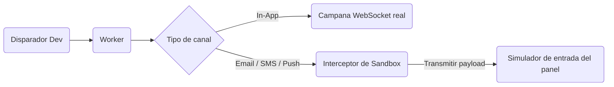
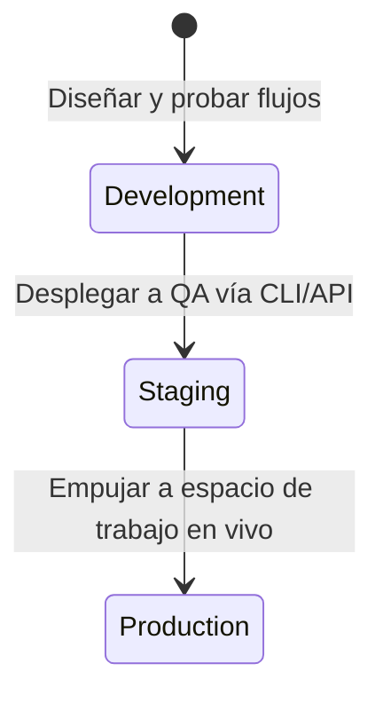

# Entornos y alcances

Cada espacio de trabajo de Nexus Signal está dividido en **tres entornos completamente aislados**: **Desarrollo (Development)**, **Staging** y **Producción (Production)**.

Cada entorno opera como una partición de base de datos lógica independiente, lo que significa que los flujos de trabajo, plantillas, suscriptores, preferencias, temas (topics) y configuraciones de inquilinos (tenants) **no cruzan fronteras**.

---

## Matriz de entornos

| Funcionalidad                  | Desarrollo (Development)                                   | Staging                                                    | Producción (Production)                              |
| :----------------------------- | :--------------------------------------------------------- | :--------------------------------------------------------- | :--------------------------------------------------- |
| **Claves API**                 | `pk_dev_*` / `sk_dev_*`                                    | `pk_stg_*` / `sk_stg_*`                                    | `pk_prd_*` / `sk_prd_*`                              |
| **Despacho saliente**          | **Intercepción en Sandbox** (APIs de operadores simuladas) | Despacho de operadores reales (Postmark, Twilio, SendGrid) | Despacho de operadores reales (Usuarios en vivo)     |
| **Entrega integrada (In-App)** | WebSockets en vivo para sesiones activas de clientes       | WebSockets en vivo para sesiones activas de clientes       | WebSockets en vivo para sesiones activas de clientes |
| **Alcance de base de datos**   | Aislado                                                    | Aislado                                                    | Aislado                                              |
| **Modo Caos (Failover)**       | Activado (Permite simular caídas de proveedores)           | Desactivado                                                | Desactivado                                          |

---

## Desarrollo y modo Sandbox

El entorno de **Development** está diseñado para la integración local y las pruebas automatizadas.

Para ahorrar créditos de los operadores y evitar el envío accidental de mensajes a usuarios reales durante el desarrollo, los nodos de salida (correo electrónico, SMS, notificaciones push, WhatsApp, plataformas de chat) se enrutan directamente a un **sandbox virtual** en lugar de llamar a APIs externas.

- **Simulador de bandeja de entrada**: En el panel de control, puedes ver el HTML compilado completo, el texto SMS o el payload JSON tal como le aparecería al usuario.
- **Desactivar el Sandbox (Bypass)**: Si necesitas probar una entrega real en Development (por ejemplo, probar un diseño de correo electrónico real en tu cliente de correo), activa la opción **Integrations → Development Integrations → Bypass Sandbox** para ese proveedor.

---

## Flujo de promoción del espacio de trabajo

Para desplegar los cambios desde Development hacia Production, utiliza nuestro pipeline de promoción en lugar de replicar los diseños manualmente:

### Promoción de workflows como código (Recomendado)

Al definir tus árboles de pasos dentro de tu repositorio, tu pipeline de promoción se gestiona automáticamente a través de ramas de git:

1. **Rama Dev**: Ejecuta `npx nexus-signal sync --env dev` dentro de tu espacio de trabajo local.
2. **Rama Principal (Main)**: Dispara `npx nexus-signal sync --env prd` desde tu pipeline de CI/CD al fusionar (merge).

Para más detalles, consulta la documentación de [Workflow-as-code](/docs/sdk/workflow/workflow-as-code).

---

## Separación de suscriptores

Los suscriptores están completamente aislados en sandboxes. Un suscriptor creado con `externalId: usr_99` usando `sk_dev_*` **no existe** en el entorno `sk_prd_*`.

- Asegúrate de que el disparador de registro (onboarding trigger) de tu servidor cree o registre el perfil del suscriptor cada vez que cambies de entorno.
- Prueba las preferencias y temas (topics) de manera independiente en cada etapa.
