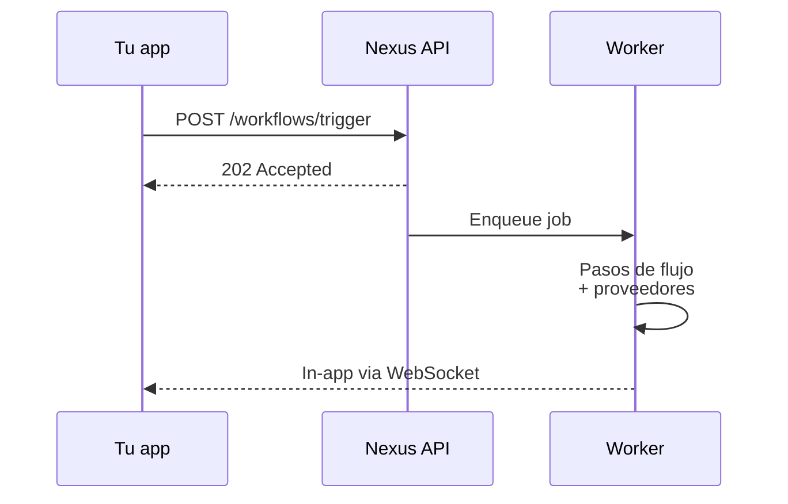

Bienvenido a Nexus Signal. Esta sección te guía desde cero hasta un trigger funcional en tres pasos: **workspace → proveedores → trigger con SDK**.

<Cards>
  <Card
    title="Inicio rápido"
    href="/docs/platform/getting-started/quickstart"
    description="Primer trigger en menos de 5 minutos."
  />
  <Card
    title="Entornos"
    href="/docs/platform/getting-started/environments"
    description="Claves de Dev, Staging y Production."
  />
  <Card
    title="Autenticación"
    href="/docs/platform/getting-started/authentication"
    description="Claves secretas, claves públicas, HMAC."
  />
</Cards>

## Requisitos previos

- Una cuenta de Nexus Signal ([regístrate gratis](https://app.nexussignal.dev))
- Node.js 18+ para el SDK de servidor
- Al menos una cuenta de proveedor (SendGrid, Resend, Twilio, etc.)

## Cómo funciona la entrega

Cada entrega se registra con estados completos del ciclo de vida para depuración y analítica.
