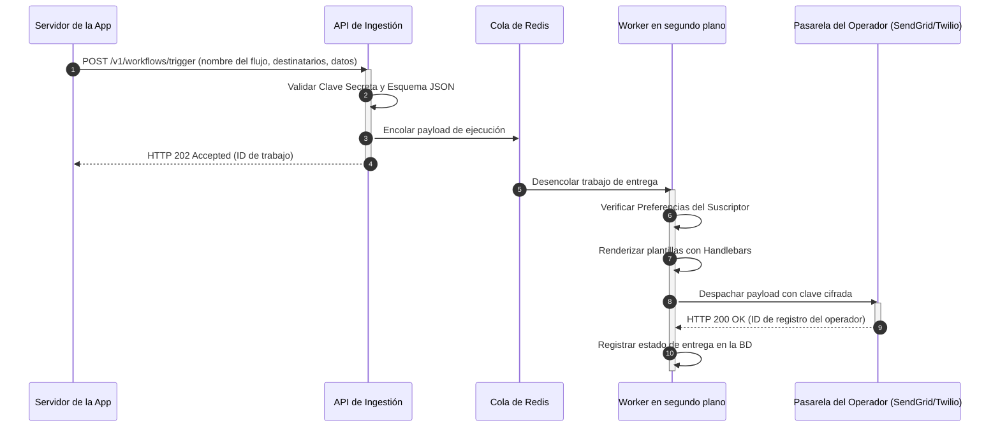

# Primeros pasos

Bienvenido a **Nexus Signal**. Esta sección te guiará desde la creación de una cuenta nueva hasta la ejecución de tu primer flujo de trabajo de notificaciones multicanal.

Para comenzar, realizarás tres pasos fundamentales:

1. **Configuración del espacio de trabajo**: Crear tu espacio de trabajo y obtener tus claves de entorno.
2. **Configuración de proveedores**: Conectar las claves de tus operadores (SendGrid, Twilio, Resend, etc.) en el panel de control.
3. **Evento desencadenante (Trigger)**: Emitir un payload POST desde tu aplicación de backend utilizando nuestros SDKs.

---

<Cards>
  <Card
    title="Guía de inicio rápido"
    href="/docs/platform/getting-started/quickstart"
    description="Activa tu primer flujo de trabajo y verifica los registros de entrega en menos de 5 minutos."
  />
  <Card
    title="Entornos y alcances"
    href="/docs/platform/getting-started/environments"
    description="Administra espacios de trabajo aislados para las etapas de Desarrollo (Development), Staging y Producción (Production)."
  />
  <Card
    title="Autenticación y seguridad"
    href="/docs/platform/getting-started/authentication"
    description="Configura claves secretas del lado del servidor, claves públicas del lado del cliente y firmas HMAC seguras."
  />
</Cards>

---

## Requisitos previos

Antes de comenzar con tu integración, asegúrate de tener:

- Una **cuenta de Nexus Signal**: Regístrate gratis en el [Panel de control de Nexus](https://app.nexussignal.dev).
- **Node.js 18+** (o entornos de backend compatibles) para ejecutar los SDKs del lado del servidor.
- **Claves de proveedor activas**: Credenciales de al menos un canal de entrega (por ejemplo, correo electrónico a través de SendGrid, SMS a través de Twilio, notificaciones push a través de Firebase Cloud Messaging).

---

## El flujo de integración

Nexus funciona de forma asíncrona. Tu aplicación envía eventos a nuestra API, la cual los encola instantáneamente para su ejecución en segundo plano:

```mermaid
sequenceDiagram
    autonumber
    participant App as Servidor de la App
    participant API as API de Ingestión
    participant Q as Cola de Redis
    participant Worker as Worker en segundo plano
    participant Carrier as Pasarela del Operador (SendGrid/Twilio)

    App->>API: POST /v1/workflows/trigger (nombre del flujo, destinatarios, datos)
    activate API
    API->>API: Validar Clave Secreta y Esquema JSON
    API->>Q: Encolar payload de ejecución
    API-->>App: HTTP 202 Accepted (ID de trabajo)
    deactivate API

    Q->>Worker: Desencolar trabajo de entrega
    activate Worker
    Worker->>Worker: Verificar Preferencias del Suscriptor
    Worker->>Worker: Renderizar plantillas con Handlebars
    Worker->>Carrier: Despachar payload con clave cifrada
    activate Carrier
    Carrier-->>Worker: HTTP 200 OK (ID de registro del operador)
    deactivate Carrier
    Worker->>Worker: Registrar estado de entrega en la BD
    deactivate Worker
```

Cada etapa de este ciclo de vida es observable en tiempo real desde las pantallas de **Registros de Auditoría** y del **Depurador** en el panel de control.
