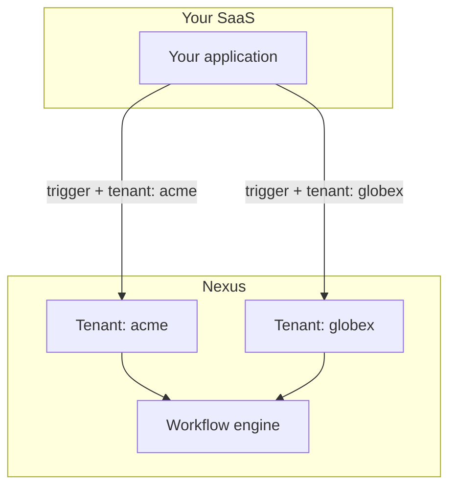

Si tu producto sirve a múltiples empresas (tenants), los **Tenants** de Nexus permiten que cada cliente reciba notificaciones con su propia marca sin necesidad de crear espacios de trabajo de Nexus independientes.

## Arquitectura



**Organización** = tu espacio de trabajo de Nexus. **Tenant** = la empresa de tu cliente dentro de ese espacio de trabajo.

## Paso 1 — Crear tenants

Cuando un nuevo cliente se registra en tu aplicación:

```ts
await nexus.tenants.upsert({
  externalId: "tenant_acme",
  name: "Acme Corp",
  branding: {
    logoUrl: "https://cdn.acme.io/logo.png",
    primaryColor: "#2563eb",
    companyName: "Acme Corp",
    footerHtml: "<p>© Acme Corp · support@acme.io</p>",
  },
});
```

Campos de marca (branding) compatibles: `logo`, `logoUrl`, `primaryColor`, `iconUrl`, `companyName`, `footerHtml`, `headerHtml`.

## Paso 2 — Aplicar branding en los layouts de email

Crea un [layout de email](/docs/platform/features/email-layouts) que haga referencia al branding:

```html

<div style="color: {{ branding.primaryColor }}">{{{ content }}}</div>
<footer>{{ branding.footerHtml }}</footer>
```

Cuando un trigger incluye un `tenant`, el compilador inyecta la marca de ese tenant de forma automática.

## Paso 3 — Disparar con contexto de tenant

```ts
await nexus.workflows.trigger({
  workflowName: "invoice.sent",
  tenant: "tenant_acme",
  recipients: [{ externalId: user.id, email: user.email }],
  data: { invoiceId: "INV-001", amount: "$500" },
});
```

## Paso 4 — Preferencias por tenant (opcional)

Establece `preferenceDefaults` en el tenant para controlar las preferencias predeterminadas de suscripción (opt-in/opt-out) para los nuevos suscriptores de ese tenant.

## Paso 5 — Filtrar feed in-app por tenant

Las notificaciones del SDK admiten la delimitación por tenant mediante un parámetro de consulta:

```http
GET /v1/sdk/notifications?subscriberExternalId=user_42&tenantId=tenant_acme
```

Utiliza esta opción cuando tu aplicación muestre un centro de notificaciones delimitado para cada tenant.

## Lista de verificación (Checklist)

<Steps>
  <Step>
    Crea el tenant cuando el cliente se registre (sincroniza `externalId` con tu
    base de datos).
  </Step>
  <Step>
    Almacena los recursos de marca (las URLs de los logos deben ser HTTPS y de
    acceso público).
  </Step>
  <Step>
    Pasa el `tenant` en cada trigger para los usuarios de ese cliente.
  </Step>
  <Step>Prueba en Desarrollo con dos tenants antes de Production.</Step>
</Steps>

## Relacionado

- [Marca Multi-Tenant](/docs/platform/features/tenants)
- [Layouts de Email](/docs/platform/features/email-layouts)
- [API de Tenants](/docs/api/tenants)
