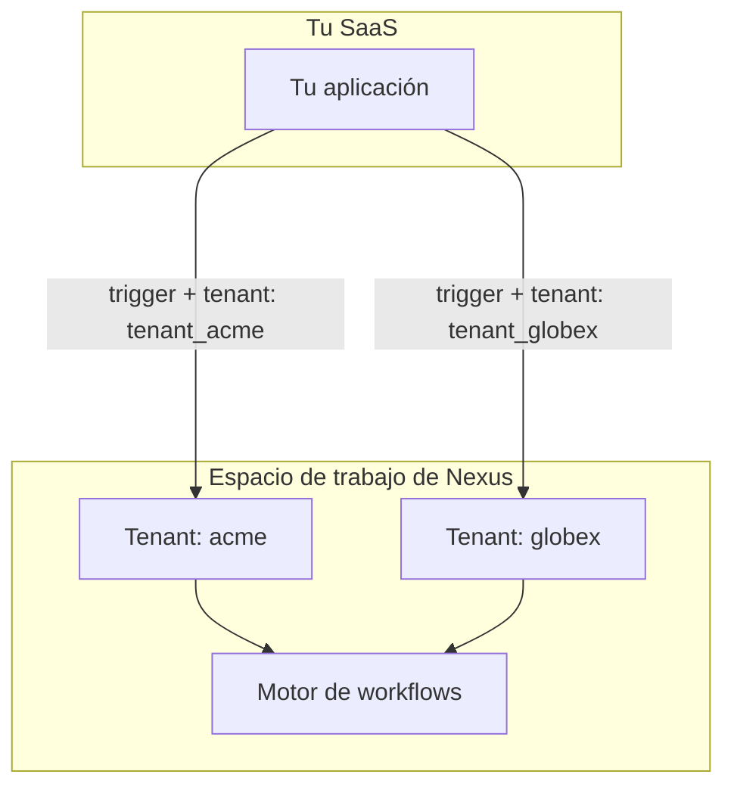

Si tu producto sirve a múltiples empresas, los **Tenants** de Nexus permiten que cada cliente reciba notificaciones con su propia marca sin necesidad de crear espacios de trabajo independientes por cliente.

---

## Cómo funciona



**Organización (Organization)** = tu espacio de trabajo de Nexus (uno por producto).
**Inquilino (Tenant)** = uno de tus clientes B2B dentro de ese espacio de trabajo.

El campo `tenant` en el payload del trigger le indica a Nexus qué contexto de marca del cliente debe aplicar al compilar el mensaje.

---

## Paso 1 — Registrar tenants

Llama al método `upsert` del SDK de Node cada vez que una nueva empresa se registre en tu aplicación:

```ts
import { NexusClient } from '@nexus-signal/node';

const nexus = new NexusClient({ secretKey: process.env.NEXUS_SECRET_KEY });

await nexus.tenants.upsert({
  externalId: 'tenant_acme',
  name: 'Acme Corp',
  branding: {
    logo: 'https://cdn.acme.io/logo.png',
    primaryColor: '#2563eb',
    footerHtml: '<p>© Acme Corp · <a href="mailto:support@acme.io">support@acme.io</a></p>',
  },
  properties: {
    planTier: 'enterprise',
  },
});
```

**Campos de `branding`** — cualquier par clave-valor de cadena que desees que esté accesible en las plantillas. Claves comunes:

| Clave          | Valor de ejemplo               |
| :------------- | :----------------------------- |
| `logo`         | `https://cdn.acme.io/logo.png` |
| `primaryColor` | `#2563eb`                      |
| `companyName`  | `Acme Corp`                    |
| `footerHtml`   | `<p>© Acme Corp</p>`           |

> **Nota:** El objeto `branding` es un `Record<string, string>` de formato libre — puedes definir cualquier clave y hacer referencia a ellas dentro de las plantillas como `{{ branding.yourKey }}`.

---

## Paso 2 — Utilizar la marca en los layouts de correo

Crea un [layout de correo](/docs/platform/features/email-layouts) que haga referencia a las claves de marca del tenant:

```html
<header>
  
</header>

<main style="color: {{ branding.primaryColor }}">{{{ content }}}</main>

<footer>{{{ branding.footerHtml }}}</footer>
```

Cuando un trigger incluye un valor de `tenant`, el compilador de plantillas inyecta automáticamente el objeto de marca de ese tenant en el contexto de Handlebars.

---

## Paso 3 — Disparar con contexto de tenant

Pasa el `externalId` del tenant en el campo `tenant` de cada trigger para los usuarios de esa empresa:

```ts
await nexus.workflows.trigger({
  workflowName: 'invoice.sent',
  tenant: 'tenant_acme',
  recipients: [{ externalId: user.id }],
  data: {
    invoiceId: 'INV-001',
    amount: '$500',
  },
});
```

> El campo `tenant` coincide con el `externalId` que utilizaste en la llamada `upsert` — no con el UUID interno.

---

## Paso 4 — Delimitar el feed de notificaciones in-app

Cuando tu aplicación muestre un centro de notificaciones limitado a un tenant, filtra el feed del SDK mediante el UUID de la base de datos de dicho tenant:

```http
GET /v1/sdk/notifications?subscriberExternalId=user_42&tenantId=<tenant-uuid>
x-nexus-public-key: pk_prd_your_public_key
```

<Callout type="info">
  El `tenantId` en la consulta del SDK es el **UUID** interno del tenant (obtenido de la respuesta
  de lista), no la cadena `externalId`. Utiliza la [API de Tenants](/docs/api/tenants) o la API de
  Gestión para recuperarlo.
</Callout>

---

## Paso 5 — Probar con dos tenants antes de Producción

1. Crea dos tenants de prueba (`tenant_acme`, `tenant_globex`) con diferentes valores de marca en **Development**.
2. Dispara el mismo workflow dos veces (una vez por tenant) para el mismo suscriptor.
3. Confirma que cada correo electrónico muestre el logotipo y el pie de página correctos en la vista previa del Sandbox.
4. Promueve a **Production** únicamente después de que la marca se renderice correctamente.

---

## Lista de verificación (Checklist)

<Steps>
  <Step>
    Registra cada tenant en el registro del cliente — sincroniza `externalId` con el ID de la
    empresa en tu base de datos.
  </Step>
  <Step>
    Sube los recursos de marca a un CDN HTTPS de acceso público. Nexus no aloja imágenes.
  </Step>
  <Step>
    Añade el campo `tenant` en cada trigger disparado para los usuarios de esa empresa.
  </Step>
  <Step>
    Prueba con dos tenants en Desarrollo antes de salir a producción en Production.
  </Step>
</Steps>

---

## Relacionado

- [Guía de características de marca por tenant](/docs/platform/features/tenants)
- [Layouts de Email](/docs/platform/features/email-layouts)
- [Referencia de la API de Tenants](/docs/api/tenants)
