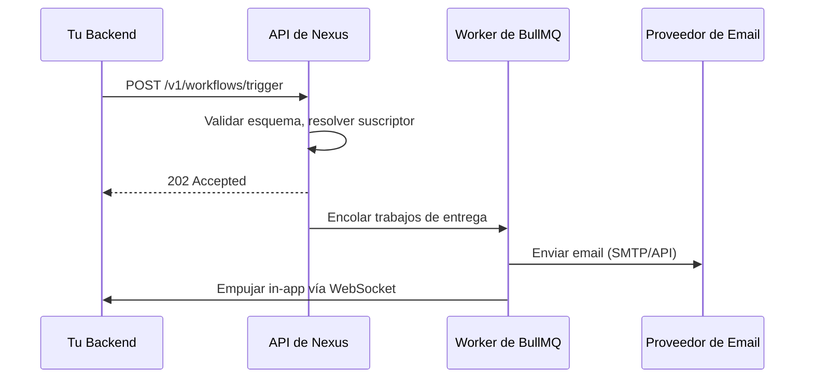

Esta guía te guiará paso a paso a través de la creación de un welcome workflow **`user.signup`** que envía un correo electrónico y una notificación integrada en la aplicación (in-app) en el momento en que un usuario se registra.

---

## Prerrequisitos

- Un espacio de trabajo de Nexus Signal con al menos un entorno activo.
- El SDK de Node instalado (`@nexus-signal/node`) e inicializado con una clave secreta.
- Al menos un proveedor de correo electrónico conectado en **Integrations**.

---

## Paso 1 — Crear el workflow

En el panel de control, navega a **Workflows** → **New Workflow**.

- **Nombre:** `user.signup`
- **Canales:** Agrega un nodo **Email** y un nodo **In-App**

Tu lienzo debería verse así:

```
Trigger → Email → In-App
```

> **Consejo:** Activa **Suppress when online** en el nodo de Email si deseas omitir el envío del correo cuando el usuario esté activo actualmente en tu aplicación.

---

## Paso 2 — Escribir las plantillas

Haz clic en cada nodo de canal para abrir el editor de plantillas.

**Plantilla de Email (HTML):**

```html
<h1>Welcome, {{ data.name }}!</h1>
<p>Thanks for joining. Your account ID is <strong>{{ subscriber.externalId }}</strong>.</p>
<p><a href="{{ data.dashboardUrl }}">Go to your dashboard →</a></p>
```

**Plantilla In-App:**

```json
{
  "title": "Welcome, {{ data.name }}!",
  "body": "Your account is ready. Click to explore.",
  "redirect": "{{ data.dashboardUrl }}"
}
```

Al terminar, promueve las plantillas al estado **Production Active**.

---

## Paso 3 — Crear un suscriptor de prueba

En el panel de control: **Subscribers** → **Add Subscriber**

Rellena lo siguiente:

- `externalId`: `test_user_01`
- `email`: `you@example.com`

> Los suscriptores deben crearse **antes** de realizar el trigger. El endpoint del trigger identifica a los destinatarios por su `externalId` — no registra nuevos usuarios en línea (inline).

---

## Paso 4 — Disparar desde tu backend

Instala e inicializa el SDK de Node:

```ts
import { NexusClient } from '@nexus-signal/node';

const nexus = new NexusClient({ secretKey: process.env.NEXUS_SECRET_KEY });
```

Lanza el trigger después de que un usuario se registre:

```ts
await nexus.workflows.trigger({
  workflowName: 'user.signup',
  recipients: [{ externalId: 'test_user_01' }],
  data: {
    name: 'Test User',
    dashboardUrl: 'https://app.example.com/dashboard',
  },
});
```

> **Nota:** La matriz `recipients` acepta `externalId` o `subscriberId` para identificar al destinatario. **No** pases datos de contacto sin procesar como `email` o `phoneNumber` aquí — estos corresponden al perfil del suscriptor, no al payload del trigger.

En el entorno de **Development**, los correos electrónicos se capturan en la pestaña de **Sandbox** — no se envían correos reales.

---

## Paso 5 — Añadir la campana in-app a tu frontend

Instala el SDK de React:

```bash
npm install @nexus-signal/react
```

Envuelve tu aplicación y añade el componente de campana:

```tsx
import { NexusProvider, NotificationCenterBell } from '@nexus-signal/react';

export function App() {
  return (
    <NexusProvider
      publicKey={process.env.NEXT_PUBLIC_NEXUS_PUBLIC_KEY!}
      subscriberId="test_user_01"
      hmacSignature={userSession.nexusHmac}
    >
      <NotificationCenterBell />
      {/* rest of your app */}
    </NexusProvider>
  );
}
```

> **Seguridad:** `hmacSignature` debe generarse en el lado del servidor utilizando tu **Clave Secreta** + el `externalId` del suscriptor. Nunca lo calcules en el navegador. Consulta [Autenticación](/docs/platform/getting-started/authentication) para obtener la fórmula de HMAC.

Dispara el trigger de nuevo — el badge de la campana se incrementará en tiempo real a través de WebSocket.

---

## Qué sucede internamente



---

## Próximos pasos

- Añade [Smart Send-Time](/docs/platform/features/smart-send-time) al correo electrónico para optimizar las tasas de apertura.
- Asigna este workflow a un [Tema (Topic)](/docs/platform/features/topics) para el control de preferencias del usuario.
- Establece una [Ventana de entrega](/docs/platform/features/delivery-windows) para evitar envíos durante la noche.
- Añade una [condición de paso](/docs/platform/features/step-conditions) para omitir el correo electrónico cuando el usuario esté en un dispositivo móvil.
