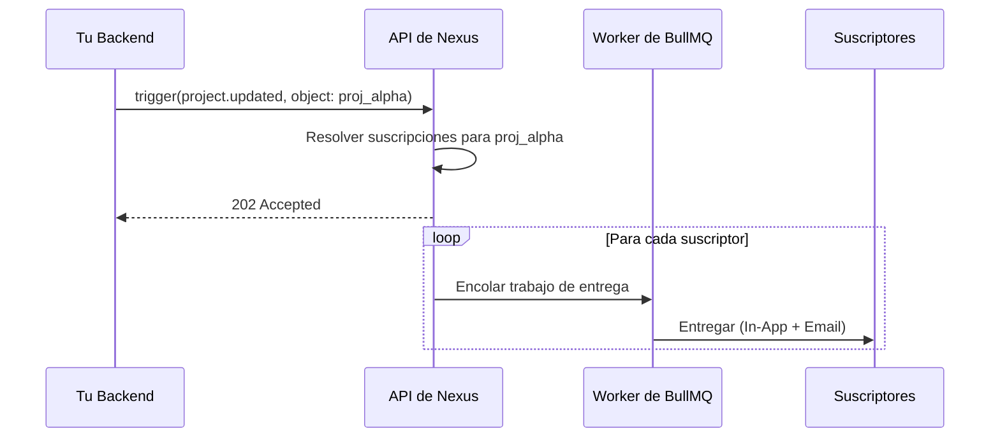

Esta guía te guiará a través de todo el flujo de **Objects & Subscriptions** (Objetos y Suscripciones): cómo registrar una entidad, suscribir usuarios a ella y enviar notificaciones en abanico (fan-out) a todos los observadores con una sola llamada de trigger.

---

## El problema que esto resuelve

Sin objetos, tu backend necesita:

1. Consultar una tabla de `watchers` (observadores) para obtener la lista de suscriptores.
2. Iterar y disparar un workflow para cada usuario de forma individual.

Con Objects, Nexus mantiene la lista de observadores por ti. Realizas un único trigger con la referencia del objeto y Nexus se encarga de resolver y entregar la notificación a todos los suscriptores automáticamente.

---

## Escenario

Tu aplicación tiene proyectos. Cuando se completa un hito del proyecto, cada miembro del equipo que lo esté observando debe ser notificado al instante — sin que tu backend tenga que consultar la tabla de observadores.

---

## Paso 1 — Registrar el objeto

Cuando se crea un nuevo proyecto en tu aplicación, realiza un upsert de este en Nexus:

```ts
import { NexusClient } from '@nexus-signal/node';

const nexus = new NexusClient({ secretKey: process.env.NEXUS_SECRET_KEY });

await nexus.objects.set({
  collection: 'projects',
  externalId: 'proj_alpha',
  name: 'Project Alpha',
  properties: {
    status: 'active',
    repo: 'acme/alpha',
    priority: 'high',
  },
});
```

- `collection`: Alfanumérico en minúsculas con guiones/guiones bajos (por ejemplo, `projects`, `issues`, `orders`). Esto pasa a formar parte de la ruta de la API.
- `externalId`: El ID interno de tu aplicación para la entidad (máximo 128 caracteres).
- `properties`: Cualquier metadata personalizada de clave-valor — accesible en las plantillas como `{{ object.properties.key }}`.

---

## Paso 2 — Suscribir usuarios

Cuando un usuario hace clic en **Watch** (Observar) en tu interfaz de usuario:

```ts
await nexus.objects.addSubscriptions('projects', 'proj_alpha', {
  recipients: [user.externalId],
  properties: { role: 'watcher' }, // metadata opcional por suscripción
});
```

- `recipients`: Matriz de cadenas con el `externalId` del suscriptor. Los suscriptores ya deben existir en el entorno.
- `properties`: Metadata clave-valor opcional almacenada en la suscripción (por ejemplo, `role`, `notificationLevel`).

Cuando un usuario hace clic en **Unwatch** (Dejar de observar):

```ts
await nexus.objects.removeSubscriptions('projects', 'proj_alpha', [user.externalId]);
```

---

## Paso 3 — Crear el workflow

En el panel de control, crea un workflow llamado `project.updated` con nodos de canal **In-App** y **Email**.

Utiliza variables de contexto del objeto en las plantillas:

**Plantilla In-App:**

```json
{
  "title": "{{ object.name }} was updated",
  "body": "Status changed to {{ object.properties.status }}",
  "redirect": "/projects/{{ object.externalId }}"
}
```

**Plantilla de Email (HTML):**

```html
<h2>Update: {{ object.name }}</h2>
<p>The project status is now <strong>{{ object.properties.status }}</strong>.</p>
<p>Milestone reached: {{ data.milestone }}</p>
```

Variables de contexto del objeto disponibles:

- `{{ object.name }}` — el nombre visible del objeto.
- `{{ object.externalId }}` — el ID externo del objeto.
- `{{ object.collection }}` — el nombre de la colección.
- `{{ object.properties.key }}` — cualquier propiedad personalizada.

---

## Paso 4 — Disparar con el objeto como destinatario

Cuando se completa el hito, dispara el trigger con la referencia del objeto en lugar de una lista de suscriptores:

```ts
await nexus.workflows.trigger({
  workflowName: 'project.updated',
  recipients: [{ collection: 'projects', id: 'proj_alpha' }],
  data: {
    changeType: 'milestone_completed',
    milestone: 'v1.0 Launch',
  },
});
```

Nexus resuelve todos los suscriptores activos que observan `projects/proj_alpha` y crea trabajos de entrega individuales para cada uno de ellos.



---

## Paso 5 — Verificar la entrega

En el panel de control, abre **Audit Logs** (Registros de auditoría). Cada observador obtiene una fila de log independiente que muestra el estado de su entrega individual y el output de los canales.

---

## Consejos

- **Suscripción en lote durante la importación**: Utiliza `addSubscriptions` con una matriz de hasta 100 destinatarios a la vez cuando migres datos existentes.
- **Las propiedades de los objetos impulsan las condiciones de paso**: Utiliza `{{ object.properties.priority }}` en las [condiciones de paso](/docs/platform/features/step-conditions) para enviar correos electrónicos únicamente para objetos de alta prioridad.
- **Combinar con temas (topics)**: Añade el workflow a un [tema](/docs/platform/features/topics) para que los usuarios puedan optar por no recibir notificaciones de proyectos a nivel de preferencias.
- **Limpieza al eliminar**: Llama a `nexus.objects.delete('projects', 'proj_alpha')` cuando se elimine el proyecto para quitar automáticamente todas las suscripciones.

---

## Límites

| Límite                                       | Valor  |
| :------------------------------------------- | :----- |
| Máximo de objetos por entorno                | 5,000  |
| Máximo de observadores por objeto            | 10,000 |
| Tamaño máximo de lote para agregar/eliminar  | 100    |
| Claves máximas de propiedades personalizadas | 50     |

---

## Relacionado

- [Descripción general de la característica de Objetos y Suscripciones](/docs/platform/features/objects-subscriptions)
- [Referencia de la API de Objetos](/docs/api/objects)
- [Condiciones de paso](/docs/platform/features/step-conditions) — ramificación basada en propiedades
