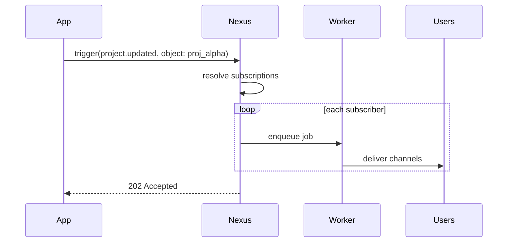

Esta guía te guiará a través del uso de **objetos y suscripciones** de extremo a extremo (end-to-end): cómo crear un objeto, suscribir usuarios, disparar el envío en abanico (fan-out) y utilizar propiedades de los objetos en las plantillas.

## Escenario

Tu aplicación tiene proyectos. Cuando un proyecto se actualiza, todos los miembros del equipo que lo estén observando deben recibir una notificación — sin que tu backend tenga que realizar una consulta a una tabla de `watchers`.

## Paso 1 — Crear el objeto

Desde el panel de control en **Objects** → crea la colección `projects`, con el ID `proj_alpha`.

O mediante el SDK de Node:

```ts
await nexus.objects.set({
  collection: "projects",
  externalId: "proj_alpha",
  name: "Project Alpha",
  properties: { status: "active", repo: "acme/alpha" },
});
```

## Paso 2 — Suscribir usuarios

Cuando un usuario hace clic en "Observar proyecto" en tu aplicación:

```ts
await nexus.objects.addSubscriptions("projects", "proj_alpha", {
  recipients: [user.externalId],
});
```

Para darlo de baja (desuscribir):

```ts
await nexus.objects.removeSubscriptions("projects", "proj_alpha", [
  user.externalId,
]);
```

## Paso 3 — Crear un flujo de trabajo (Workflow)

Crea el flujo `project.updated` en el panel de control con canales In-App + Email. Utiliza las propiedades del objeto en las plantillas:

```html
<p>El proyecto <strong>{{ object.name }}</strong> ha sido actualizado.</p>
<p>Estado: {{ object.properties.status }}</p>
```

## Paso 4 — Disparar con el objeto como destinatario

```ts
await nexus.workflows.trigger({
  workflowName: "project.updated",
  recipients: [{ collection: "projects", id: "proj_alpha" }],
  data: { changeType: "milestone_completed", milestone: "v1.0" },
});
```

Nexus resuelve automáticamente todos los suscriptores y ejecuta el flujo de trabajo para cada usuario de manera individual.



## Paso 5 — Verificar la entrega

Consulta la sección de **Audit Logs** (Registros de Auditoría) en el panel de control. Cada suscriptor dispondrá de una fila de registro de ejecución independiente.

## Consejos

- Utiliza nombres lógicos de `collection` (`issues`, `orders`, `channels`) — estos aparecerán en las rutas de la API.
- Las propiedades de los objetos pueden guiar las [condiciones de paso](/docs/platform/features/step-conditions): `object.properties.priority`.
- Combínalos con [temas](/docs/platform/features/topics) para el control de preferencias por parte del usuario.

## Relacionado

- [Objetos y Suscripciones](/docs/platform/features/objects-subscriptions)
- [API de Objetos](/docs/api/objects)
- [API de Workflows](/docs/api/workflows)
