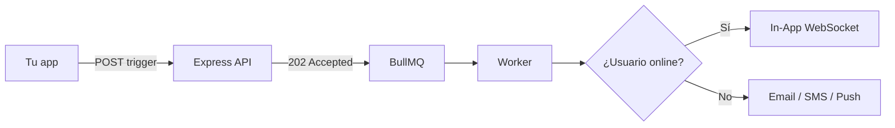

# Plataforma Nexus Signal

**Nexus Signal** es infraestructura de notificaciones orientada a desarrolladores. Una API y un canvas visual de flujos enrutan mensajes por **10 canales** mientras conservas **tus propias claves de proveedor** — sin markup por mensaje ni vendor lock-in.

Todo lo necesario para operar Nexus como tu plano de control de notificaciones, desde el primer flujo hasta producción.

<Cards>
  <Card title="Inicio rápido" href="/docs/platform/getting-started/quickstart" description="Envía tu primera notificación en menos de 5 minutos." />
  <Card title="Primeros pasos" href="/docs/platform/getting-started" description="Workspace, entornos y autenticación." />
  <Card title="Conceptos" href="/docs/platform/concepts" description="Arquitectura, BYOP, flujos y pipeline." />
  <Card title="Funciones" href="/docs/platform/features" description="Timing inteligente, presencia, IA y costos." />
  <Card title="Integraciones" href="/docs/platform/integrations" description="SendGrid, Twilio, Slack, webhooks." />
  <Card title="Guías" href="/docs/platform/guides/first-workflow" description="Primer flujo y checklist de producción." />
</Cards>

## Qué hace diferente a Nexus

| Capacidad | Beneficio |
|-----------|-----------|
| **Supresión por presencia** | Omite push/SMS redundantes cuando el usuario está online — menos gasto |
| **Envío inteligente con IA** | Entrega en la hora pico de engagement de cada suscriptor |
| **BYOP** | Tus claves SendGrid, Twilio, Resend — cero markup |
| **Analítica de costos** | Gasto por proveedor, canal y flujo con alertas de presupuesto |
| **Flujos visuales** | Delay, digest, throttle, failover, A/B split, ventanas de entrega |

## Diez canales, un trigger

Email · SMS · Web Push · Mobile Push · In-App · WhatsApp · Slack · Discord · Teams · Webhook

```ts
await nexus.workflows.trigger({
  workflowName: 'order.shipped',
  recipients: [{ externalId: 'user_42', email: 'alex@acme.io' }],
  data: { trackingNumber: '1Z999AA10123456784' },
});
```

Devuelve **202 Accepted** de inmediato — la entrega es asíncrona vía Redis + BullMQ.

## Flujo principal



## Cuándo leer qué

| Quieres… | Lee |
|----------|-----|
| Enviar la primera notificación | [Inicio rápido](/docs/platform/getting-started/quickstart) |
| Entender el pipeline async | [Pipeline de entrega](/docs/platform/concepts/delivery-pipeline) |
| Reducir gasto en proveedores | [Reducción de costos](/docs/platform/features/cost-reduction) |
| Mejorar tasas de apertura | [Envío inteligente](/docs/platform/features/smart-send-time) |
| Salir a producción con seguridad | [Checklist de producción](/docs/platform/guides/production-checklist) |

<Callout type="info">
¿Nuevo aquí? Empieza con [Inicio rápido](/docs/platform/getting-started/quickstart), luego lee [Arquitectura](/docs/platform/concepts/architecture).
</Callout>

## Stack

Node.js · PostgreSQL · Redis · React — API de ingestión en menos de 10 ms, pipeline observable.
