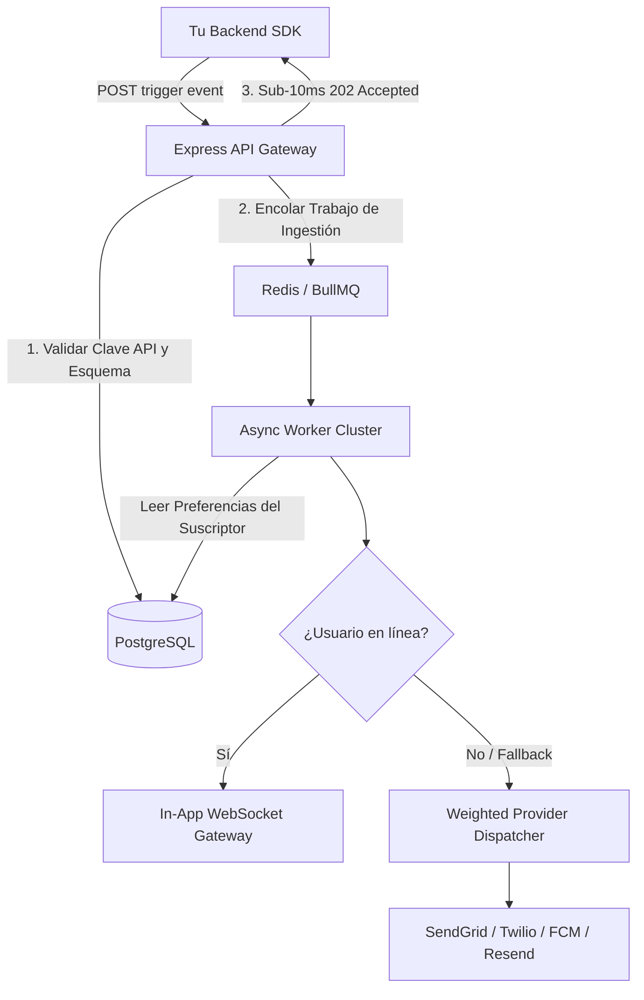

# Plataforma Nexus Signal

**Nexus Signal** es una infraestructura de notificaciones orientada a desarrolladores. Una API unificada y un lienzo visual de flujos de trabajo enrutan mensajes a través de **10 canales** mientras conservas **tus propias claves de proveedor**, evitando recargos por mensaje y el secuestro del proveedor (vendor lock-in).

Piensa en Nexus como tu plano de control centralizado de notificaciones, orquestando la entrega desde los eventos desencadenantes (triggers) iniciales hasta los callbacks de producción.

<Cards>
  <Card
    title="Inicio rápido"
    href="/docs/platform/getting-started/quickstart"
    description="Envía tu primera notificación en menos de 5 minutos."
  />
  <Card
    title="Primeros pasos"
    href="/docs/platform/getting-started"
    description="Espacio de trabajo, entornos y autenticación."
  />
  <Card
    title="Conceptos"
    href="/docs/platform/concepts"
    description="Arquitectura, BYOP, flujos de trabajo, pipeline."
  />
  <Card
    title="Funcionalidades"
    href="/docs/platform/features"
    description="Objetos, broadcasts, nodos de IA, guías y más."
  />
  <Card
    title="Integraciones"
    href="/docs/platform/integrations"
    description="SendGrid, Twilio, Slack, webhooks."
  />
  <Card
    title="Guías"
    href="/docs/platform/guides"
    description="Flujos de trabajo, fan-out, broadcasts, multi-tenant."
  />
</Cards>

## Diferencias principales

| Capacidad                      | Beneficio para el desarrollador y el negocio                                                                                                                                |
| :----------------------------- | :-------------------------------------------------------------------------------------------------------------------------------------------------------------------------- |
| **Supresión por presencia**    | Omite push/SMS redundantes si el usuario tiene una sesión de WebSocket activa en la aplicación, reduciendo significativamente el gasto en operadores.                       |
| **Envío inteligente con IA**   | Analiza automáticamente la actividad del usuario para entregar resúmenes de notificaciones o mensajes durante su hora pico de engagement.                                   |
| **Arquitectura BYOP**          | Conecta las credenciales de SendGrid, Twilio, Resend y SNS directamente. Paga a los operadores a precio de costo con control absoluto.                                      |
| **Análisis de costos**         | Seguimiento detallado del gasto por proveedor, canal y evento de flujo de trabajo individual con alertas de límite de presupuesto automatizadas.                            |
| **Flujos de trabajo visuales** | Compone árboles de pasos con retrasos, regulaciones (throttles), pruebas A/B, filtros condicionales, nodos HTTP Fetch y generadores de contenido LLM.                       |
| **Fan-out de objetos**         | Notifica a todos los suscriptores de un proyecto, documento, equipo o problema con un solo payload de trigger sin consultas de búsqueda manuales en la base de datos.       |
| **Multi-tenancy B2B**          | Plantillas de correo marca blanca, personalización de marca integrada (in-app branding) y preferencias de entrega por organización cliente (tenant).                        |
| **Herramientas de CLI y MCP**  | Administra flujos de trabajo como código bajo control de versiones e intégrate con asistentes de codificación de IA (como Cursor, Claude Code) a través de un servidor MCP. |

---

## Diez canales, una sola API de trigger

En lugar de gestionar de forma individual integraciones personalizadas para correo electrónico, SMS, Web Push, Mobile Push, campanas integradas (In-App Bells), WhatsApp, Slack, Discord, Microsoft Teams y Webhooks, emites un único evento a Nexus:

```ts
import { NexusClient } from '@nexus-signal/node';

const nexus = new NexusClient({ secretKey: process.env.NEXUS_SECRET_KEY! });

await nexus.workflows.trigger({
  workflowName: 'order.shipped',
  recipients: [{ externalId: 'user_42', email: 'alex@acme.io' }],
  tenant: 'tenant_acme_corp', // Limita el estilo y las preferencias a este tenant cliente
  data: {
    customerName: 'Alex',
    orderId: 'ord_990142',
    trackingNumber: '1Z999AA10123456784',
  },
});
```

El endpoint del trigger devuelve un payload **HTTP 202 Accepted** en menos de 10 ms. La plataforma encola el evento en una cola resiliente basada en Redis donde los workers procesan las reglas de tus pasos, compilan plantillas localizadas y enrutan los mensajes a tus proveedores.

---

## Flujo de ejecución de alto nivel


```mermaid
flowchart TD
    App[Tu Backend SDK] -->|POST trigger event| API[Express API Gateway]
    API -->|1. Validar Clave API y Esquema| DB[(PostgreSQL)]
    API -->|2. Encolar Trabajo de Ingestión| Q[Redis / BullMQ]
    API -->|3. Sub-10ms 202 Accepted| App
    Q --> Worker[Async Worker Cluster]
    Worker -->|Leer Preferencias del Suscriptor| DB
    Worker --> Presence{¿Usuario en línea?}
    Presence -->|Sí| InApp[In-App WebSocket Gateway]
    Presence -->|No / Fallback| Carriers[Weighted Provider Dispatcher]
    Carriers --> CarrierAPIs[SendGrid / Twilio / FCM / Resend]
```

---

## Guía de navegación por el documento

| Si deseas...                                                             | Página sugerida                                                                  |
| :----------------------------------------------------------------------- | :------------------------------------------------------------------------------- |
| Integrar tu primer flujo de trabajo                                      | [Inicio rápido](/docs/platform/getting-started/quickstart)                       |
| Asegurar tu conexión de webhook o WebSocket                              | [Autenticación y firmas HMAC](/docs/platform/getting-started/authentication)     |
| Entender la reintento de cola y el pipeline de ejecución                 | [Conceptos del pipeline de entrega](/docs/platform/concepts/delivery-pipeline)   |
| Transmitir anuncios a un subconjunto de usuarios                         | [Guía de la funcionalidad de Broadcasts](/docs/platform/features/broadcasts)     |
| Configurar marca blanca personalizada por cliente                        | [Guía de Multi-tenancy B2B](/docs/platform/guides/b2b-multi-tenant)              |
| Monitorear los márgenes de los proveedores y las métricas de los canales | [Estrategias de reducción de costos](/docs/platform/features/cost-reduction)     |
| Desplegar cambios de forma segura a través de entornos                   | [Entornos y alcances de claves API](/docs/platform/getting-started/environments) |

<Callout type="info">
  ¿Te estás integrando por primera vez? Empieza con el [Inicio
  rápido](/docs/platform/getting-started/quickstart) para enviar tu primer evento, luego lee
  [Arquitectura](/docs/platform/concepts/architecture) para configurar tu servidor de desarrollo.
</Callout>

## Stack tecnológico

El host de Nexus Signal está construido utilizando componentes web estándar de alto rendimiento:

- **API Gateway**: Node.js y Express
- **Bases de datos**: PostgreSQL (a través de Prisma ORM) y Redis (almacenamiento en caché y pub/sub)
- **Gestor de colas**: BullMQ (enrutamiento de contrapresión, reintentos retrasados)
- **Tiempo real**: Socket.IO (motor de conexión WebSocket para campanas integradas)
- **Componentes de interfaz**: React y Tailwind CSS
