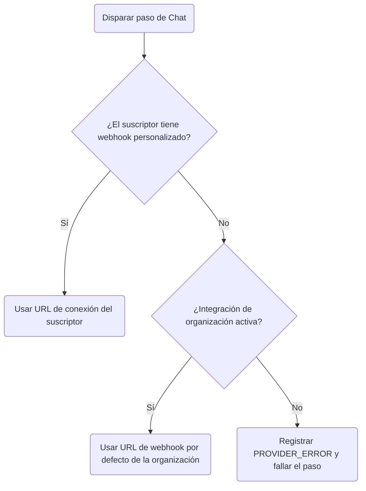

Nexus incluye nodos de canal nativos para **Slack**, **Discord** y **Microsoft Teams**. Puedes configurar canales a nivel de organización (por ejemplo, enviar alertas del sistema al Slack de tu propia empresa) o enrutar notificaciones a webhooks de canal únicos y específicos del suscriptor.

---

## Jerarquía de credenciales de webhook

Al despachar notificaciones de chat, Nexus determina qué URL de webhook usar en este orden de prioridad:

1. **Webhook del suscriptor**: Comprueba el perfil del suscriptor en busca de URLs de conexión personalizadas (por ejemplo, `slackWebhookUrl` en `channelConnections` del suscriptor).
2. **Webhook de la organización**: Hace fallback a las credenciales por defecto almacenadas en la configuración de integración de tu entorno para ese proveedor.



---

## Enrutamiento de webhook por suscriptor

Para enrutar notificaciones a canales específicos del suscriptor (por ejemplo, canales DM personales de Slack, canales de workspace del equipo), pasa URLs de webhook únicas en la solicitud del trigger:

```ts
await nexus.workflows.trigger({
  workflowName: 'billing.invoice',
  recipients: [
    {
      externalId: 'user_42',
      slackWebhookUrl: 'https://hooks.slack.com/services/{workspace_id}/{channel_id}/{token}',
      discordWebhookUrl: 'https://discord.com/api/webhooks/{channel_id}/{token}',
      teamsWebhookUrl:
        'https://your-org.webhook.office.com/webhookb2/{guid}@{tenant_id}/IncomingWebhook/{id}/{token}',
    },
  ],
  data: { amount: 150 },
});
```

### Persistencia automática

- Cuando se pasan URLs de webhook en un payload de trigger, Nexus las extrae automáticamente y las guarda en el objeto `channelConnections` del suscriptor en la base de datos.
- Los futuros triggers para el mismo suscriptor reutilizarán estas URLs de conexión en caché — solo necesitas pasarlas una vez (normalmente cuando el usuario vincula su herramienta de chat en la interfaz de configuración de tu aplicación).

---

## Formatos de payload esperados

Nexus adapta automáticamente el copy de texto de tus plantillas para que coincida con las especificaciones de layout de cada plataforma de chat:

| Canal               | Clave      | Formato | Comportamiento del adaptador                                                              |
| :------------------ | :--------- | :------ | :---------------------------------------------------------------------------------------- |
| **Slack**           | `slack`    | JSON    | Despacha el payload como `{ "text": "..." }`. Admite markdown estándar de Slack (mrkdwn). |
| **Discord**         | `discord`  | JSON    | Despacha el payload como `{ "content": "..." }`.                                          |
| **Microsoft Teams** | `ms_teams` | JSON    | Compila un bloque JSON de Adaptive Card que contiene el título y el cuerpo del mensaje.   |

---

## Configuración del workflow

1. Crea un workflow y añade un nodo de canal **Slack**, **Discord** o **Teams** al lienzo.
2. En la configuración del nodo, selecciona la clave de proveedor a la que hacer fallback.
3. Guarda y dispara el workflow.

---

## Relacionado

- [SDK de Node](/docs/sdk/backend/node) — documentación del esquema de destinatarios
- [Integración de webhooks](/docs/platform/integrations/webhooks) — despachos de payload personalizados
- [Archivos de traducción](/docs/platform/features/translations) — localizar texto de chat
