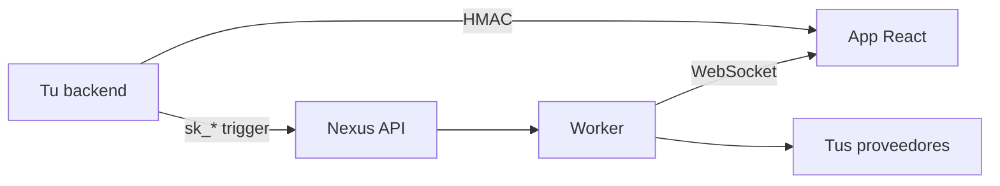

# SDKs de Nexus Signal

Paquetes oficiales para disparar flujos desde tu backend y renderizar notificaciones in-app en el navegador.

<Cards>
  <Card title="SDK Node.js" href="/docs/sdk/node" description="Triggers, schedules, HMAC — solo servidor." />
  <Card title="SDK React" href="/docs/sdk/react" description="Campana, inbox, preferencias — UI en browser." />
  <Card title="Referencia API" href="/docs/api" description="Endpoints REST si prefieres HTTP directo." />
</Cards>

## Flujo de integración



1. El backend dispara flujos con la **clave secreta** (`sk_*`)
2. El backend genera **HMAC** para el usuario autenticado
3. El frontend envuelve la app en `NexusProvider` con **clave pública + HMAC**
4. Las notificaciones in-app llegan a `NotificationCenterBell`

## Ejemplo rápido

```ts
import { NexusClient } from '@nexus-signal/node';

const nexus = new NexusClient({
  secretKey: process.env.NEXUS_SECRET_KEY!,
  baseUrl: 'https://api.nexussignal.dev',
});

await nexus.workflows.trigger({
  workflowName: 'order.shipped',
  recipients: [{ externalId: 'user_42', email: 'alex@acme.io' }],
  data: { trackingNumber: '1Z999AA10123456784' },
});
```

## Requisitos

| SDK | Requiere |
|-----|----------|
| Node | Node.js 18+ |
| React | React 18/19, `socket.io-client` ^4.8 |

## Instalación

<Tabs items={['npm', 'pnpm', 'yarn']}>
  <Tab value="npm">

```bash
npm install @nexus-signal/node
npm install @nexus-signal/react socket.io-client
```

  </Tab>
  <Tab value="pnpm">

```bash
pnpm add @nexus-signal/node
pnpm add @nexus-signal/react socket.io-client
```

  </Tab>
  <Tab value="yarn">

```bash
yarn add @nexus-signal/node
yarn add @nexus-signal/react socket.io-client
```

  </Tab>
</Tabs>

<Callout type="info">
¿Solo REST? Omite el SDK React y usa la [Referencia API](/docs/api) con tu cliente HTTP.
</Callout>

<Callout type="warn">
Nunca expongas claves `sk_*` en código del navegador. Usa claves `pk_*` solo en rutas SDK.
</Callout>
