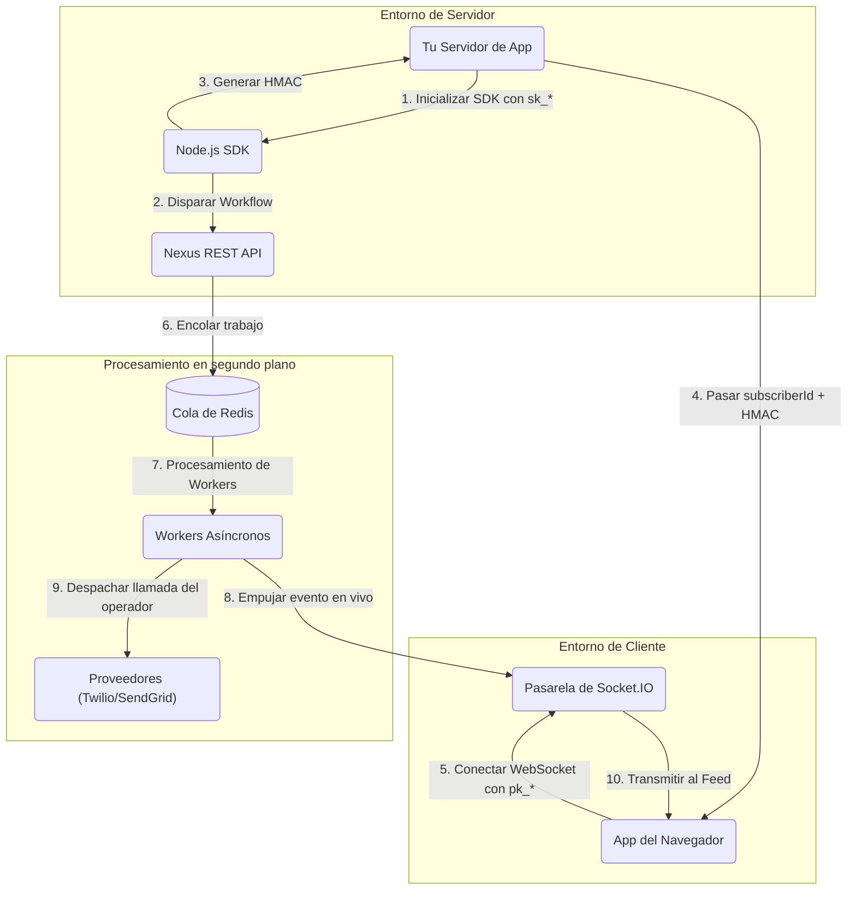

# SDKs de Nexus Signal

Librerías oficiales, componentes cliente, interfaces de línea de comandos y kits de herramientas de IA para integrar Nexus Signal en tu stack.

---

## Librerías de cliente y servidor

Accede a nuestras librerías principales del lado del cliente y del lado del servidor para gestionar triggers, suscriptores y estados de la interfaz:

<Cards>
  <Card
    title="Node.js SDK"
    href="/docs/sdk/backend/node"
    description="Triggers de flujos de trabajo del backend, alcances multi-tenant, programaciones (schedules) y firmas criptográficas HMAC."
  />
  <Card
    title="React SDK"
    href="/docs/sdk/frontend/react"
    description="Campana de notificación lista para usar, bandeja de entrada con feed completo, matriz de preferencias de usuario y guías en tiempo real."
  />
  <Card
    title="Headless JS SDK"
    href="/docs/sdk/frontend/js"
    description="Cliente independiente de framework para Vue, Svelte o HTML5 nativo sin dependencias de estilos empaquetadas."
  />
  <Card
    title="Angular SDK"
    href="/docs/sdk/frontend/angular"
    description="Componentes independientes y Signals nativos para centros de notificaciones reactivos (Angular 17+)."
  />
</Cards>

---

## Herramientas de desarrollo

Administra estados de workflows, integraciones de CI/CD y conjuntos de plantillas locales:

<Cards>
  <Card
    title="Workflow-as-code"
    href="/docs/sdk/workflow/workflow-as-code"
    description="Define pasos de notificaciones en TypeScript y súbelos programáticamente al panel de control."
  />
  <Card
    title="Nexus CLI"
    href="/docs/sdk/devtools/cli"
    description="Descarga o sube recursos, administra suscriptores y sincroniza plantillas desde tu terminal o ejecutor de tareas (runner)."
  />
  <Card
    title="Servidor MCP"
    href="/docs/sdk/devtools/mcp-server"
    description="Conecta asistentes de codificación de IA como Cursor y Claude a las herramientas de tu espacio de trabajo utilizando lenguaje natural."
  />
  <Card
    title="Referencia de API"
    href="/docs/api"
    description="Endpoints directos de la API REST para integraciones HTTP personalizadas en cualquier lenguaje de programación."
  />
</Cards>

---

## Flujo de arquitectura integrada

El siguiente diagrama sigue el límite de la transacción entre los despachos del lado del servidor, los sockets de agentes de usuario y los relevos de operadores externos:


```mermaid
flowchart TD
  subgraph Server Environment [Entorno de Servidor]
    App(Tu Servidor de App) -->|1. Inicializar SDK con sk_*| SDK(Node.js SDK)
    SDK -->|2. Disparar Workflow| API(Nexus REST API)
    SDK -->|3. Generar HMAC| App
  end

  subgraph Client Environment [Entorno de Cliente]
    App -->|4. Pasar subscriberId + HMAC| FE(App del Navegador)
    FE -->|5. Conectar WebSocket con pk_*| WebHost(Pasarela de Socket.IO)
  end

  subgraph Background Processing [Procesamiento en segundo plano]
    API -->|6. Encolar trabajo| Q[(Cola de Redis)]
    Q -->|7. Procesamiento de Workers| Workers(Workers Asíncronos)
    Workers -->|8. Empujar evento en vivo| WebHost
    Workers -->|9. Despachar llamada del operador| Carriers("Proveedores (Twilio/SendGrid)")
  end

  WebHost -->|10. Transmitir al Feed| FE
```

---

## Matriz de compatibilidad de paquetes

Asegúrate de que tus entornos de ejecución cumplan con los requisitos mínimos del entorno:

| Nombre del paquete             | Entorno de ejecución principal | Dependencias de pares       | Responsabilidad principal                                                               |
| :----------------------------- | :----------------------------- | :-------------------------- | :-------------------------------------------------------------------------------------- |
| **`@nexus-signal/node`**       | Node.js >= 18.0.0              | Ninguna (Fetch nativo)      | Triggers de backend, schedules, sincronización de objetos, sincronización de workflows. |
| **`@nexus-signal/react`**      | React >= 18.0.0                | `socket.io-client >= 4.8.0` | Campanas con estilos predeterminados, feeds de página completa, preferencias.           |
| **`@nexus-signal/js`**         | ES6 / HTML5                    | `socket.io-client >= 4.8.0` | Controladores de almacén independientes de framework, emisores de WebSocket.            |
| **`@nexus-signal/angular`**    | Angular >= 17.0.0              | `socket.io-client >= 4.8.0` | Signals reactivos, envolturas de componentes independientes.                            |
| **`@nexus-signal/cli`**        | Node.js >= 18.0.0              | Ninguna                     | Sincronización de esquemas locales, pipelines de promoción de CI/CD.                    |
| **`@nexus-signal/mcp-server`** | Node.js >= 18.0.0              | Ninguna                     | Llamadas de herramientas en lenguaje natural para asistentes de codificación de IA.     |

---

## Inicio rápido de instalación

Configura las librerías según los puntos de entrada en tu aplicación:

<Tabs items={['Lado del servidor', 'Cliente React', 'Herramientas de desarrollo']}>
  <Tab value="Lado del servidor">
    Para ejecutar triggers y sincronizar workflows desde tus rutas de backend:
    ```bash
    npm install @nexus-signal/node
    ```
  </Tab>
  <Tab value="Cliente React">
    Para montar centros de notificaciones y configuraciones de usuario integrados en la aplicación dentro de un árbol de React:
    ```bash
    npm install @nexus-signal/react socket.io-client
    ```
  </Tab>
  <Tab value="Herramientas de desarrollo">
    Para acceder a los mecanismos de sincronización local o iniciar una instancia de MCP:
    ```bash
    # Instalar la CLI de forma global
    npm install -g @nexus-signal/cli

    # Ejecutar el servidor MCP sobre la marcha
    npx -y @nexus-signal/mcp-server@latest
    ```

  </Tab>
</Tabs>

<Callout type="warn">
  **Regla de exposición de claves**: Nunca incrustes claves secretas que comiencen con `sk_` en el
  código del cliente, aplicaciones de una sola página (SPAs) o scripts de compilación. Las rutas
  públicas siempre deben utilizar claves públicas (`pk_`) verificadas mediante una firma HMAC
  generada estrictamente en tu servidor.
</Callout>
