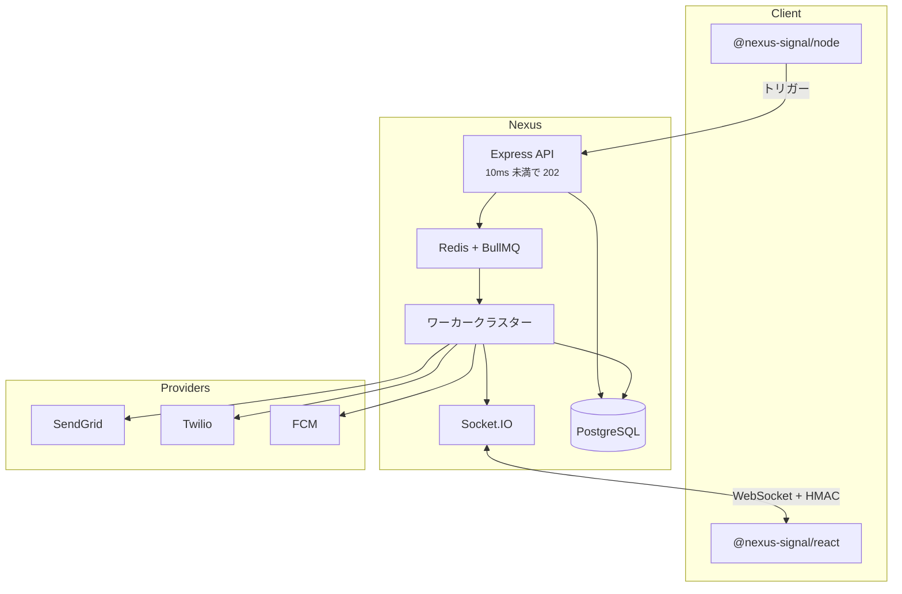

## システム図

## コンポーネント

| レイヤー | 技術 | 役割 |
| -------- | ---- | ---- |
| 取り込み API | Node.js + Express | 認証、バリデーション、エンキュー、202 返却 |
| コアデータベース | PostgreSQL + Prisma | 組織、ワークフロー、サブスクライバー、ログ |
| キュー | Redis + BullMQ | 非同期ジョブ、遅延、ダイジェスト、サーキットブレーカー |
| ワーカー | Node.js | ステップ実行、テンプレートコンパイル、ディスパッチ |
| リアルタイム | Socket.IO | アプリ内、既読同期、サンドボックスシミュレーター |
| ダッシュボード | React SPA | キャンバス、テンプレート、分析 |

## ノンブロッキング取り込み

API は HTTP リクエスト中にキャリアの呼び出しや重いテンプレートのコンパイルを**一切行いません**。`INGESTED` ログを書き込み、ジョブをエンキューして即座に応答します。

## マルチテナンシー

リソースは**組織** → **環境**（開発、ステージング、本番）にスコープされています。各環境には独立したキー、サブスクライバー、ワークフローがあります。

<Callout type="idea">
  開発では**サンドボックスモード**を使用します — 外部チャンネルはシミュレートされるため、プロバイダー費用なしでテストできます。[サンドボックス](/docs/platform/features/sandbox)をご覧ください。
</Callout>

## 関連

- [配信パイプライン](/docs/platform/concepts/delivery-pipeline)
- [BYOP](/docs/platform/concepts/byop)
