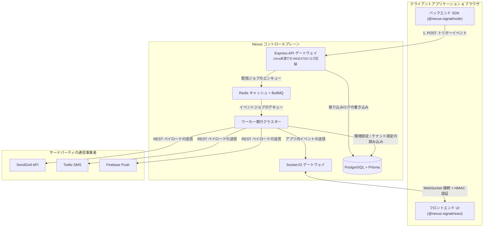

# システムアーキテクチャ

Nexus Signal は、高スループットで疎結合な通知オーケストレーションシステムとして設計されています。プラットフォームは、トリガーの取り込みと実際の通知のコンパイルおよび配信を分離するために、主に5つのレイヤーで構成されています。

---

## システム図

```mermaid
flowchart TB
  subgraph Client [クライアントアプリケーション & ブラウザ]
    SDK["バックエンド SDK (@nexus-signal/node)"]
    UI["フロントエンド UI (@nexus-signal/react)"]
  end

  subgraph Nexus [Nexus コントロールプレーン]
    API["Express API ゲートウェイ<br/><small>10ms未満での INGESTED ログ記録</small>"]
    Q["Redis キャッシュ + BullMQ"]
    W["ワーカー実行クラスター"]
    WS["Socket.IO ゲートウェイ"]
    DB[(PostgreSQL + Prisma)]
  end

  subgraph Providers [サードパーティの通信事業者]
    SG[SendGrid API]
    TW[Twilio SMS]
    FCM[Firebase Push]
  end

  SDK -->|1. POST トリガーイベント| API
  API -->|取り込みログの書き込み| DB
  API -->|配信ジョブのエンキュー| Q
  Q -->|イベントジョブのデキュー| W
  W -->|環境設定 / テナント設定の読み込み| DB
  W -->|REST ペイロードの送信| SG & TW & FCM
  W -->|アプリ内イベントの送信| WS
  WS <-->|WebSocket 接続 + HMAC 認証| UI
```

---

## アーキテクチャ構成要素

| コンポーネント            | 技術                   | 役割                                                                                                               | パフォーマンス                              |
| :------------------------ | :--------------------- | :----------------------------------------------------------------------------------------------------------------- | :------------------------------------------ |
| **取り込み API**          | Node.js + Express      | 認証資格情報とトリガースキーマの検証、ジョブのエンキュー、および即時の応答。                                       | 10ms 未満の応答時間。                       |
| **関係データベース (DB)** | PostgreSQL + Prisma    | ワークスペース構成、環境資格情報、テンプレート構造、サブスクライバー、およびトランザクションログの永続化。         | インデックス化された読み取り/書き込みパス。 |
| **メッセージブローカー**  | Redis + BullMQ         | リアルタイムキューチャネル、遅延ワークフロー、バッチダイジェスト、およびバックプレッシャースケジューリングの管理。 | メモリキャッシュによる高速性。              |
| **ワーカー**              | Node.js ワーカープール | ワークフローノードの順次実行、ローカルタイムゾーン調整、A/B 分割、および送信の処理。                               | 水平スケーラビリティ。                      |
| **WebSocket ハブ**        | Socket.IO ゲートウェイ | アクティブなブラウザへの永続的な WebSocket チャネルの維持、および即時のアプリ内アラートの配信。                    | イベント駆動型のプッシュ配信。              |
| **ウェブダッシュボード**  | React + Next.js SPA    | ビジュアルなドラッグ＆ドロップ テンプレートデザイナー、実行ログ、およびサンドボックスシミュレーター。              | 静的クライアントレンダリング。              |

---

## 非ブロッキングのイベント取り込み

バックエンドトリガーに対する 10ms 未満の応答時間を維持するために、取り込み API は以下のタスクを**同期的に実行することはありません**。

- テンプレートエンジンのコンパイル。
- 条件付きステップ分岐ルールの評価。
- 外部プロバイダーゲートウェイ（SendGrid、Twilio など）への DNS ルックアップや HTTP REST リクエストの実行。

代わりに、ゲートウェイは PostgreSQL に状態が `INGESTED` であるレコードを1行書き込み、ペイロードのメタデータを BullMQ にパブリッシュして、サーバー SDK に対してトランザクション ID を含む **HTTP 202 Accepted** ステータスコードを即座に返します。

---

## キューの回復力とバックプレッシャー

BullMQ を活用することで、Nexus はネットワーク遅延やプロバイダーのダウンタイムからバックエンドシステムを保護します。

- **ジョブの再試行**: Twilio や SendGrid が HTTP 500 を返した、またはレート制限に達した場合、ワーカーは**指数バックオフ**（exponential backoff）戦略を使用してジョブを Redis キューに戻します。
- **サーキットブレーカー**: プロバイダーが特定のしきい値ウィンドウ内で連続してエラーを返す場合、ディスパッチャーは**フェイルオーバーノード**をトリガーし、代替チャネル（例: SMS からプッシュ通知へのフォールバック）を介して通知をルーティングします。
- **レート制限（スロットリング）**: ワーカーは、プロバイダー統合ごとに構成されたレート制限を厳密に遵守してメッセージをルーティングします。

---

## 永続的な WebSocket ゲートウェイ

アプリ内通知（通知ベルやカスタムトーストメッセージなど）は、専用の Socket.IO WebSocket ゲートウェイを通じてルーティングされます。

- **セキュリティ**: 接続の確立（ハンドシェイク）にはサーバーによって生成された有効な HMAC 署名が必要であり、ユーザー ID のなりすましを防ぎます。
- **配信状態**: ユーザーが WebSocket を介してアクティブに接続している場合、ワーカーは SMS やプッシュ通知などの外部チャネルへの発送をスキップ（プレゼンス抑制）し、通信コストを抑えることができます。
