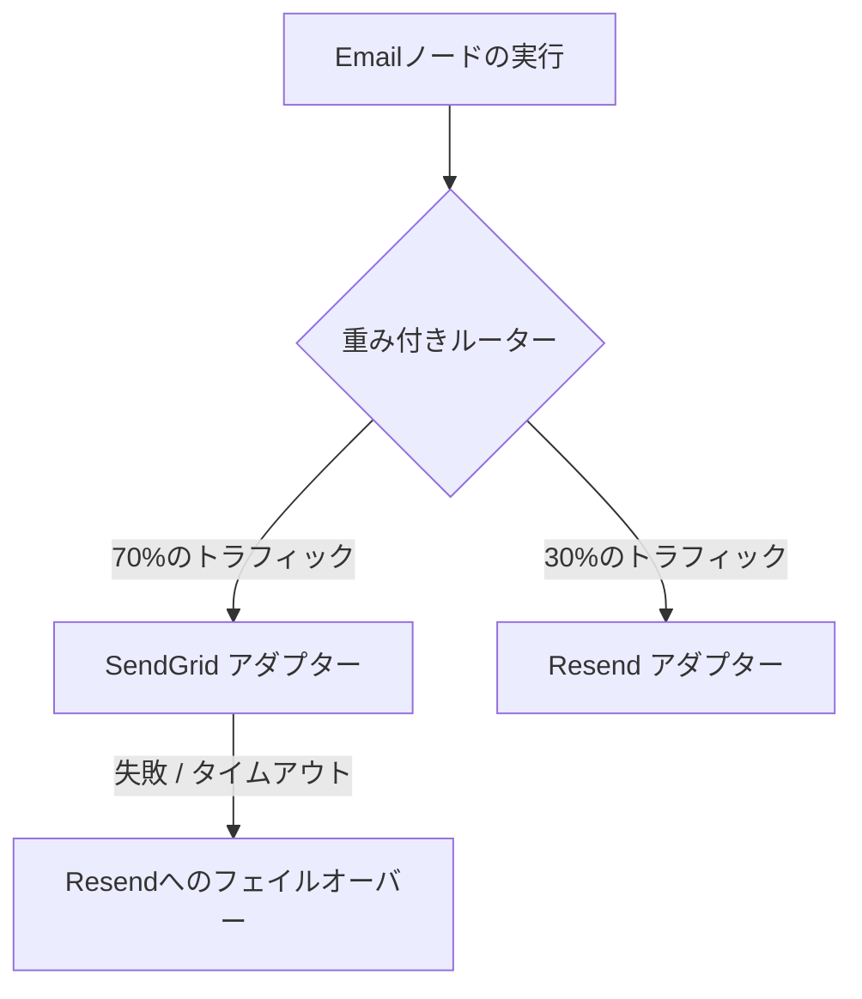

# Bring Your Own Provider (BYOP)

**BYOP (Bring Your Own Provider)** は、Nexus Signal の基礎となる設計思想です。メールや SMS の送信ごとに追加の手数料を請求する従来の中間業者型通知プラットフォームとは異なり、Nexus は純粋なオーケストレーション用のソフトウェアレイヤーとして機能します。

開発者は、**独自の API キー**をプロバイダーに設定し、実費のみを通信事業者に直接支払います。

---

## コスト比較: 従来型 vs. BYOP

通知ボリュームは急速にスケールしやすいため、メッセージごとのマークアップ手数料は大きなオーバーヘッドとなります。

| 指標                 | 従来の通知 SaaS                                                       | Nexus Signal (BYOP)                                                        |
| :------------------- | :-------------------------------------------------------------------- | :------------------------------------------------------------------------- |
| **課金モデル**       | 基本料金 + メッセージ量に応じた手数料。                               | プラットフォームの定額基本料金のみ。                                       |
| **メッセージ手数料** | 送信実費に対して 50% 〜 200% の手数料が上乗せされることが一般的。     | **手数料 0%**。通信事業者の実費のみを直接支払います。                      |
| **冗長性の確保**     | プラットフォームが選択した通信事業者に固定。                          | プロバイダー間の重み付きルーティングや、即時の自動フェイルオーバーが可能。 |
| **配信品質の制御**   | 共有 IP（他のユーザーと共有のIPアドレス）による配信品質低下のリスク。 | 専用 IP アドレスの選択、直接の送信ドメイン設定。                           |

---

## 安全な Vault 暗号化

API キーを安全に保護することは、独自の資格情報を扱う Nexus にとって最優先のセキュリティ事項です。

- **AES-256 暗号化**: プロバイダーの資格情報は、ワークスペースの `providerKeys` セキュアストレージ（Vault）内のデータベースレベルで暗号化されます。
- **復号スコープ**: キーは、分離されたワーカープロセス内で、実際に通信事業者に発送するタイミングでのみ、メモリ上に復号されます。
- **ログの保護**: ペイロードログは、認証情報や API トークンを自動的にサニタイズ（隠蔽）し、配信トレースログにキーが漏洩するのを防ぎます。

---

## ルーティングと冗長性

BYOP を使用すると、単一の通信事業者に依存する必要がなくなります。単一のチャネル（例：メール）に対して複数のプロバイダーアカウントを構成し、トラフィックを動的に割り当てることができます。

- **重み付きルーティング**: メールの 70% を SendGrid に、30% を Resend にルーティングすることで、複数のプロバイダーの IP アドレスのウォームアップ状態を適切に維持できます。
- **即時フェイルオーバー**: SendGrid の API 呼び出しがタイムアウトするか、レート制限エラーを返した場合、ワーカーは即座に Resend を介してメッセージを再発送します。

---

## AI キーも BYOP です

Nexus Signal は、ビジュアルワークフロー内の **AI ノード**（例：翻訳の自動検証や、動的なコピーライティングトリガー）をサポートしています。これらのノードは、**独自の LLM キー**（OpenAI、Anthropic、または Cohere）を使用します。Nexus が共有のプロキシアカウントを使用して LLM タスクを実行することはありません。データプライバシーポリシーとトークン使用制限を完全に自社で管理できます。
