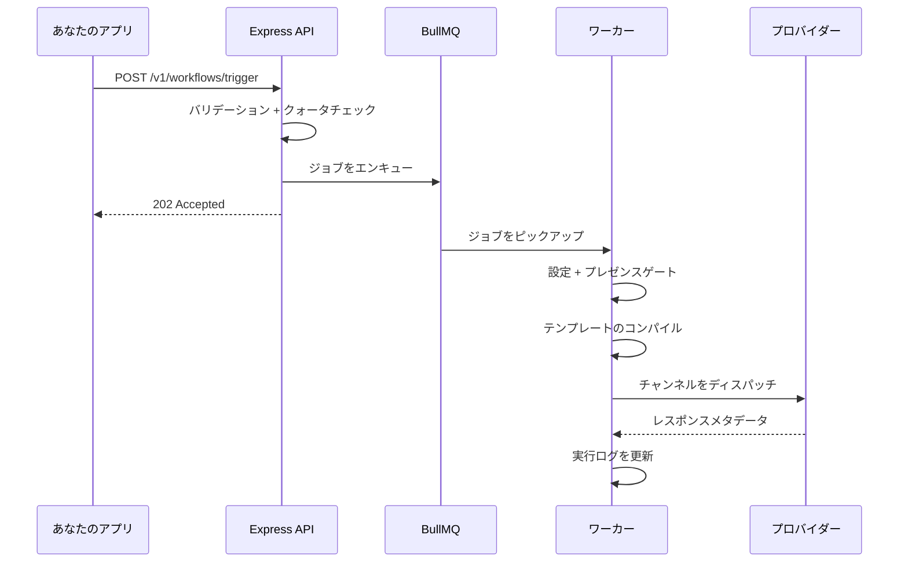

`workflows.trigger` を呼び出すと、このパイプラインが非同期で実行されます。

## ステップ概要

| ステップ | 実行内容 |
|--------|--------|
| **取り込み** | キーのバリデーション、サブスクライバーの解決、ログ作成、エンキュー |
| **ワーカーピックアップ** | ワークフロー、テンプレート、組織コンテキストの読み込み |
| **ゲート** | 設定、プレゼンス抑制、スマートタイミング、配信ウィンドウ |
| **コンパイル** | Handlebars + ロケール解決 + クリックトラッキング URL |
| **ディスパッチ** | 重み付きプロバイダールーター → キャリアアダプター |
| **テレメトリ** | WebSocket（アプリ内）、クリックトラッキング、キャリアコールバック |

## ライフサイクルステータス

`INGESTED` → `QUEUED` → `PROCESSING` → `DISPATCHED` → `DELIVERED` → `READ` / `OPENED` / `FAILED`

特殊: `SKIPPED_BY_PREFERENCE`、`QUEUED_IN_DIGEST`、`FAILED_PROVIDER_DOWN`

<Callout type="warn">
スケジュールトリガーとスマートタイミング保留は遅延付きでキューに再入します — 待機中はステータスが `QUEUED` と表示される場合があります。
</Callout>

**監査ログ**のドリルダウンで完全なタイムラインを確認できます。
