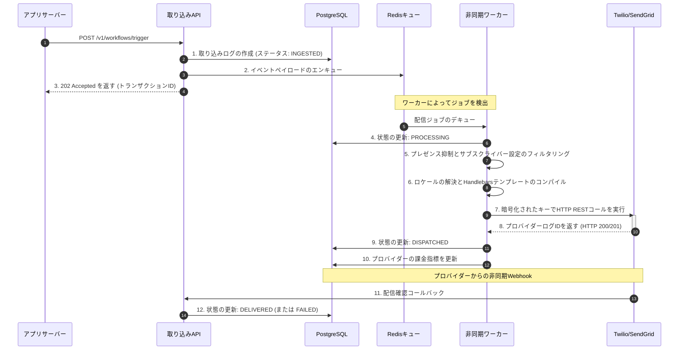

# 配信パイプライン

アプリケーションサーバーが `nexus.workflows.trigger()` を介してイベントをトリガーすると、そのイベントは高スループットで観測可能な実行パイプラインに入ります。配信プロセスは、バックグラウンドワーカープール内で完全に非同期に実行されます。

---

## テレメトリシーケンスの詳細

次の図は、イベントの取り込みからテンプレートのコンパイル、環境設定の検証、プロバイダーアダプターの実行、およびプロバイダーからの配信レポートにいたるまでのトランザクションパスを示しています。

```mermaid
sequenceDiagram
    autonumber
    participant App as アプリサーバー
    participant API as 取り込みAPI
    participant DB as PostgreSQL
    participant Q as Redisキュー
    participant W as 非同期ワーカー
    participant Carrier as Twilio/SendGrid

    App->>API: POST /v1/workflows/trigger
    API->>DB: 1. 取り込みログの作成 (ステータス: INGESTED)
    API->>Q: 2. イベントペイロードのエンキュー
    API-->>App: 3. 202 Accepted を返す (トランザクションID)

    Note over Q, W: ワーカーによってジョブを検出
    Q->>W: 配信ジョブのデキュー
    W->>DB: 4. 状態の更新: PROCESSING
    W->>W: 5. プレゼンス抑制とサブスクライバー設定のフィルタリング
    W->>W: 6. ロケールの解決とHandlebarsテンプレートのコンパイル
    W->>Carrier: 7. 暗号化されたキーでHTTP RESTコールを実行
    activate Carrier
    Carrier-->>W: 8. プロバイダーログIDを返す (HTTP 200/201)
    deactivate Carrier

    W->>DB: 9. 状態の更新: DISPATCHED
    W->>DB: 10. プロバイダーの課金指標を更新

    Note over Carrier, DB: プロバイダーからの非同期Webhook
    Carrier->>API: 11. 配信確認コールバック
    API->>DB: 12. 状態の更新: DELIVERED (または FAILED)
```

---

## 実行パイプラインのフェーズ

### 1. 取り込みフェーズ（Ingestion Phase）

- **認証**: シークレットキー（`sk_`）の有効性とスコープを検証します。
- **検証**: `workflowName` が存在することを確認し、`recipients` 配列のスキーマを検証します。
- **ジョブの作成**: ターゲットの宛先ごとに永続的な一意の ID を生成し、データベースに初期状態の `INGESTED` ログを書き込み、実行コンテキストを BullMQ にプッシュして、API スレッドを解放します。

### 2. 環境設定とプレゼンスの検証

メッセージアセットをコンパイルする前に、ワーカーは通知の送信を続行すべきかどうかを判断します。

- **オプトアウトの確認**: 受信者のオプトアウト設定を読み込みます。トピックまたはチャンネルがオフに設定されている場合、ステップはスキップされ、ステータスは `SKIPPED_BY_PREFERENCE` に更新されます。
- **アクティブプレゼンスの傍受**: 受信者がアプリ内ゲートウェイでアクティブな WebSocket セッションを持っているかどうかを確認します。チャンネルノードで `suppressWhenOnline` が有効になっている場合、外部（SMSやプッシュなど）への発送はスキップされます。
- **ローカル時間制限**: ワークフロー内に `Delivery Window`（配信ウィンドウ）ノードがある場合、ワーカーはサブスクライバーのローカルタイムゾーンを計算し、現在の時刻がウィンドウ外であれば、Redis 内でジョブを遅延させます。

### 3. テンプレートレンダリング

- **ロケールの解決**: サブスクライバーの希望する言語（`en`、`es`、`ja` など）を解決します。
- **Handlebars のコンパイル**: 件名、ヘッダー、および HTML テンプレートをコンパイルし、トリガーの `data` 変数をマージします。
- **追跡リンクの挿入**: テンプレート内の URL を、クリック率を測定するためのリダイレクト追跡リンクに自動的に置き換えます。

### 4. プロバイダーへの発送

- **重み付きルーティング**: ディスパッチャーはアクティブなプロバイダーアダプターを特定し、統合の重みに基づいてプロバイダーを選択します。
- **アダプターハンドシェイク**: 統合キーを復号し、プロバイダー固有の API スキーマを構築して REST 呼び出しを実行します。

---

## ライフサイクル状態（ステータス）の定義

各配信ジョブは、以下の一連の監視可能な状態を遷移します。

| ステータス              | 意味とスコープ                                                                                         |
| :---------------------- | :----------------------------------------------------------------------------------------------------- |
| `INGESTED`              | API がトリガーイベントペイロードを受理した状態。                                                       |
| `QUEUED`                | ジョブが Redis に入り、ワーカーによる処理を待っている状態。                                            |
| `PROCESSING`            | ワーカーが現在、テンプレートのレンダリングや各種検証を実行している状態。                               |
| `DISPATCHED`            | メッセージがプロバイダー API（SendGrid、Twilio など）に受け入れられた状態。                            |
| `DELIVERED`             | プロバイダーの Webhook により、ユーザーがメール/SMS/プッシュを受信したことが確認された状態。           |
| `OPENED` / `READ`       | ユーザーがメールを開封した（ピクセルがトリガーされた）、またはアプリ内メッセージを既読にした状態。     |
| `FAILED`                | 実行中にエラーが発生したか、プロバイダーによって配信が拒否された状態。                                 |
| `SKIPPED_BY_PREFERENCE` | サブスクライバーがトピックをオプトアウト（購読解除）したため、配信がスキップされた状態。               |
| `QUEUED_IN_DIGEST`      | イベントがダイジェストノードのバッチ処理間隔の経過を待っている状態。                                   |
| `FAILED_PROVIDER_DOWN`  | プロバイダーゲートウェイに接続できなかった状態。自動フェイルオーバーのために再度キューイングされます。 |

---

## 再試行とエラーからの回復

通信事業者のネットワーク切断や一時的な HTTP 5xx エラーが原因で発送が失敗した場合、ワーカーは以下の回復処理を実行します。

1. **再試行キューイング**: ワーカーは、**指数バックオフ**（exponential backoff）戦略を使用して、ジョブを Redis キューに戻します。
2. **最大再試行回数**: ジョブは最大5回まで再試行されます（Integrations タブで構成可能）。
3. **デッドレターキュー (DLQ)**: すべての再試行が失敗した場合、ステータスは `FAILED` に設定され、スタックトレースが監査ログに保存され、開発者へのアラートがトリガーされます。
