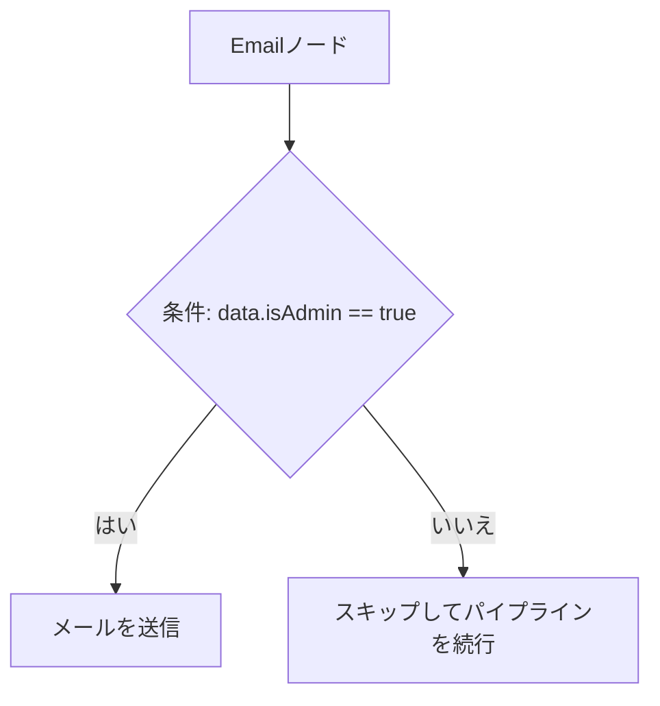

# ビジュアルワークフローとテンプレート

**ワークフロー**（workflow）は、イベントトリガーを処理するための構造化された自動化計画（`user.welcome`、`billing.payment_failed` など）です。ワークフローは、機能ノードの**ステップツリー**として、ダッシュボードキャンバス上で視覚的に構成されます。

---

## イベントトリガー

各ワークフローは、イベントの名前空間を定義する単一の **Trigger Node（トリガーノード）** から始まります。アプリケーションサーバーが SDK を使用してイベントをトリガーする場合、`workflowName` パラメータはこのビジュアル識別子と一致する必要があります。

```ts
await nexus.workflows.trigger({
  workflowName: 'user.welcome', // トリガーノードの名前空間と一致させる
  recipients: [{ externalId: 'user_12' }],
  data: { name: 'Alex' },
});
```

---

## ノードカタログの詳細

キャンバスビジュアルビルダーは、メッセージのタイミング、実行ロジック、およびプロバイダーの選択を制御するために10種類のノードクラスをサポートしています。

| ノードクラス        | アイコン        | 動作と機能                                                                                                                                                          |
| :------------------ | :-------------- | :------------------------------------------------------------------------------------------------------------------------------------------------------------------ |
| **Channel Node**    | `MessageSquare` | Email、SMS、Web Push、Mobile Push、アプリ内ベル、Slack、Discord、Microsoft Teams、WhatsApp、または Webhook 経由で通知を配信します。                                 |
| **Delay Node**      | `Clock`         | 次のステップを実行する前に、相対的な期間（例: `24時間` または `3日間`）実行を一時停止します。                                                                       |
| **Wait Until Node** | `Calendar`      | トリガーペイロードで渡された動的な ISO-8601 タイムスタンプ（例: `data.trialExpirationDate`）まで実行を保持します。                                                  |
| **Delivery Window** | `Moon`          | 配信をインターセプトし、サブスクライバーのローカルタイムゾーンに合わせて、受け取りやすい時間帯（例: `午前9:00 - 午後6:00`）にのみ通知を解放します。                 |
| **Digest Node**     | `Archive`       | 高頻度のアラートを単一の統合された要約（ダイジェスト）にまとめます（例：30分間の10件のコメント通知を1つのダイジェストにバッチ処理）。                               |
| **Throttle Node**   | `Activity`      | サブスクライバーへのスパム送信を防ぐために、通知の配信頻度を制限します（例: サブスクライバーごとに最大 `1時間に1通のメール`）。                                     |
| **Failover Node**   | `RefreshCw`     | プライマリチャネルを試行し、既読コールバック（または特定の期間）を待ち、既読にならない場合は自動的にセカンダリチャネルにフォールバックします。                      |
| **A/B Split Node**  | `Split`         | 実行トラフィックを2つの分岐（例: `50% 分岐A`、`50% 分岐B`）に分割し、開封率やクリック率を追跡してメッセージ内容を最適化します。                                     |
| **HTTP Fetch Node** | `Globe`         | ワークフローの途中でサードパーティ API から外部データを取得します。JSON 応答のプロパティを Handlebars コンテキスト変数に直接マージします。                          |
| **AI Node**         | `Brain`         | 実行時に LLM リクエスト（OpenAI/Anthropic）を実行し、受信イベントを分類したり、サブスクライバーのプロファイルに合わせた動的なコピーライティングを作成したりします。 |

---

## ステップの条件

ビジュアルツリー内の**任意のノード**にブーリアンルール（条件）をアタッチできます。実行時に条件ルールが `false` と評価された場合、ワーカーはそのノード（およびその子ノード）の処理を完全にスキップします。



条件ルールのチェック例：

- **トリガーペイロードのコンテキスト**: `data.planType == 'enterprise'`
- **サブスクライバープロファイル**: `subscriber.country == 'JP'`
- **B2B テナントの詳細**: `tenant.brandingColor == '#ff0000'`

---

## Handlebars テンプレート構文

メッセージ本文のレイアウトは、実行時に動的プロパティを挿入するための **Handlebars（`{{ }}`）変数**をサポートしています。

```html title="Email テンプレート本文"
<h2>Hi {{ subscriber.firstName }},</h2>
<p>Your order <strong>#{{ data.orderId }}</strong> has been shipped!</p>
<p>You can track your package using: <a href="{{ data.trackingUrl }}">Tracking Link</a>.</p>

{{#if tenant}}
<p>Thank you for shopping at {{ tenant.name }}.</p>
{{/if}}
```

### レンダリング中に使用可能なコンテキスト変数

- `{{ subscriber }}`: プロファイルフィールド（`externalId`、`email`、`phone`、`locale`）が含まれます。
- `{{ data }}`: 未加工のトリガー JSON ペイロードメタデータ。
- `{{ tenant }}`: スコープされた顧客組織パラメータ（`name`、`brandingColor`）。
- `{{ steps }}`: 上流の **HTTP Fetch Nodes** からマージされた応答（例: `{{ steps.fetch_product_data.title }}`）。
