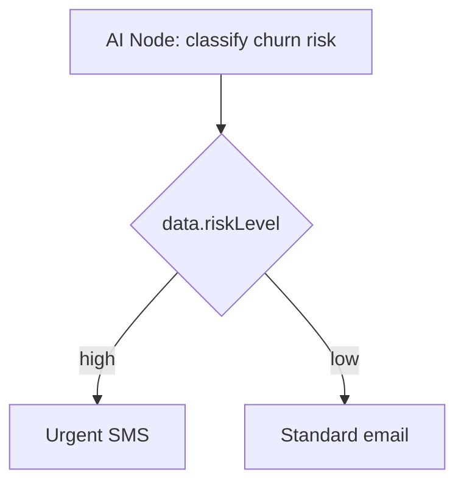

**AIノード**は、ワークフロー実行の途中で構成されたLLM（OpenAIまたはAnthropic）を呼び出します。動的コピー、ユーザー分類、インテントスコアリング、および非決定論的分岐に使用します。

<Callout type="info">
  これは**ワークフロー内の実行時AI**です。ダッシュボードエディターでのAI支援によるテンプレート*作成*については、[AIコンテンツ生成](/docs/platform/features/ai-content)を参照してください。
</Callout>

## 設定

| Campo         | Descrição                                                           |
| ------------- | ------------------------------------------------------------------- |
| `prompt`      | 購読者＋トリガーコンテキストを持つHandlebarsテンプレート            |
| `responseKey` | `ctx.data` にLLM出力を格納するキー（デフォルト： `aiResponse`）     |
| `conditions`  | オプションの[ステップ条件](/docs/platform/features/step-conditions) |

## 例：パーソナライズされた件名

プロンプト：

```
Write a short email subject line for {{ subscriber.externalId }} about order {{ data.orderId }}.
Tone: friendly, under 60 characters. Return only the subject text.
```

後続のメールチャネルテンプレート：

```html
Subject: {{ aiResponse }}
```

## 例：チャーンリスク分岐



プロンプトは、`responseKey` を介してマージされた構造化コンテキストを返します。後続のノードに `data.riskLevel` キーを持つ[ステップ条件](/docs/platform/features/step-conditions)を添付します。

## プロバイダー設定

**Integrations → AI Providers** でOpenAIまたはAnthropicのAPIキーを構成します。トークンの使用量は、コスト分析のために実行ごとに追跡されます。

## ガードレール

- ノードごとのリクエストタイムアウト
- LLMが失敗した場合のフォールバックパス（代替分岐の条件を使用）
- 組織プラン層ごとの構成可能なコスト制限

## 関連リンク

- [AIコンテンツ生成](/docs/platform/features/ai-content)
- [ステップ条件](/docs/platform/features/step-conditions)
- [HTTPデータ取得ノード](/docs/platform/features/http-fetch-node)

---
