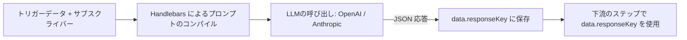
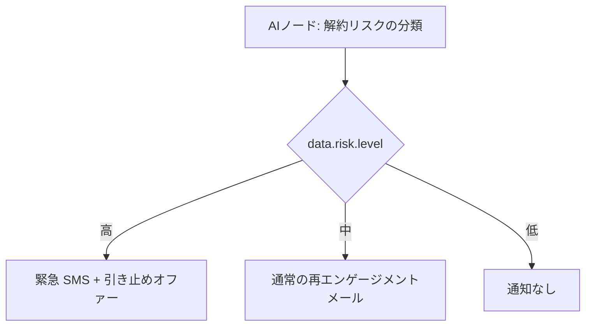

**AI ノード**は、ワークフローの実行中に構成された LLM（OpenAI または Anthropic）を呼び出します。プロンプトは現在のサブスクライバーおよびトリガーのデータコンテキストを使用してコンパイルされ、応答は下流のテンプレートや条件付きステップで使用するために `data` の下に格納されます。

<Callout type="info">
  これは**ワークフロー内での実行時 AI（ランタイム
  AI）**に関するドキュメントです。ダッシュボードエディタでの AI
  支援によるテンプレート*作成*については、[AI
  コンテンツ生成](/docs/platform/features/ai-content)を参照してください。
</Callout>

---

## 仕組み



LLM は、常に**有効な JSON オブジェクト**を返すように固定のシステムプロンプトを通じて指示されます。応答は解析され、`data.<responseKey>` の下に格納されます。

---

## 構成

| フィールド    | 型     | 必須 | 説明                                                                                       |
| :------------ | :----- | :--- | :----------------------------------------------------------------------------------------- |
| `prompt`      | string | ✅   | サブスクライバー + トリガーデータコンテキストを含む Handlebars テンプレート                |
| `responseKey` | string | —    | LLM の JSON 出力を `data.*` の下に保存するためのキー。デフォルトは `ai` です。             |
| `conditions`  | object | —    | 実行を制限するためのオプションの [ステップの条件](/docs/platform/features/step-conditions) |

<Callout type="info">
  **デフォルトの `responseKey`**: 指定しない場合、LLM の応答は `data.ai`
  の下に格納されます。キー名は文字で始まり、英数字とアンダースコア（`[a-zA-Z][a-zA-Z0-9_]*`）のみを含める必要があります。
</Callout>

---

## 例: パーソナライズされた件名

**AI ノードのプロンプト:**

```
Write a short email subject line for {{ subscriber.first_name }} about order {{ data.orderId }}.
Tone: friendly, under 60 characters.
Return a JSON object: { "subject": "<subject line here>" }
```

**下流のメールテンプレート**（`data.ai.subject` を参照）:

```html
Subject: {{ data.ai.subject }}
<p>Hi {{ subscriber.first_name }}, your order {{ data.orderId }} is confirmed!</p>
```

または、カスタムの `responseKey: "copy"` を使用する場合：

```html
Subject: {{ data.copy.subject }}
```

---

## 例: 解約リスクによる分岐



**プロンプト:**

```
Based on last active date {{ data.lastActiveAt }} and plan {{ data.plan }},
classify this user's churn risk.
Return JSON: { "level": "high" | "medium" | "low", "reason": "<brief reason>" }
```

**SMS ノードのステップの条件**（`data.risk.level` に基づく）:

```json
{
  "logic": "AND",
  "rules": [{ "variable": "data.risk.level", "operator": "equals", "value": "high" }]
}
```

---

## プロバイダーのセットアップ

ダッシュボードの **Integrations → AI Providers** で OpenAI または Anthropic の API キーを構成します。トークンの使用量は、コスト分析のためにワークフローの実行ごとに追跡されます。

- **OpenAI**: ダッシュボードの統合から `OPENAI_API_KEY` を設定します。
- **Anthropic**: ダッシュボードの統合から `ANTHROPIC_API_KEY` を設定します。

AI プロバイダーのキーが構成されていない場合、AI ノードはスキップされ、`No AI provider API key configured` という理由で `AI_NODE_FAILED` がログに記録されます。

---

## エラー処理 & ガードレール

- **API キーが構成されていない場合**: ステップはスキップされ、`data.<responseKey>` は `null` に設定され、`AI_NODE_FAILED` がログに記録されます。
- **LLM リクエストのタイムアウト**: ステップはスキップされ、`data.<responseKey>` は `null` に設定され、`AI_NODE_FAILED` がログに記録されます。
- **無効な JSON 応答**: 応答はそのまま格納されます。下流のテンプレートでは、`{{#if data.ai}}` によるガードで安全に処理してください。
- **コスト上限**: ダッシュボードの組織プラン設定で制限を構成可能です。

---

## Workflow-as-code

```ts
import { defineWorkflow } from '@nexus-signal/node';

defineWorkflow('payment.overdue')
  .addHttpFetch({
    url: 'https://api.billing.com/invoices/{{ data.invoiceId }}',
    method: 'GET',
    responseKey: 'invoice',
  })
  .addAiNode({
    prompt:
      'Classify urgency for invoice {{ data.invoice.amount }} due {{ data.invoice.dueDate }}. Return JSON: { "level": "low" | "medium" | "high" }',
    responseKey: 'risk',
  })
  .addChannel('EMAIL')
  .addChannel('SMS', {
    conditions: {
      logic: 'AND',
      rules: [{ variable: 'data.risk.level', operator: 'equals', value: 'high' }],
    },
  })
  .toDefinition();
```

---

## 関連リンク

- [AI コンテンツ生成](/docs/platform/features/ai-content)
- [ステップの条件](/docs/platform/features/step-conditions)
- [HTTP Fetch ノード](/docs/platform/features/http-fetch-node)
- [ワークフロー・アズ・コード](/docs/sdk/workflow/workflow-as-code)
