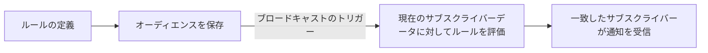

**オーディエンス**は、サブスクライバーの属性フィールドに適用されるフィルタールールによって定義される、名前付きの動的なセグメントです。サブスクライバーのデータが変更されると、メンバー数は自動的に更新されます。リストを手動でメンテナンスする必要はありません。

---

## オーディエンスの仕組み

オーディエンスのルールは、オーディエンスの作成時ではなく、**送信時**（ブロードキャストがトリガーされたとき）に評価されます。つまり、今日 `"growth"` プランに参加したサブスクライバーは、明日送信されるブロードキャストの該当オーディエンスに自動的に含まれます。



---

## フィルタリング可能なフィールド

オーディエングルールでは、以下のサブスクライバーフィールドをフィルター条件として使用できます。

| フィールド           | 型       | 値の例                 |
| :------------------- | :------- | :--------------------- |
| `email`              | string   | `"user@example.com"`   |
| `phoneNumber`        | string   | `"+14155552671"`       |
| `locale`             | string   | `"en"`, `"es"`, `"ja"` |
| `timezone`           | string   | `"Asia/Tokyo"`         |
| `globalUnsubscribed` | boolean  | `true`, `false`        |
| `externalId`         | string   | `"user_42"`            |
| `createdAt`          | datetime | ISO 8601 形式の文字列  |

<Callout type="warn">
  サブスクライバーのカスタムメタデータフィールド（例:
  `properties.plan`）は、オーディエンスルールで直接フィルタリングすることは**できません**。オーディエンスフィルターは、上記の標準的なサブスクライバーフィールドのみに制限されています。
</Callout>

---

## サポートされる演算子

| 演算子                       | 対象のデータ型                         |
| :--------------------------- | :------------------------------------- |
| `equals` / `not_equals`      | すべての文字列、ブール値フィールド     |
| `contains` / `not_contains`  | 文字列フィールド                       |
| `starts_with` / `ends_with`  | 文字列フィールド                       |
| `is_empty` / `is_not_empty`  | 文字列フィールド                       |
| `is_true` / `is_false`       | ブール値フィールド                     |
| `greater_than` / `less_than` | 日付/数値フィールド（例: `createdAt`） |

1つのオーディエンスあたり、最大10個のルールを設定できます。

---

## オーディエンスの作成

**ダッシュボード**: **Audiences** ページ → **New Audience** → ルールを追加します。

**API（Management、`sk_*` キーを使用）:**

```http
POST /v1/management/audiences
Authorization: Bearer sk_prd_…
Content-Type: application/json
```

```json
{
  "name": "English locale subscribers",
  "description": "Subscribers whose locale is set to English",
  "filters": {
    "logic": "AND",
    "rules": [
      { "field": "locale", "operator": "equals", "value": "en" },
      { "field": "globalUnsubscribed", "operator": "is_false" }
    ]
  }
}
```

**API（ダッシュボード/ブラウザ、JWT 認証）:**

```http
POST /v1/audiences
Authorization: Bearer <jwt_token>
```

---

## メンバーのプレビュー

ダッシュボードでは、ルールの編集時に**リアルタイムのメンバー数**がプレビュー表示されます。API 経由でメンバーを取得することも可能です。

```http
GET /v1/audiences/:id/members?page=1&limit=50
Authorization: Bearer <jwt_token>
```

現在のルールに一致する、ページネーションされたサブスクライバーリストが返されます。

---

## ブロードキャストでの使用

オーディエンスは、[ブロードキャスト](/docs/platform/features/broadcasts)の送信ターゲットとして使用されます。

```json
{
  "name": "English User Re-engagement",
  "workflowId": "<workflow-uuid>",
  "audienceId": "<audience-uuid>",
  "scheduledAt": "2026-09-01T09:00:00Z"
}
```

<Callout type="info">
  ブロードキャストを送信するには、事前に `audienceId`
  が割り当てられている必要があります。オーディエンスを設定せずにブロードキャストを送信しようとすると、`400`
  エラーが返されます。
</Callout>

---

## 制限事項

| 制限事項                           | 値  |
| :--------------------------------- | :-- |
| 環境あたりの最大オーディエンス数   | 50  |
| オーディエンスあたりの最大ルール数 | 10  |

---

## 関連リンク

- [ブロードキャスト](/docs/platform/features/broadcasts)
- [オーディエンス API](/docs/api/audiences)
- [サブスクライバー API](/docs/api/subscribers)
