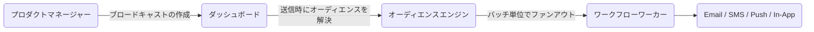

**ブロードキャスト**を使用すると、製品チームやマーケティングチームは、コードを変更することなく、ダッシュボードからアナウンス、機能ローンチ、およびメンテナンス通知を送信できます。受信者ターゲットとして[オーディエンス](/docs/platform/features/audiences)を使用し、既存のワークフローを実行します。

---

## ブロードキャストとイベントトリガーの違い

|                  | イベントトリガー                           | ブロードキャスト                             |
| :--------------- | :----------------------------------------- | :------------------------------------------- |
| **起動元**       | バックエンドコード                         | ダッシュボードまたは Management API          |
| **受信者**       | 明示的なサブスクライバーまたはオブジェクト | オーディエンスセグメント（必須）             |
| **タイミング**   | 即時（非同期 202 応答）                    | 即時またはスケジュール設定                   |
| **ユースケース** | トランザクション、イベント駆動型通知       | アナウンス、キャンペーン、再エンゲージメント |



---

## ブロードキャストのライフサイクル

| ステータス  | 意味                                                                                                      |
| :---------- | :-------------------------------------------------------------------------------------------------------- |
| `DRAFT`     | 作成済み、未送信。編集や削除が可能です。                                                                  |
| `SCHEDULED` | 将来の `scheduledAt` 日時に送信されるようスケジュールされた状態。キャンセルや編集が可能です。             |
| `SENDING`   | ファンアウト（一斉配信）処理が実行中。編集や削除はできません。                                            |
| `COMPLETED` | すべての受信者の処理が完了した状態。一部の配信失敗が発生した場合でもステータスは `COMPLETED` になります。 |
| `FAILED`    | 受信者バッチ全体の配信が完全に失敗した状態。                                                              |
| `CANCELLED` | ユーザーによって手動でキャンセルされた状態（`SCHEDULED` または `SENDING` からのみ可能）。                 |

<Callout type="info">
  ブロードキャストが `FAILED`
  ステータスに切り替わるのは、**すべて**の受信者への送信が失敗した場合のみです。1人でも受信者に配信された場合は、ステータスは
  `COMPLETED` になります。
</Callout>

---

## ブロードキャストの作成

**ダッシュボード**: **Broadcasts** → **New Broadcast** → ワークフローとオーディエンスを選択 → スケジュールを設定します。

**Management API（`sk_*` キーを使用 — サーバー側の自動化用）:**

```http
POST /v1/management/broadcasts
Authorization: Bearer sk_prd_…
Content-Type: application/json
```

```json
{
  "name": "Q4 Product Update",
  "workflowId": "<workflow-uuid>",
  "audienceId": "<audience-uuid>",
  "data": { "version": "4.0", "changelogUrl": "https://blog.example.com/q4" },
  "scheduledAt": "2026-08-01T09:00:00Z"
}
```

`scheduledAt` を省略すると、`DRAFT` として作成されます（後でダッシュボード等から手動で送信）。`scheduledAt` を含めると、ステータスは即座に `SCHEDULED` に設定されます。

**ダッシュボード API（JWT 認証 — フロントエンド統合用）:**

```http
POST /v1/broadcasts
Authorization: Bearer <jwt_token>
```

---

## 即時送信

`DRAFT` または `SCHEDULED` 状態のブロードキャストを今すぐ送信します。

```http
POST /v1/management/broadcasts/:id/send
Authorization: Bearer sk_prd_…
```

または、ダッシュボードから該当するブロードキャストの詳細を開き、**Send Now** をクリックします。

---

## ブロードキャストのキャンセル

```http
POST /v1/broadcasts/:id/cancel
Authorization: Bearer <jwt_token>
```

キャンセルできるのは、`SCHEDULED` または `SENDING` ステータスのブロードキャストのみです。

---

## ワークフローへのデータの受け渡し

ブロードキャストの `data` フィールドの値は、すべての受信者に対してワークフローのトリガーペイロードとして渡されます。変更ログ、URL、プロモーションコードなどの動的コンテンツに使用します。

```json
{
  "data": {
    "promoCode": "LAUNCH40",
    "expiresAt": "2026-09-01"
  }
}
```

ワークフローのメールテンプレートで次のように参照します: `{{ data.promoCode }}`, `{{ data.expiresAt }}`。

---

## 分析

送信後、ブロードキャストごとの配信、開封、クリックの統計がダッシュボードのブロードキャスト詳細ビューに表示されます。

- `totalRecipients` — 送信時のオーディエンスサイズ
- `deliveredCount` — プロバイダーに正常に受け入れられた数
- `failedCount` — プロバイダーの拒否または処理エラーの数

---

## 制限事項

| 制限事項                                     | 値                               |
| :------------------------------------------- | :------------------------------- |
| 環境あたりの最大ブロードキャスト数           | 200                              |
| ファンアウトバッチサイズ                     | 1バッチあたり100サブスクライバー |
| スケジュールされたブロードキャストの確認間隔 | 60 秒ごと                        |

---

## 関連リンク

- [最初のブロードキャストガイド](/docs/platform/guides/first-broadcast)
- [オーディエンス](/docs/platform/features/audiences)
- [ブロードキャスト API リファレンス](/docs/api/broadcasts)
