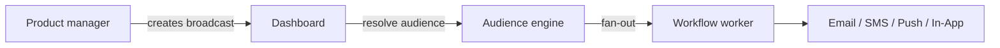

**ブロードキャスト**を使用すると、プロダクトおよびマーケティングチームは、コードを変更することなく、ダッシュボードからお知らせ、機能のリリース、およびメンテナンス通知を送信できます。

## ブロードキャストとトリガーの違い

|              | イベントトリガー (Trigger)       | ブロードキャスト (Broadcast) |
| ------------ | -------------------------------- | ---------------------------- |
| 開始者       | バックエンドのコード             | ダッシュボードまたは管理API  |
| 受信者       | 明示的なリストまたはオブジェクト | オーディエンスセグメント     |
| ユースケース | トランザクション、イベント駆動   | お知らせ、キャンペーン       |



## ブロードキャストの作成

ダッシュボード： **Broadcasts** → ワークフローの作成 ＋ オーディエンスの選択 ＋ スケジュール。

管理API（`sk_*` キーを使用）：

```http
POST /v1/management/broadcasts
Authorization: Bearer sk_prd_…
```

```json
{
  "name": "Q4 Product Update",
  "workflowId": "uuid",
  "audienceId": "uuid",
  "scheduledAt": "2026-08-01T09:00:00Z"
}
```

即時送信：

```http
POST /v1/management/broadcasts/:id/send
```

ダッシュボードユーザーは、JWT認証を介して `POST /v1/broadcasts` で作成することもできます — [Broadcasts API](/docs/api/broadcasts) を参照してください。

## ブロードキャストのライフサイクル

| ステータス             | 意味                                 |
| ---------------------- | ------------------------------------ |
| `DRAFT`                | 作成済み、未送信                     |
| `SCHEDULED`            | 将来の送信のためにキューに登録済み   |
| `SENDING`              | ファンアウト送信中                   |
| `COMPLETED`            | すべての受信者が処理されました       |
| `FAILED` / `CANCELLED` | エラーまたはユーザーによるキャンセル |

## アナリティクス

ブロードキャストごとの配信、開封、およびクリックの統計が、ダッシュボードのブロードキャスト詳細ビューに表示されます。

## 関連リンク

- [最初のブロードキャストガイド](/docs/platform/guides/first-broadcast)
- [オーディエンス](/docs/platform/features/audiences)
- [Broadcasts API](/docs/api/broadcasts)
