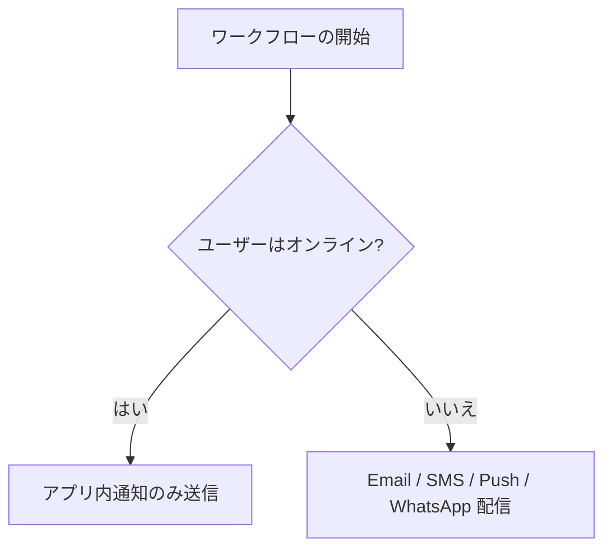

Nexus には、不要な通知の送信費用を自動的に削減するように設計されたコスト管理メカニズムが組み込まれています。

---

## プレゼンス（オンライン状況）抑制

ユーザーがすでにアプリケーションをアクティブに使用しているときに、SMS やプッシュ通知などの外部通知を複数回送信することは、ユーザーにとって煩わしいだけでなく、プロバイダーの送信費用の無駄でもあります。

サブスクライバーがアクティブなクライアント SDK 接続（React、Angular、または Headless JS）を持っている場合、Nexus はそのユーザーを**オンライン**としてフラグを立て、外部チャネルへの送信を抑制し、**アプリ内インボックスのみ**に通知をルーティングします。



### 抑制可能なチャネル

デフォルトでは、サブスクライバーがアクティブ（オンライン）な場合、以下の外部チャネルへの送信が自動的に抑制されます。

- モバイルプッシュ通知 (`MOBILE_PUSH`)
- ウェブプッシュ通知 (`WEB_PUSH`)
- SMS (`SMS`)
- WhatsApp (`WHATSAPP`)

アプリ内インボックス通知は決して抑制されず、常に WebSocket 接続を介して配信されます。

### オンライン状況（プレゼンス）の追跡方法

1. クライアント側 SDK は WebSocket 接続を開き、**40秒ごと**に `/realtime` に対してハートビート ping を送信します。
2. Redis は、接続キー `presence:sub:<subscriberId>` を厳密な **45秒の有効期限（TTL）** を指定して保存します。
3. 抑制可能なステップを配信する直前に、ワークフローワーカーは Redis をクエリします。キーが存在する場合、そのチャネルステップはスキップされます。
4. 抑制された実行は、ライフサイクルログに `PRESENCE_SUPPRESSION` ステップの下で `SKIPPED_BY_PREFERENCE` ステータスとして記録されます。

<Callout type="info">
  ワークフローエディタのチャネルステップ設定で、**Suppress when subscriber is
  online**（ユーザーがオンラインのときに抑制）チェックボックスを切り替えるか、Workflow-as-Code
  のオプションで `suppressWhenOnline`
  を設定することで、チャネルごとにこの挙動を切り替えることができます。
</Callout>

---

## サンドボックスモード（開発環境）

実際のプロバイダー（Twilio や SendGrid など）を使用して通知ワークフローのテストを行うと、トランザクションコストが発生し、誤って実際のユーザーにテスト用テキストが送信されるリスクがあります。

**Development（開発）**環境では、Nexus は仮想の **Sandbox Simulator** を使用してすべての外部チャネルを隔離します。外部 API 呼び出しはモック処理され、生成されたコンテンツ、ペイロード、およびレンダリング結果は直接開発ログに格納されます。

- ダッシュボード上で、配信されるメールのプレビュー、SMS ペイロード、および WhatsApp JSON 形式を確認できます。
- テスト用の API 認証情報は一切不要です。
- セットアップについては [Sandbox モード](/docs/platform/features/sandbox) を参照してください。

---

## 重み付けプロバイダールーティング

同じチャネルレイヤー内で、複数のプロバイダーに配信トラフィックを分散させます（例: SendGrid 70%、Resend 30%）。これは以下のようなケースで便利です。

- プロバイダー間での支出割合の分割
- プロバイダーの段階的な移行（移行期間のトラフィック調整）
- リスク分散

**API 経由でルーティング比率を更新する例:**

```http
PUT /v1/integrations/weights/:layer
Authorization: Bearer <jwt_dashboard_token>
Content-Type: application/json

{
  "weights": {
    "sendgrid": 70,
    "resend": 30
  }
}
```

- `:layer`: `email`、`sms`、`whatsapp`、`push`、`webhook`、`slack`、`discord`、または `ms_teams` のいずれかでなければなりません。
- **制約事項**: 該当レイヤー内のすべてのプロバイダーの重みの合計値は、**正確に 100 になる必要があります**。

---

## サーキットブレーカーによるフェイルオーバー

プロバイダーのエンドポイントが繰り返しリクエストを拒否した場合（60秒の間に5回連続してエラーが発生した場合）、該当プロバイダーのサーキットブレーカーが「開いた」状態（`OPEN` 状態）になります。トラフィックは、そのレイヤー内の代替プロバイダーに自動的に再ルーティングされ、障害の発生している API に対する無駄な再試行による損失を防ぎます。

---

## 関連リンク

- [Smart send-time](/docs/platform/features/smart-send-time) — 配信時間の最適化
- [コスト分析](/docs/platform/features/cost-analytics) — 節約コストの計測
- [Digest & throttle](/docs/platform/features/digest-throttle) — アラート集約ルール
