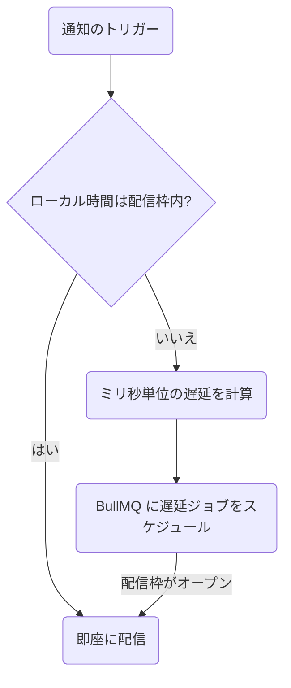

**配信ウィンドウ（Delivery Window）**ステップは、後続の通知を発送する前にサブスクライバーのローカル時間を確認します。現在時刻が許可された時間枠の外である場合（例: 深夜など）、Nexus は実行を一時停止し、時間枠が開いたときに再開するように遅延ジョブをスケジュールします。



---

## 構成

キャンバスで、または Workflow-as-Code を使用して配信ウィンドウノードを定義する場合、以下のパラメータを指定します。

| フィールド    | 型      | 必須 | 説明                                                                                                           |
| :------------ | :------ | :--- | :------------------------------------------------------------------------------------------------------------- |
| `windowStart` | string  | ✅   | `HH:MM` 形式の開始時刻（24時間表記、例: `"09:00"`）                                                            |
| `windowEnd`   | string  | ✅   | `HH:MM` 形式の終了時刻（24時間表記、例: `"21:00"`）                                                            |
| `urgent`      | boolean | —    | `true` に設定すると、重要なアラートについて時間枠のチェックを完全にバイパスします。デフォルトは `false` です。 |

---

## サブスクライバーのタイムゾーンの解決方法

サブスクライバーのローカル時間は、以下の優先順位で決定されます。

1. トリガー時にサブスクライバーオブジェクトで渡される `timezone` プロパティ：
   ```ts
   recipients: [{ externalId: 'user_42', timezone: 'America/New_York' }];
   ```
2. データベースのサブスクライバープロファイルに保存されている `timezone`。
3. タイムゾーンが解決できない場合、または提供された文字列が有効な IANA 識別子でない場合は、**`UTC`** にフォールバックします。

---

## 実行状態とライフサイクル

配信ウィンドウステップは、実行履歴のライフサイクルツリーに以下のイベントをログに記録します。

### 1. 配信ウィンドウ保留 (`DELIVERY_WINDOW_HOLD`)

ユーザーのローカル時間が許可された時間枠の外である場合：

- ステータスが `QUEUED` に変更されます。
- BullMQ は、`jobId: "deliveryWindow:<logId>:<nodeId>"` とカスタムのミリ秒遅延を設定して遅延ジョブをスケジュールします。
- 以下のメタデータをログに記録します。
  - `subscriberLocalTime`
  - `delayMs`（時間枠が開くまでのミリ秒数）
  - `resumeNodeId`（フローの次のステップ）

### 2. 配信ウィンドウ通過 (`DELIVERY_WINDOW_PASS`)

ユーザーのローカル時間が許可された時間枠内である場合、または `urgent` が `true` に設定されている場合：

- ステータスは `PROCESSING` のままとなり（即座に実行されます）。
- ログに `reason: "within_window"` または `reason: "urgent_bypass"` を記録します。

---

## Workflow-as-code の例

```ts
import { defineWorkflow } from '@nexus-signal/node';

defineWorkflow('invoice.overdue')
  .addDeliveryWindow({
    windowStart: '09:00',
    windowEnd: '18:00',
    urgent: false,
  })
  .addChannel('SMS')
  .toDefinition();
```

---

## 関連リンク

- [Smart send-time](/docs/platform/features/smart-send-time) — *何時*に配信するのが最適かを判断します。配信ウィンドウは配信が*許可されている時間*を設定します。
- [サブスクライバー API](/docs/api/subscribers) — ユーザータイムゾーンの設定
- [ワークフロー・アズ・コード](/docs/sdk/workflow/workflow-as-code)
