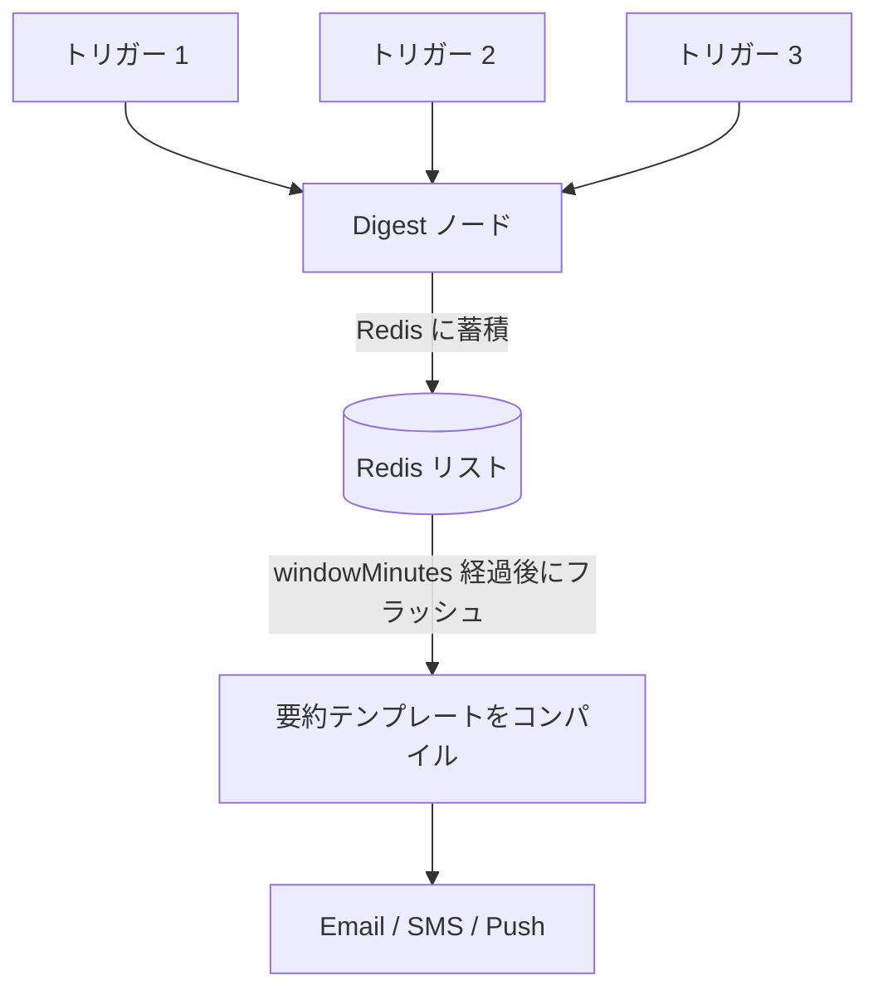
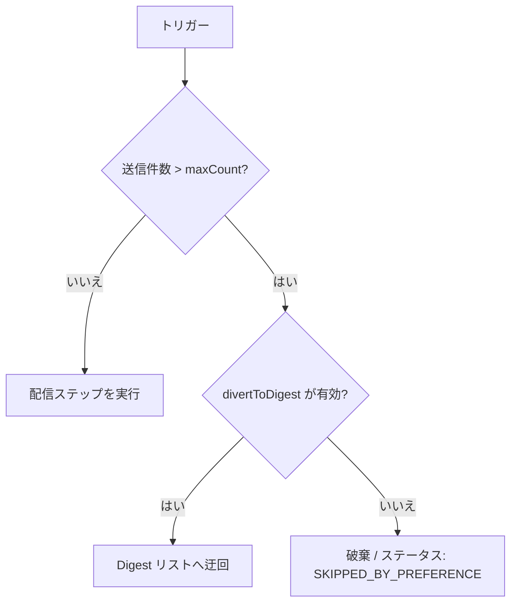

Nexus には、リアルタイムコーディネーターとして Redis を使用し、サブスクライバーレベルで**頻雑な通知を集約する**（Digest）機能と、**メッセージ送信レートの上限を設定する**（Throttle）機能のステート管理が標準で組み込まれています。

---

## Digest ノード

**Digest** ノードは、ワークフローの実行をインターセプトしてトリガーコンテキストを Redis リストにプッシュし、下流ステップへの発送を遅延させます。構成されたタイマーが満了すると、Nexus は Redis リストをフラッシュ（一括取り出し）し、グループ化されたすべてのイベントを含む単一の通知を発送します。



### 構成

| フィールド      | 型     | デフォルト値 | 説明                                                                                     |
| :-------------- | :----- | :----------- | :--------------------------------------------------------------------------------------- |
| `windowMinutes` | number | `30`         | フラッシュする前にトリガーイベントを収集するスライディングウィンドウのサイズ（分単位）。 |

### 仕組み

1. トリガーが Digest ノードに到達すると、ワーカーは `{ logId, at, data }` を Redis キー `digest:<workflowId>:<subscriberId>:<nodeId>` にプッシュします。
2. ログステータスは `QUEUED_IN_DIGEST` に設定され、実行は保留されます（`deferred: true`）。ライフサイクルには `DIGEST_HELD` が記録されます。
3. `windowMinutes` に対応する BullMQ の遅延ジョブが、`jobId: "digest:<workflowId>:<nodeId>"` としてスケジュールされます。
4. ジョブが起動すると、Redis リストをフラッシュし、ライフサイクルステータスを `DIGEST_FLUSH` に更新して、統合された `digest` オブジェクトを Handlebars コンテキストに注入します。

```json
{
  "digest": {
    "count": 3,
    "items": [
      { "logId": "log-1", "at": "2026-07-28T21:00:00Z", "data": { "comment": "Nice post!" } },
      { "logId": "log-2", "at": "2026-07-28T21:01:00Z", "data": { "comment": "Love this!" } }
    ],
    "nodeId": "digest-node-id",
    "windowMinutes": 30
  }
}
```

### 要約テンプレートの記述形式

下流のメールまたはプッシュ通知のテンプレートでは、Handlebars の `{{#each}}` ヘルパーを使用して `digest.items` ループを回します。

```html
<h3>You have {{ digest.count }} new updates</h3>
<ul>
  {{#each digest.items}}
  <li>On {{ at }}: {{ data.comment }}</li>
  {{/each}}
</ul>
```

---

## Throttle ノード

**Throttle** ノードは、Redis で配信頻度を追跡することにより、通知の送信レートを制限します。サブスクライバーが `windowSeconds` 内に `maxCount` 件を超えるメッセージを受信した場合、超過したメッセージは破棄されるか、または Digest（集約）に迂回されます。



### 構成

| フィールド       | 型      | デフォルト値 | 説明                                                                                        |
| :--------------- | :------ | :----------- | :------------------------------------------------------------------------------------------ |
| `maxCount`       | number  | `3`          | 時間枠（ウィンドウ）内で許容される最大通知数。                                              |
| `windowSeconds`  | number  | `60`         | 送信レート制限時間枠の期間（秒単位）。                                                      |
| `divertToDigest` | boolean | `false`      | `true` の場合、制限超過分を破棄する代わりに、Digest（集約）リストにバッチ処理して送ります。 |

### 仕組み

1. 実行されるたびに、Redis のスロットルカウントキーがインクリメントされます。最初のインクリメント時に、キーの有効期限は `windowSeconds` に設定されます。
2. **制限内（Under limit）の場合**: 実行履歴に `THROTTLE_PASS` を記録し、即座に配信を続行します。
3. **制限超過（Over limit）の場合**:
   - **`divertToDigest: false` の場合**: 実行は破棄されます。ログステータスは `SKIPPED_BY_PREFERENCE` に設定され、ライフサイクルに `THROTTLE_LIMIT` ステップが記録されます。
   - **`divertToDigest: true` の場合**: 実行は Redis の Digest リストにルーティングされます。ログステータスは `QUEUED_IN_DIGEST` に変更され、`DIGEST_HELD` が記録されます。ウィンドウが満了したときに Digest をフラッシュするために、`jobId: "throttle-digest:<workflowId>:<nodeId>"` の BullMQ ジョブがスケジュールされます。

---

## Workflow-as-code の例

```ts
import { defineWorkflow } from '@nexus-signal/node';

// 通常の Digest（集約）ワークフロー
defineWorkflow('comments.digest')
  .addDigest({ windowMinutes: 15 })
  .addChannel('EMAIL')
  .toDefinition();

// 超過分の迂回を設定した Throttle（流量制御）ワークフロー
defineWorkflow('payment.alerts')
  .addThrottle({
    maxCount: 2,
    windowSeconds: 300,
    divertToDigest: true,
  })
  .addChannel('SMS')
  .toDefinition();
```

---

## 関連リンク

- [ワークフロー](/docs/platform/concepts/workflows)
- [配信パイプライン](/docs/platform/concepts/delivery-pipeline)
- [ワークフロー・アズ・コード](/docs/sdk/workflow/workflow-as-code)
