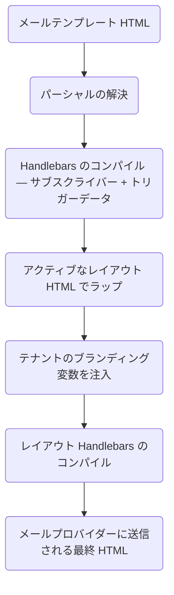

**メールレイアウト**は、すべてのメールテンプレートを共有の HTML フレーム（ヘッダー、フッター、スタイルなど）でラップします。**パーシャル（Partials）**は、複数のテンプレート間で参照できる再利用可能な Handlebars スニペットです。これらを組み合わせることで、HTML を重複させることなく、一貫したブランドデザインを維持できます。

---

## メールレイアウト

レイアウトは外側の HTML シェルを定義します。コンパイルされたテンプレートの本文は `{{{ content }}}` に注入されます。

```html
<!DOCTYPE html>
<html>
  <head>
    <meta charset="utf-8" />
    <style>
      /* 基本のベーススタイル */
    </style>
  </head>
  <body>
    <header>
      
    </header>
    <main>{{{ content }}}</main>
    <footer>{{{ footerHtml }}}</footer>
  </body>
</html>
```

<Callout type="info">
  HTML のエスケープ処理を行わずにレンダリングするには、3重波括弧の `{{{ content }}}` および `{{{ footerHtml }}}` を使用します。画像 URL 文字列などの通常の値には、2重波括弧の `{{ logo }}` を使用します。
</Callout>

### レイアウト内のテナントブランディング変数

ワークフリートリガーに `tenant` が含まれている場合、そのテナントのブランディングフィールドがフィールド名で直接レイアウトコンテキストに注入されます。

| レイアウト変数       | ソース                         |
| :------------------- | :----------------------------- |
| `{{ logo }}`         | `tenant.branding.logo`         |
| `{{ primaryColor }}` | `tenant.branding.primaryColor` |
| `{{{ footerHtml }}}` | `tenant.branding.footerHtml`   |
| `{{ name }}`         | `tenant.name`                  |

トリガーでテナントが指定されていない場合、これらの変数は空になりますので、レイアウト内で適切なフォールバック処理を記述してください。

### レイアウト変数

テナントブランディング以外に、レイアウト自体に**カスタム静的変数**（ダッシュボードで設定するキーと値のペア）を定義できます。これらは、テナントブランディングやサブスクライバーデータとともにコンテキストにマージされます。

---

## パーシャル

パーシャルは、名前で登録された再利用可能な HTML スニペットです。これらは **Templates → Partials** で作成します。

```html
<!-- パーシャル名: cta-button -->
<a
  href="{{ url }}"
  style="display:inline-block; padding:12px 24px;
   background-color:{{ primaryColor }}; color:#fff; text-decoration:none;
   border-radius:4px;"
  >{{ label }}</a
>
```

任意のメールテンプレートまたはレイアウトから次のように参照します：

```html
{{> cta-button url=data.checkoutUrl label="購入手続きを完了する" }}
```

パーシャルを一度変更するだけで、それを使用しているすべてのテンプレートが次回の送信時に自動的に更新されます。

---

## コンパイル順序



---

## ワークフローへのレイアウトの割り当て

ダッシュボードの**ワークフローキャンバス**上での設定手順：

1. ワークフロー設定を開きます。
2. **Email Layout** を選択し、現在の環境に存在するレイアウトから選択します。
3. 保存します。これで、そのワークフロー内のすべてのメールチャネルステップにそのレイアウトが適用されます。

1つのレイアウトを複数のワークフローに適用できます。レイアウトの HTML を変更すると、それを使用しているすべてのワークフローの送信内容が次回の送信時に即座に更新されます。

---

## 関連リンク

- [テナントごとのブランディング](/docs/platform/features/tenants)
- [メールレイアウト API](/docs/api/email-layouts)
- [マルチ言語テンプレート](/docs/platform/features/i18n)
