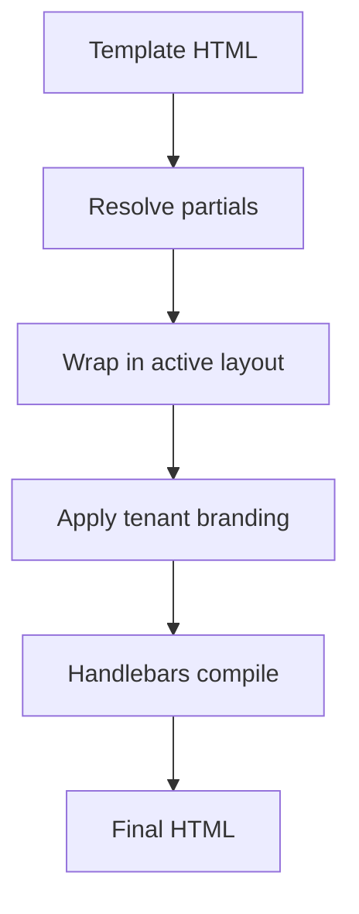

**メールレイアウト** は、すべてのメールテンプレートを共有HTMLフレーム（ヘッダー、フッター、スタイル）でラップします。 **パーシャル** (partials) は、テンプレート間で参照される再利用可能なHandlebarsフラグメントです。

## レイアウト

レイアウトは、コンテンツ用のスロットを持つ外部構造を定義します：

```html
<!DOCTYPE html>
<html>
  <body>
    
    <div class="content">{{{ content }}}</div>
    <footer>{{ branding.footerHtml }}</footer>
  </body>
</html>
```

ダッシュボード： **Templates → Layouts**。環境ごとに1つのレイアウトをアクティブとしてマークできます。テナントコンテキストが定義されている場合、テナントのブランド変数が自動的に挿入されます。

## パーシャル (Partials)

**Templates → Partials** 内で再利用可能なブロックを作成します：

```html
<!-- partial: cta-button -->
<a href="{{ url }}" class="btn btn-primary">{{ label }}</a>
```

任意のメールテンプレートでの参照：

```html
{{> cta-button url=data.checkoutUrl label="Complete purchase" }}
```

パーシャルスニペットを一度変更すると、それを使用するすべてのテンプレートが次の送信時に自動的に更新されます。

## コンパイル順序



## 関連リンク

- [テナントごとのブランディング](/docs/platform/features/tenants)
- [メールレイアウトAPI](/docs/api/email-layouts)
- [マルチ言語テンプレート](/docs/platform/features/i18n)
