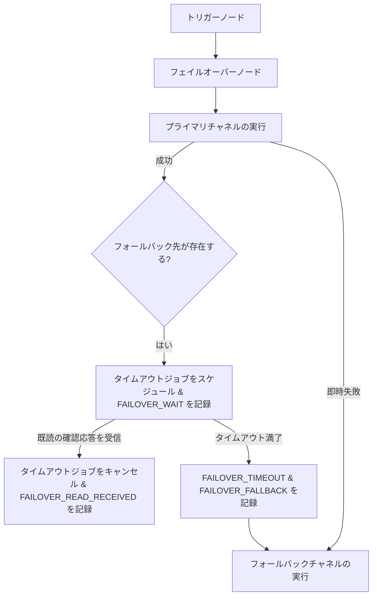

**フェイルオーバー（Failover）**ノードは、代替のフォールバックチャネルを実行することで、重要なアラートが必ずサブスクライバーに届くようにします。フェイルオーバーは、プロバイダー障害時の**即時フェイルオーバー**と、メッセージが未読のまま一定時間経過したときの**遅延フェイルオーバー**の 2 つのモードで機能します。

---

## 構成

フェイルオーバーノードを構成する場合、以下のパラメータを指定します。

| フィールド        | 型     | 必須 | デフォルト値 | 説明                                                                                |
| :---------------- | :----- | :--- | :----------- | :---------------------------------------------------------------------------------- |
| `primaryChannel`  | string | ✅   | —            | 第一選択肢として配信するプライマリチャネル（例: `MOBILE_PUSH`、`EMAIL`）            |
| `fallbackChannel` | string | —    | —            | プライマリが失敗したか、または未読の場合に使用するバックアップチャネル（例: `SMS`） |
| `timeoutSeconds`  | number | —    | `120`        | フォールバックをトリガーするまでに既読確認を待機する秒数（10秒から3600秒まで）。    |

---

## 実行パス

### 1. 即時フェイルオーバー（プロバイダーの停止）

プライマリチャネルの発送が失敗した場合（例: メールアドレスが無効であるか、プロバイダーのエラーが発生した場合）、またはプライマリプロバイダーの[サーキットブレーカー](/docs/platform/features/cost-reduction)が開いている場合：

- Nexus は、ライフサイクルの `FAILOVER_PRIMARY` ステップの下にその失敗をログに記録します。
- サーキットブレーカーが開いていた場合、ログステータスは `FAILED_PROVIDER_DOWN` に設定され、エラーは `provider_down` になります。
- Nexus は待機時間をバイパスして即座に `fallbackChannel` ステップを実行し、理由に `circuit_open_primary` または `primary_failed` を指定して `FAILOVER_FALLBACK` を記録します。

### 2. 遅延フェイルオーバー（未読アラート）

プライマリチャネルは正常に発送されたものの、フォールバック先が構成されている場合：

1. **監視スケジュール**: Nexus は、`timeoutSeconds` で指定された遅延時間とともに、BullMQ の遅延ジョブ `failover:<logId>:<nodeId>` をスケジュールします。
2. **Redis メタデータの書き込み**: 監視パラメータが `failover:meta:<logId>` というキーで Redis に保存されます（有効期限 TTL は `timeoutSeconds + 60`秒）。
3. **WAIT の記録**: 実行履歴に `FAILOVER_WAIT` ライフサイクルステップを記録し、ログステータスを `QUEUED` に設定します。
4. **解決方法**:
   - **ケース A: ユーザーがメッセージを読んだ場合**: ユーザーがタイムアウト前にメッセージを開封または既読にすると、WebSocket/SDK の既読イベントが `acknowledgeFailoverWatch` を呼び出します。これにより、BullMQ の遅延ジョブが削除され、Redis のメタデータがクリアされ、`FAILOVER_READ_RECEIVED` が記録され、下流のステップが即座に再開されます。
   - **ケース B: タイムアウトが満了した場合**: タイムアウト期間内に既読確認（`READ` または `OPENED` ステータス）が得られない場合、ワーカーはログに `FAILOVER_TIMEOUT` および `FAILOVER_FALLBACK` （理由: `read_timeout`）を記録し、`fallbackChannel` を発送します。

---

## カオスモード（Chaos Mode）でのテスト

実際のプロバイダーのシステム停止を待つことなく、フェイルオーバーパスをテストできます。

1. ダッシュボードで **Integrations** に移動します。
2. 対象のプライマリプロバイダーで **Chaos Mode** を有効にします。
3. ワークフローをトリガーします。プロバイダーは擬似的に失敗（モック）を発生させ、ダッシュボードの監査ログで即時フェイルオーバーが実行されるのを確認できます。

---

## 関連リンク

- [コスト削減 & サーキットブレーカー](/docs/platform/features/cost-reduction)
- [Sandbox シミュレータ](/docs/platform/features/sandbox)
- [ワークフロー・アズ・コード](/docs/sdk/workflow/workflow-as-code)
