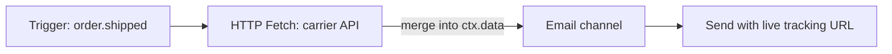

**HTTP Fetch** ノードは、ワークフローの実行中にHTTPリクエストを行い、その後のステップのためにレスポンスデータをワークフローコンテキストにマージします。

## なぜ送信時に取得するのか

HTTP Fetchがない場合、すべてのデータはトリガー時に渡される必要があります。これにより、データが古くなったり（変更される追跡URLなど）、ペイロードが肥大化したりします。通知が実際に送信されるときに、動的にデータを取得します。



## 設定

| フィールド    | 説明                                                                                         |
| ------------- | -------------------------------------------------------------------------------------------- |
| `url`         | リクエストURL — Handlebarsをサポート： `https://api.carrier.com/track/{{ data.trackingId }}` |
| `method`      | `GET` または `POST`                                                                          |
| `headers`     | オプションのヘッダーキー値ペア                                                               |
| `body`        | POSTボディテンプレート (Handlebars)                                                          |
| `responseKey` | 解析されたJSONを格納するコンテキストキー（デフォルト： `data` にマージ）                     |

## 例

メール送信の前に最新の配送ステータスを取得します：

```
URL:    https://api.shipping.com/v1/shipments/{{ data.shipmentId }}
Method: GET
responseKey: shipment
```

メールテンプレート：

```html
<p>Status: {{ shipment.status }}</p>
<a href="{{ shipment.trackingUrl }}">パッケージを追跡</a>
```

## エラーハンドリング

- 構成可能なタイムアウト（デフォルトはワーカーのタイムアウト）
- 失敗したフェッチは実行ライフサイクルに記録されます。 [ステップ条件](/docs/platform/features/step-conditions) またはフェイルオーバーノードで代替パスを構成します。
- 環境ごとのドメインホワイトリスト（セキュリティ）

## Workflow-as-code

```ts
import { defineWorkflow } from "@nexus-signal/node";

defineWorkflow("order.shipped")
  .addHttpFetch({
    url: "https://api.carrier.com/track/{{ data.trackingId }}",
    method: "GET",
    responseKey: "tracking",
  })
  .addChannel("EMAIL");
```

## 関連リンク

- [ワークフロー](/docs/platform/concepts/workflows)
- [Workflow-as-code](/docs/sdk/workflow/workflow-as-code)
