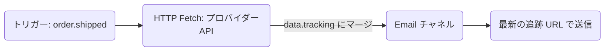

**HTTP Fetch** ノードは、ワークフロー実行中に外部への HTTP リクエストを行い、JSON 応答をワークフローの `data` コンテキストにマージします。下流のステップ（テンプレート、ステップの条件、および AI ノードなど）は、フェッチされたデータを `{{ data.<responseKey>.<field> }}` として参照できます。

---

## 送信時にフェッチする理由

トリガーの実行時にすべてのデータを一度に渡す方式には、以下のような限界があります。

- 追跡 URL がトリガーから配信までの間に変更される可能性がある。
- API 呼び出しから通知送信までの数秒の間に注文ステータスが更新される可能性がある。
- 決して使用されないかもしれないデータによって、トリガーのペイロードが肥大化する。

HTTP Fetch は、通知がアセンブル（構築）されるまさにその瞬間に最新のデータをプルすることで、この課題を解決します。



---

## 構成

| フィールド    | 型               | 必須 | 説明                                                                                               |
| :------------ | :--------------- | :--- | :------------------------------------------------------------------------------------------------- |
| `url`         | string           | ✅   | リクエスト URL。Handlebars をサポートします: `https://api.carrier.com/track/{{ data.trackingId }}` |
| `method`      | `GET` \| `POST`  | —    | HTTP メソッド。デフォルトは `GET` です。                                                           |
| `headers`     | `{key, value}[]` | —    | オプションのヘッダーのキー値ペア。キーと値の両方で Handlebars をサポートします。                   |
| `body`        | string           | —    | POST リクエストボディのテンプレート（Handlebars）。`POST` リクエストの時のみ送信されます。         |
| `responseKey` | string           | —    | 解析された JSON 応答を `data.*` 配下に格納するコンテキストキー名。デフォルトは `fetched` です。    |

<Callout type="info">
  **デフォルトの `responseKey`**: `responseKey` を指定しない場合、応答は `data.fetched`
  の下に格納されます。キー名は文字で始まり、英数字とアンダースコアのみを含める必要があります。
</Callout>

---

## 制限事項

| プロパティ                 | 値         |
| :------------------------- | :--------- |
| リクエストタイムアウト     | 10 秒      |
| 最大応答サイズ             | 50 KB      |
| 最大リクエスト URL 長      | 2,048 文字 |
| 最大カスタムヘッダー数     | 10         |
| 最大リクエストボディサイズ | 10 KB      |

---

## 例: 最新の出荷ステータスの取得

**ノード構成:**

```
URL:         https://api.shipping.com/v1/shipments/{{ data.shipmentId }}
Method:      GET
responseKey: shipment
```

**メールテンプレート** (下流ステップ):

```html
<p>Status: {{ data.shipment.status }}</p>
<a href="{{ data.shipment.trackingUrl }}">Track your package →</a>
```

<Callout type="warn">
  フェッチされたデータは常に `data.<responseKey>` として利用可能であり、直接 `{{ responseKey }}` として参照することはできません。これは、HTTP Fetch の結果を含むすべてのトリガーデータがテンプレートコンテキストの `data` 名前空間の下に配置されるためです。
</Callout>

---

## エラー処理

- リクエストが 10 秒後に**タイムアウト**した場合、実行は継続し、`data.<responseKey>` は `null` に設定されます。
- 応答ボディが **JSON として解析できない**場合、`{ "_raw": "<テキストコンテンツ>" }` として格納されます。
- フェッチ失敗時は、実行履歴に `HTTP_FETCH_FAILED` がログ記録されます。[ステップの条件](/docs/platform/features/step-conditions)を使用してフォールバックパス（代替ルート）を設定してください。
- セキュリティを重視するセットアップのために、環境ごとに**ドメインの許可リスト（allowlisting）**を使用できます。

---

## Workflow-as-code

```ts
import { defineWorkflow } from '@nexus-signal/node';

defineWorkflow('order.shipped')
  .addHttpFetch({
    url: 'https://api.carrier.com/track/{{ data.trackingId }}',
    method: 'GET',
    responseKey: 'tracking',
  })
  .addChannel('EMAIL')
  .toDefinition();
```

このワークフローのメールテンプレートでは、`{{ data.tracking.estimatedDelivery }}`、`{{ data.tracking.status }}` などを参照できます。

---

## フェッチされたデータに基づく条件付き分岐

下流のノードで [ステップの条件](/docs/platform/features/step-conditions) を使用して、フェッチされた結果に基づき分岐します。

```json
{
  "logic": "AND",
  "rules": [{ "variable": "data.tracking.status", "operator": "equals", "value": "DELAYED" }]
}
```

これを SMS ノードに添付することで、運送業者が遅延を報告したときにのみ遅延アラートを送信できます。

---

## 関連リンク

- [ワークフロー](/docs/platform/concepts/workflows)
- [ステップの条件](/docs/platform/features/step-conditions)
- [AI ワークフローノード](/docs/platform/features/ai-workflow-node)
- [ワークフロー・アズ・コード](/docs/sdk/workflow/workflow-as-code)
