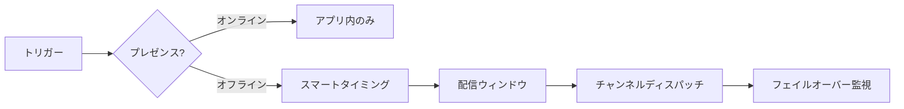

<Cards>
  <Card title="コスト削減" href="/docs/platform/features/cost-reduction" description="プレゼンス抑制、サンドボックス、重み付きルーティング。" />
  <Card title="スマート送信時刻" href="/docs/platform/features/smart-send-time" description="サブスクライバーごとの AI ピーク時間配信。" />
  <Card title="AI コンテンツ" href="/docs/platform/features/ai-content" description="1つのプロンプトで全チャンネルのコピーを生成。" />
  <Card title="コスト分析" href="/docs/platform/features/cost-analytics" description="支出追跡と予算アラート。" />
  <Card title="配信ウィンドウ" href="/docs/platform/features/delivery-windows" description="タイムゾーン対応のサイレント時間帯。" />
  <Card title="i18n テンプレート" href="/docs/platform/features/i18n" description="1つのワークフローで多言語対応。" />
  <Card title="ダイジェストとスロットル" href="/docs/platform/features/digest-throttle" description="アラートのバッチ処理、レート制限。" />
  <Card title="フェイルオーバー" href="/docs/platform/features/failover" description="自動チャンネルフォールバック。" />
  <Card title="トピック" href="/docs/platform/features/topics" description="カテゴリベースのサブスクリプション。" />
  <Card title="スケジュール" href="/docs/platform/features/schedules" description="Cron および単発トリガー。" />
  <Card title="サンドボックス" href="/docs/platform/features/sandbox" description="実際のプロバイダー費用なしでテスト。" />
</Cards>

## Nexus vs 一般的なプラットフォーム

| 機能 | Nexus | 一般的なインフラ |
|------|-------|--------------|
| プレゼンス抑制 | あり | まれ |
| AI スマート送信時刻 | あり | まれ |
| プロバイダーコスト分析 | あり | なし |
| BYOP 手数料ゼロ | あり | よく組み込まれている |
| AI コンテンツ生成 | あり | なし |

## 機能の接続方法

