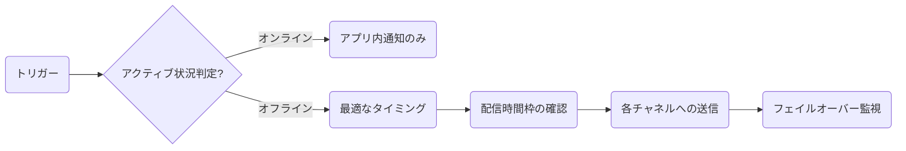

## 配信 & 信頼性

<Cards>
  <Card
    title="コスト削減"
    href="/docs/platform/features/cost-reduction"
    description="プレゼンス（オンライン状況）抑制、サンドボックス、重み付けルーティング。"
  />
  <Card
    title="Smart send-time"
    href="/docs/platform/features/smart-send-time"
    description="AI によるサブスクライバーごとのピーク時間の配信。"
  />
  <Card
    title="配信ウィンドウ"
    href="/docs/platform/features/delivery-windows"
    description="タイムゾーンを考慮した静止時間（サイレントアワー）の設定。"
  />
  <Card
    title="Digest & throttle"
    href="/docs/platform/features/digest-throttle"
    description="バッチアラート、レート制限（流量制御）。"
  />
  <Card
    title="Failover"
    href="/docs/platform/features/failover"
    description="チャネルの自動フォールバック。"
  />
  <Card
    title="Sandbox"
    href="/docs/platform/features/sandbox"
    description="実際のプロバイダー費用をかけずにテスト送信を実行。"
  />
</Cards>

---

## ワークフロー・インテリジェンス

<Cards>
  <Card
    title="ステップの条件"
    href="/docs/platform/features/step-conditions"
    description="ワークフロー内の任意のノードに対するブール値ルール。"
  />
  <Card
    title="HTTP Fetch ノード"
    href="/docs/platform/features/http-fetch-node"
    description="ワークフローの途中での外部 API からのデータ取得。"
  />
  <Card
    title="AI ワークフローノード"
    href="/docs/platform/features/ai-workflow-node"
    description="実行時 LLM による分類およびパーソナライズコピー生成。"
  />
  <Card
    title="AI コンテンツ生成"
    href="/docs/platform/features/ai-content"
    description="プロンプトからテンプレートのテキストコピーを自動生成。"
  />
</Cards>

---

## 製品メッセージング

<Cards>
  <Card
    title="オブジェクト & 購読"
    href="/docs/platform/features/objects-subscriptions"
    description="エンティティを監視しているユーザーへのファンアウト一斉配信。"
  />
  <Card
    title="オーディエンス"
    href="/docs/platform/features/audiences"
    description="動的なサブスクライバーセグメント。"
  />
  <Card
    title="ブロードキャスト"
    href="/docs/platform/features/broadcasts"
    description="ダッシュボードから開始される 1 回限りの送信。"
  />
  <Card
    title="アプリ内ガイド"
    href="/docs/platform/features/guides"
    description="バナー、モーダル、ツールチップ。"
  />
  <Card
    title="テナントごとのブランディング"
    href="/docs/platform/features/tenants"
    description="B2B SaaS 顧客向けのホワイトレーベル対応。"
  />
  <Card
    title="リッチなアプリ内インボックス"
    href="/docs/platform/features/rich-inbox"
    description="タブ、アクションボタン、アバター、タグフィルター。"
  />
</Cards>

---

## コンテンツ & ローカライズ

<Cards>
  <Card
    title="翻訳ファイル"
    href="/docs/platform/features/translations"
    description="{{ t 'key' }} による共通文字列の共有ストア。"
  />
  <Card
    title="メールレイアウト & パーシャル"
    href="/docs/platform/features/email-layouts"
    description="共通の HTML フレームと再利用可能なマークアップブロック。"
  />
  <Card
    title="マルチ言語テンプレート"
    href="/docs/platform/features/i18n"
    description="チャネルごとの複数言語のバリエーション管理。"
  />
</Cards>

---

## 組織 & 分析

<Cards>
  <Card
    title="トピック"
    href="/docs/platform/features/topics"
    description="カテゴリごとの購読環境設定グループ。"
  />
  <Card
    title="スケジュール"
    href="/docs/platform/features/schedules"
    description="定期実行（cron）および 1 回限りのトリガー。"
  />
  <Card
    title="コスト分析"
    href="/docs/platform/features/cost-analytics"
    description="費用追跡と予算アラートの設定。"
  />
</Cards>

---

## Nexus と一般的な通知プラットフォームの比較

| 機能                         | Nexus    | 一般的なインフラ     |
| :--------------------------- | :------- | :------------------- |
| オブジェクトファンアウト     | **対応** | ほとんどなし         |
| ダッシュボードからの送信     | **対応** | エンタープライズ限定 |
| HTTP Fetch / AI ノード       | **対応** | ほとんどなし         |
| テナントごとのブランディング | **対応** | エンタープライズ限定 |
| MCP + CLI                    | **対応** | 2025年以降の新機能   |
| BYOP（手数料なし）           | **対応** | パック料金に含まれる |

---

## 機能同士の連携フロー

```mermaid
flowchart LR
  T(トリガー) --> P{アクティブ状況判定?}
  P -->|オンライン| I(アプリ内通知のみ)
  P -->|オフライン| S(最適なタイミング)
  S --> W(配信時間枠の確認)
  W --> C(各チャネルへの送信)
  C --> F(フェイルオーバー監視)
```
