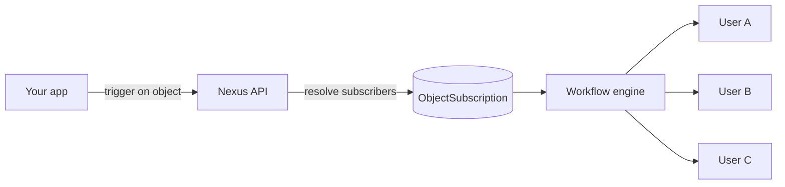

**オブジェクト**は、ユーザーが購読する第1級エンティティ（プロジェクト、ドキュメント、注文、チャネルなど）です。オブジェクトを受信者としてワークフローをトリガーすると、Nexusは自動的にすべての購読者にファンアウトします。

## なぜオブジェクトが重要なのか

オブジェクトがない場合、トリガーのたびにバックエンドが「これを誰が監視しているか？」をクエリし、受信者の完全なリストを渡す必要があります。オブジェクトは、その関係をNexusに移動します。



## オブジェクトの作成

ダッシュボードの **Objects** ページ、またはAPI/SDK：

```ts
await nexus.objects.set({
  collection: "projects",
  externalId: "proj_alpha",
  name: "Project Alpha",
  properties: { status: "active", owner: "team-eng" },
});
```

オブジェクトのプロパティは、テンプレート内で `{{ object.name }}`、 `{{ object.properties.status }}` として使用できます。

## 購読の管理

```ts
await nexus.objects.addSubscriptions("projects", "proj_alpha", {
  recipients: ["user_alice", "user_bob"],
});

await nexus.objects.removeSubscriptions("projects", "proj_alpha", ["user_bob"]);
```

## オブジェクトファンアウトによるトリガー

個々のユーザーの代わりにオブジェクトを渡します：

```ts
await nexus.workflows.trigger({
  workflowName: "project.updated",
  recipients: [{ collection: "projects", id: "proj_alpha" }],
  data: { changeType: "milestone_completed" },
});
```

ワーカーは購読しているすべての購読者を解決し、それぞれに対してワークフローを実行します。

## オブジェクトごとの設定

購読者は、他のオブジェクトをアクティブに保ちながら、特定のオブジェクトをミュートできます。設定は、購読者の `preferences` JSON内のオブジェクトキーの下にスコープされます。

## 関連リンク

- [オブジェクトファンアウト通知ガイド](/docs/platform/guides/object-fanout)
- [Objects API](/docs/api/objects)
- [Node SDKのオブジェクト](/docs/sdk/backend/node)
